# 1. Mạng cơ bản 
- 2 Thiết bị có thể chia sẻ file và móc nối được với nhau thì đã được gọi là hệ thống mạng rồi
## 1.1. Các đặc điểm của 1 hệ thống mạng 

# 2. Mô hình OSI và TCP/IP
## 2.1. OSI
### 2.1.1. Lớp application
- Tiếp xúc thường xuyên nhất tiếp xúc thông qua các ứng dụng, chrome, mail out look 
- Các giao thức: 
	- SMTP: dùng để gửi mail tới server 
	- Lấy mail về có 2 option:
    	- POP3: Lấy mail về và lưu trữ mail cục bộ tại máy tính và xóa mail trên server
    	- IMAP: Móc nối tới mail server lấy cái bản sao của mail về chứ không có xóa mail trên server
	- FTP: Truyền chia sẻ file 
    	- FTP Client
    	- FTP Server
	- HTTP, HTTPS:
    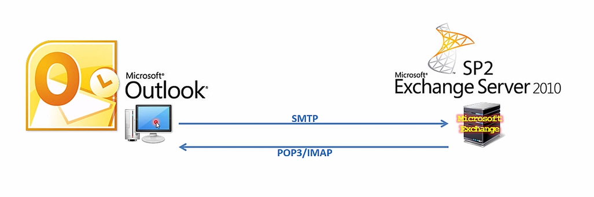
## 2.2. TCP/IP
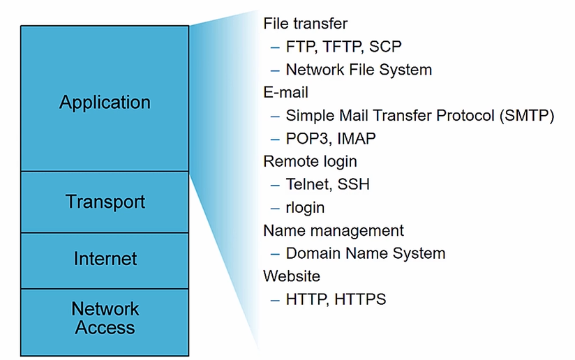
- Chỉ có 4 phân lớp như ảnh trên
- 3 lớp trên cùng gom thành 1 nhóm là Application
- Mỗi card mạng có 1 địa chỉ mac và các địa chỉ này đều khác nhau trên mỗi card mạng

L3: packet (data, ip)
L2: frame (data, ethernet)
- QUá trình gửi nhận dữ liệu: giữa 2 PC 

  - 2 PC khác mạng muốn liên kết được với nhau (default gateway) 
  - Nó sẽ soạn thảo 1 bản tin (IP Nguồn, IP Đích, MAC Nguồn, MAC đích)
  - MAC Nguồn: MAC của PC 1 
  - MAC Đích: MAC của Default Gateway (router)
  - Phân giải địa chi ARP 
  - PC1 xác định đỉa chỉ MAC đích của IP gateway sau đó gắn địa chỉ mac đích vào 
  - PC1 sẽ gửi cho gateway và nó thấy là bản tin gửi cho nó nên nó thực hiện thao tác định tuyến dựa vào IP đích 
  - Nó sẽ gỡ bỏ thông tin MAC nguồn và MAC đích đi và nó gắn 1 MAC nguồn và đích mới với:
    - MAC Nguồn là MAC của gateway
    - MAC Đích là MAC của PC2
## 2.3. Giao thức vận chuyển dữ liệu UDP và TCP
### 2.3.1. Kích thước tối đa của 1 phân mảnh dữ liệu segment
- Nhiệm vụ chủ yếu của lớp transport là đảm bảo quá trình truyền thông tin cậy từ đầu cuối đến đầu cuối 
- Dữ liệu khi được lấy về sẽ bị phân mảnh và được tải về máy trạm
L4: Seqment (data, tcp)
L3: packet (data,ip)
## 2.4. TCP và UDP
- Ghép phiên kết nối sesion: Chỉ có 1 card mạng nhưng có thể mở nhiều phiên làm việc khác nhau
- Phân mảnh dữ liệu segmentation:  Phân mảnh 1 file có kích thước N Mbps được phân mảnh thành nhiều phân mảnh khác nhau trước đó phải trải qua quá trình bắt tay ba bước để quyết định xem dữ liệu được phân mảnh có kích thước bao nhiêu
- Bắt tay ba bước: 
- Đảm bảo quá trình truyền thôn tin cậy
- Điều khiển luồn 
### 2.4.1. UDP
- UDP Header

	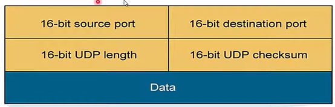
- Cơ chết hoạt động truyền thông:
### 2.4.2. TCP
- Gắn thêm TCP Header và IP Header

	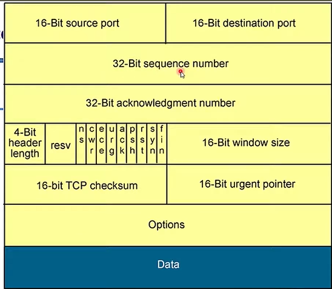
- Cơ chế hoạt động truyền thông: với 2 Máy tính 
  - Bắt tay ba bước: Giúp thỏa thuận tham số mà 2 thiết bị hỗ trợ `kích thước và tốc độ` (Connection-oriented)
    - PC1: Máy truyền Gửi 1 tính hiệu SYN thăm dò thiết bị đầu cuối đã sẵn sàng quá trình truyền nhận dữ liệu hay không, nếu đủ tài nguyên 
    - PC2: Báo nhận ACK sẵn sàng quá trình truyền nhận và lúc này nó bảo gửi 1 tín hiệu SYN của chỉnh nó để hỏi xem máy truyền đã sẵn sàng truyền nhận dữ liệu hay chưa 
	- PC1: Và máy truyền sẽ gửi ra 1 bản tin ACK chấp nhận quá trình truyền thông này, và quá trình truyền nhận dữ liệu bắt đầu diễn ra.
	- Trước khi truyền thì nó phân mảnh dữ liệu ra thành rất nhiều phân nhảnh và đánh stt cho các segment để phục vụ cho quá trình báo nhận ACK 
	- Khi máy nhận nhận được 1 segment nó bắt buộc phải báo nhận bằng 1 bản tin ACK báo rằng tôi đã nhận segment 1 thành công và khi máy truyền nhận được ACK thì nó gửi tiếp cái segment tiếp theo nó lặp lại cho đến khi kết thúc đảm bảo rằng không bị mất dữ liệu.
	- Khi segment được gửi đi mà không nhận được hồi đáp về, bị mất mát trong quá trình truyền thông thì máy truyền ở 1 thời gian nhất định khi gửi segment 3 mà không thấy hồi áp ACK trở về thì nó sẽ chủ động gửi lại segment cho đến khi nhận được hồi đáp ACK.
	- Không bị mất mát dữ liệu.
#### 2.4.2.1. Cơ chế điều khiển luồn Flow Control 
	- Để cải thiện tốc độ thì TCP sử dụng tham số `Windown size` áp dụng trong kỹ thuật **Flowc Control** luồn lưu lượng trong hệ thống
	- 32 bit sequence number: đánh số thứ tự 
	- 32 bit Acknowledgment number: báo nhận ACK 
	- Windown size là trường có trong `TCP header` 

- Biểu diễn luồng. Trong quá trình bắt tay ba bước giứa 2 hiết bị
	-  2 máy thỏa thuận giá trị windown size = 1 Tại 1 thời điểm thì máy gửi chỉ gửi được 1 segment 
	- Và khi máy nhận nhận được segment 1 thì làm thao tác với ack là 2 ngầm báo cho máy gửi tiếp muốn nhận cái segment là 2 và báo là segment 1 đã nhận thành công rồi.
	- Khi mà máy gửi nhận được ACK là 2 rồi gửi tiếp cái segment thứ 2 và máy nhận sẽ báo ack là 3 và tiếp tục cho đến khi nhận hết dữ liệu
	
	- Và để cải thiện dữ liệu thì thay vì thỏa thuận giá trị ws =1 thì thay bằng window size = 3 máy sẽ chuyển tiếp 3 segment rồi sau đó mới đợi hồi đáp ACK 
	- Máy gửi gửi segment 1,2,3 và nếu mà máy nhận đều nhận được cả 3 thì nó gửi lại 1 ACK là 4 và báo segment 1,2,3 đã nhận được và yêu cầu gửi tiếp segment là 4 
	- Tiếp tục gửi các segment 4, 5, 6 đến khi nhận đủ hết dữ liệu
#### 2.4.2.2. Silding Windowing
- Khi nào 2 thiết bị tự động điều chỉnh Windown size: khi hệ thống mạng bị nghẽn thì sẽ tự động tăng giảm giá trị này tùy vào hệ thống mạng hiện tại dựa vào Silding Windowing
- Nếu ở 2 PC 1 bên có ws =3 và 1 bên có ws=2 thì trong quá trình truyền bên nhận chỉ nhận được 2 segment và báo ack = 3 kèm theo ws = 2 tiếp đến máy gửi sẽ điều chỉnh ws theo máy nhận và tiếp tục truyền dữ liệu.
- Window size thường tăng theo cấp số nhân
#### 2.4.2.3. MAC vs IP add
- Trên 1 thiết bị ta có thể cài đặt rất nhiều dịch vụ. HTTP, FTP,... Khi mà gói tin muốn truy cập tới dịch vụ nào thì nó sẽ căng cứ đến cái port đích
- 1-1023: Đã được định danh cho các dịch vụ trước rồi VD: port 80 http,...
- Đứng tại máy 1 ta có thể mở được nhiều phiên làm việc và mỗi phiên làm việc được định danh phân biệt với nhau được gọi là định danh port nguồn 
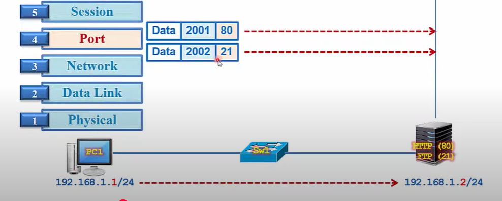
- Tự định danh port ngẫu nhiên port nguồn
- Ví dụ như ở giao diện web mở đồng thời 2 trình duyệt và cùng truy cập tới google.com thì dựa vào port nguồn để server có thể đẩy đúng cái phiên để sử lí 
### 2.4.3. UDP (Connectionless)
- Cơ chết hoạt động truyền thông: với 2 Máy tính 
	- Không cần trải qua việc bắt tay 3 bước và lúc này khi có dữ liệu cần truyền thì nó sẽ phân mảnh dữ liệu ra thành nhiều phần và lần lược gửi các phân mảnh dữ liệu đi mà không cần phải đánh stt và gửi với tốc độ ồ ạt và nhanh, nhưng không có khả năng phục hồi lại dữ liệu đã mất 
- Ví dụ trong một cuộc điện thoại VoIP mà muốn  thiết lập thì nó vẫn sử dụng TCP rồi nó sẽ chủ động thiết lập 2 luồn UDP 1 luồn để truyền tín hiệu từ trái sang phải và 1 luồn UDP khác từ phải sang trái 
- Chứa Port nguồn và Port Đích
# 3. Ethernet LAN
## 3.1. Local Area Network (LAN)
## 3.2. MAC (Hexa)
- Các thiết bị tham gia cùng 1 mạng LAN được định danh với khái niệm là địa chỉ MAC 
- Mỗi máy tính muốn tham gia vòa mạng LAN cần phải có card mạng và trên mỗi card mạng thì có 1 địa chỉ MAC riêng (12 số hexa và được rút gọn thành 4 số nhị phân)
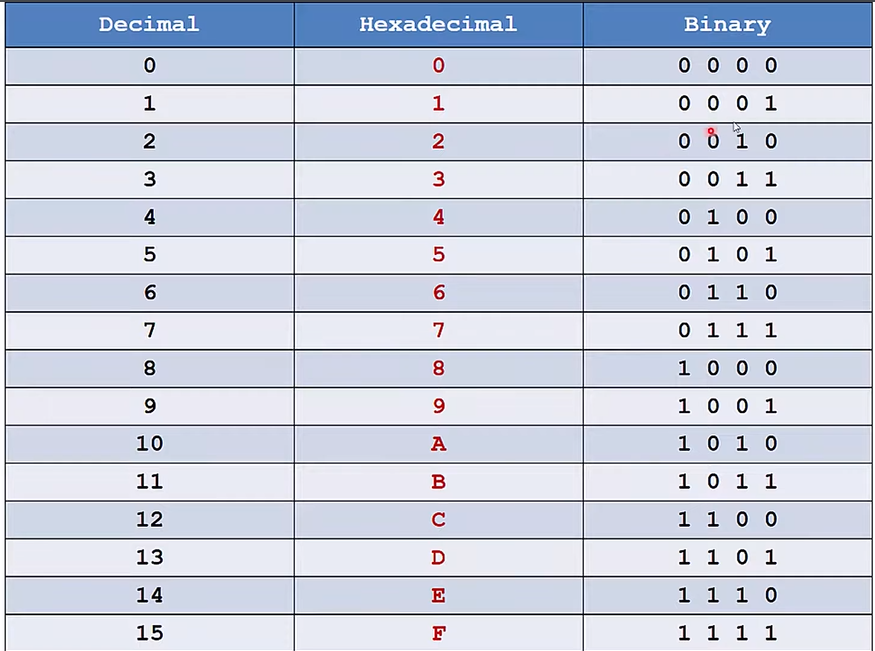
## 3.3. Quá trình trao đổi dữ liệu trên LAN
- Các thiết bị đầu cuối muốn trao đổi dữ liệu trong mạng LAN cần 2 thông tin 1 địa chỉ MAC và 2 là địa chỉ IP 
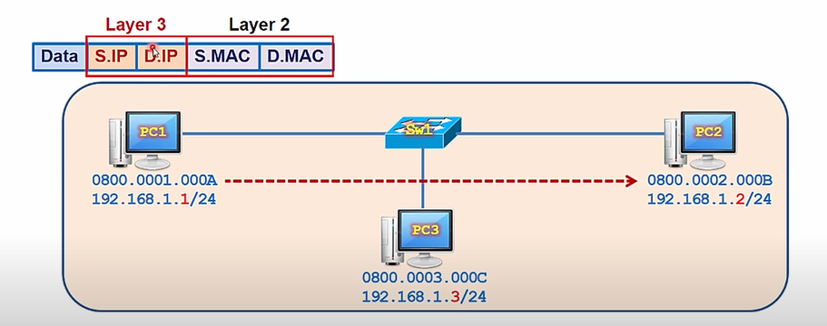
- PC1 muốn giao tiếp với PC2 sẽ soạn ra 1 gói tin với IP nguồn và IP đích sau đó nó sẽ gửi bản tin tới switch tuy nhiên switch chỉ có khả năng sử lý thông tin L2 header thôi do vậy PC1 phải gắn thêm MAC nguồn và MAC đích như trên hình
## 3.4. Cơ chế chuyển mạch trên switch
- Switch nhận frame trên 1 port rồi đẩy đến các port khác để xử lí gọi là quá trình chuyển mạch
- Để thực hiện chức năng chuyển mạch thì switch cần dựa vào 1 bản công cụ gọi là `MAC Table` 
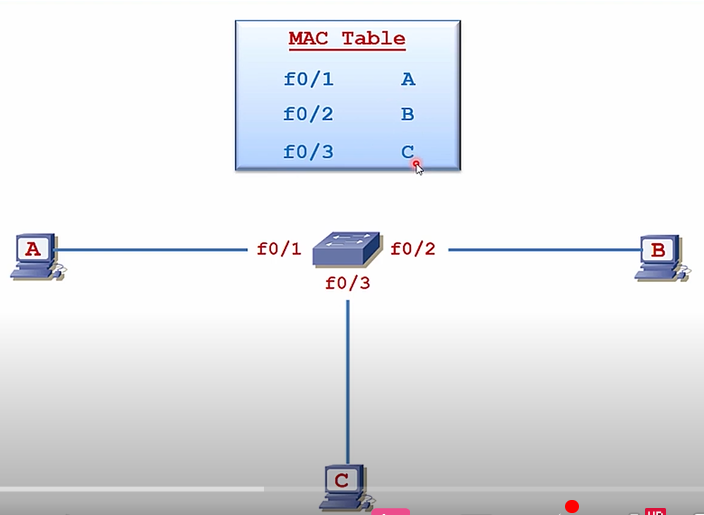
- Có 2 cột 1 là cổng kết nối đến switch và 2 là địa chỉ MAC
- Khi Từ một máy có địa chỉ MAC là A muốn gửi dữ liệu đến MAC đích là MAC B thì nó sẽ tìm kiếm MAC B trong cái bảng `MAC Table` từ trên xuống dưới và nó phát hiện nếu muốn đi đến MAC B thì phải đẩy dữ liệu đến port 2 tương tự với MAC C
### 3.4.1. Cách switch xây dựng bảng MAC 
- Khi Switch mới mua về hoặc chưa cấu hình thì sẽ không có bất kỳ dữ liệu nào và switch sẽ xây dựng MAC Table một cách tự động
- Khi nhận được bất kì một cấu trúc frame nào thì nó sẽ thực hiện 2 thao tác
	- Học MAC nguồn 
	- Forward địa chỉ MAC đích 
	- Nếu nó nhận được MAC nguồn là A trên port 1 thì lúc này nó sẽ cập nhật MAC A tương ứng với port 1  
	- B2: MAC đích lúc này là B tuy nhiên trong bảng MAC Table vẫn chưa có biết MAC B nên đi port nào nên nó sẽ forward ra tất cả các port trừ port nhận vào 
- Mỗi dòng thông tin trong bảng MAC Table chỉ được lưu trữ trong khoảng thời gian giới hạn khoảng 5 phút trong khoảng tg đó nếu không có bất kỳ dữ liệu nào được gửi tới port này nữa thì nó sẽ bị xóa khỏi bảng MAC Table: mục tiêu là làm tin gọn bảng `MAC add Table` làm tăng hiệu năng tiêu thụ 
- Để kiểm tra được bảng MAC address-table trên switch cisco thì ta dùng lệnh: **`show mac address-table`**
## 3.5. Các kiểu truyền thông trên mạng LAN
### 3.5.1. Unicast: 
- 1 máy tính gửi dữ liệu cho 1 máy tính 
### 3.5.2. Broadcast: 
- 1 máy tính gửi dữ liệu cho toàn bộ máy tính cùng mạng (FFFF.FFFF.FFFF)
#### 3.5.2.1. Boardcast Domain trên LAN
- Một BD khi mà một máy tính gửi ra lưu lượng này thì tất cả các thiết bị còn lại trong vùng mạng sẽ nhận được thông tin này 
- Trên 1 BD chỉ được sử dụng 1 lớp mạng duy nhất được thôi
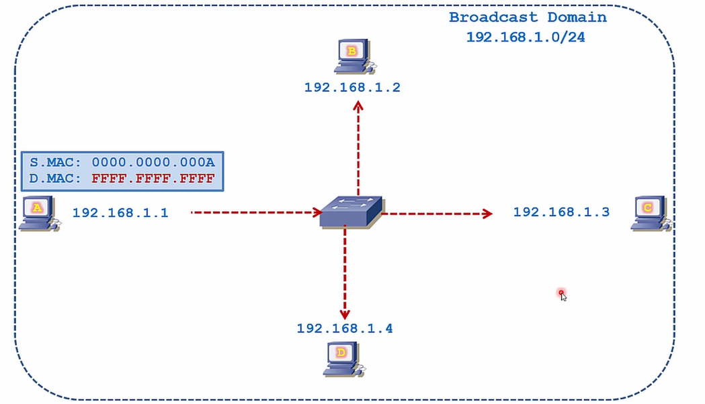
- BD mà quá lớn sẽ ảnh hướng đến performent của hệ thống và nguy cơ về bảo mật
- Nên chia 1 BD lớn thành nhiều BD nhỏ
- Mỗi cổng của Router được coi là 1 BD và sử dụng các lớp mạng khác nhau 
### 3.5.3. Multicast: 
- 1 máy tính gửi cho một nhóm thiết bị máy tính còn lại
## 3.6. Cơ chế hoạt động của giao thức ARP (Address Resolution Protocol) phân giải địa chỉ IP thành địa chỉ MAC
- Máy tính sử dụng giao thức ARP sử dụng để phân giải địa chỉ IP thành địa chỉ MAC tương ứng
- Khi một MT A muốn gửi dữ liệu cho MTB thì nó sẽ soạn thảo ra một cấu trúc frame (data, IP nguồn, IP đích) nó phải gắn thêm MAC nguồn và MAC đích nữa nhưng mà máy tính không biết MAC B là bao nhiêu nó phải căng cứ vào địa chỉ IP đích và nó phân giải được địa chỉ MAC đích tương ứng là gì 
- Để phân giải được từ địa chỉ IP sang MAC thì nó phải soạn thảo 1 bản tin là `ARP request` với MAC nguồn là A và MAC đích là FFFF.FFFF.FFFF nó sẽ gửi ra tất cả các máy tính còn lại và hỏi Ai có IP này thì hồi đáp địa chỉ MAC tương ứng
- Và request này khi gửi đến switch thì căng cứ vào địa chỉ MAC đích và sẽ đẩy địa chỉ ra tất cả các port trừ port nhận vào và PC nào có IP đó thì sẽ hồi đáp về PC A Thông qua bảng tin `ARP reply` 
- Và khi đó PC A sẽ biết được địa chỉ MAC B là của ai rồi sẽ bổ xung vào địa chỉ MAC đích của mình sau đó nó sẽ gửi dữ liệu đến switch và switch sẽ căn cứ vào địa chỉ MAC B này và đẩy ra đúng port với PCB
- Sau khi PCA nhận được bản tin `ARP reply` từ PCB hồi đáp về thì nó sẽ lưu trữ về cái bản `arp cache table`: `arp -a` và khi mà gửi dữ liệu cho PCB thì nó không cần phân giải thêm 1 lần nào nữa
## 3.7. Quá trính trao đổi dữ liệu giữa các phân vùng Mạng LAN
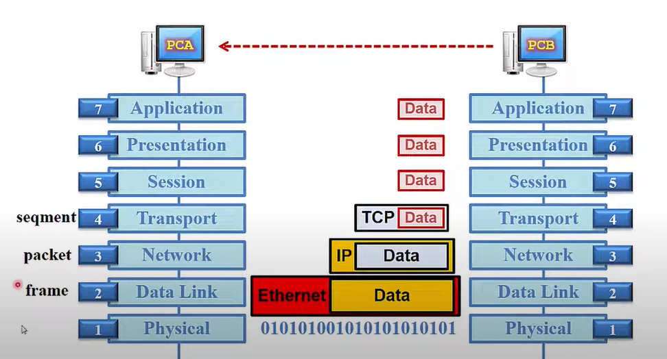
- Cấu trúc L3 header không bị thay đổi còn L2 header thì bị thay đổi trong quá trình truyền 
- Ngoài Ethernet L2 còn có các công nghệ khác như PPP truyền dữ liệu với khoảng cách xa hơn
## 3.8. Cấu trúc của địa chỉ MAC
- L2 Heder (Dest MAC, Source MAC, Type(cho biết nội dung Data chứa bản tin IP4 hay IP6 hay bản tin ARP))
- Data
- FCS: kiểm tra lỗi, căng cứ vào trường này để xem cacaus trúc frame có bị lỗi trong quá trình truyền hay không
- Địa chỉ MAC 48 bit chia làm 2 phần
  - 24 bit đầu tiên gọi là OUI (Organization Unique Identifier): ta có thể biết được do hãng nào sản xuất ra thường phải liên hệ với tổ chức cung cấp dải địa chỉ MAC để xin và mua được 24 con OUI này 
  - 24 bit cuối cùng (Vendor Assigned): để định danh cho từng card mạng họ sản xuất ra 
- Địa chỉ MAC được viết dưới dạng số hexa nếu địa chỉ MAC dài 48 bit nhị phân thì cứ 4 bit nhị phân gom thành 1 số hexa vậy nên ngta gom thành 12 số hexa 
- Cấu trúc số hexa như sau: cứ 2 hexa được ngăn cách bởi dấu : hoặc - hoặc cứ 4 số hexa ngăn cách nhau bằng dấu chấm 
  - VD: 6400.6A: Card mạng này do hãng nào sản xuất ra 
## 3.9. Các tiêu chuẩn công nghệ ethernet LAN
### 3.9.1. Ethernet
- IEEE 802.3 10BASE-TX
### 3.9.2. Fast Ethernet
- IEEE 802.3u, 100BASE-TX
- IEEE 802.3
### 3.9.3. Gigabit Ethernet
- IEEE 802.3u, 1000BASE-TX
- IEEE 802.3x
- IEEE 802.3ab
## 3.10. Hub và Switch 
- Cơ chế hoạt động của HUB 
- So sanh với Switch và HUB
  - Switch là thiết bị lớp 2 vì nó có thể đọc vào L2 Header đọc vào cấu trúc Ethenet header dựa nào MAC nguồn và MAC đích đẩy cấu trúc frame vào chính xác port 
  - HUB là thiết bị lớp 1 vì nó 0 có khả năng đọc vào L2 Header đọc vào cấu trúc Ethenet header khi mà chúng nhận được frame và chúng hiểu rằng frame này có tín hiệu 0101 trên môi trường truyền và lúc này sẽ khuếch đại tín hiệu này lên và gửi ra tất cả các port trừ port nhận vào, mặc định là nó sẽ đẩy Broadcard nếu nó nhận được thông tin từ bất cứ đâu gây giảm hiệu năng hệ thống và vấn đề bảo mật
### 3.10.1. Half Duplex (HUB)
- Chỉ có thể truyền thông tại 1 thời điểm chỉ có 1 thiết bị có thể truyền dữ liệu còn các thiết bị khác phải chờ 
- Gây ra giảm tốc độ chia sẻ băng thông tốc độ tối đa sẽ chia ra trên từng phân đoạn mạng
#### 3.10.1.1. Conllision Domain và cơ chế tránh đụng độ CSMA CD 
- Khi sd HUB thì xảy ra Conllision Domain chỉ có khả nawg sd half duplex nếu các thiết bị sd đồng thời thì có nguy cơ đụng độ xảy ra 

	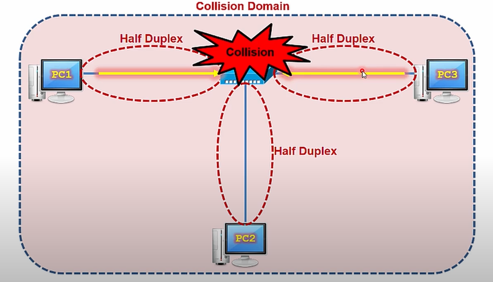
- Để hạn chế đụng độ thì sd switch vì mỗi port của switch được coi là 1 CD để chia CD lớn thành nhiều CD nhỏ thì sd switch trên hệ thống 

	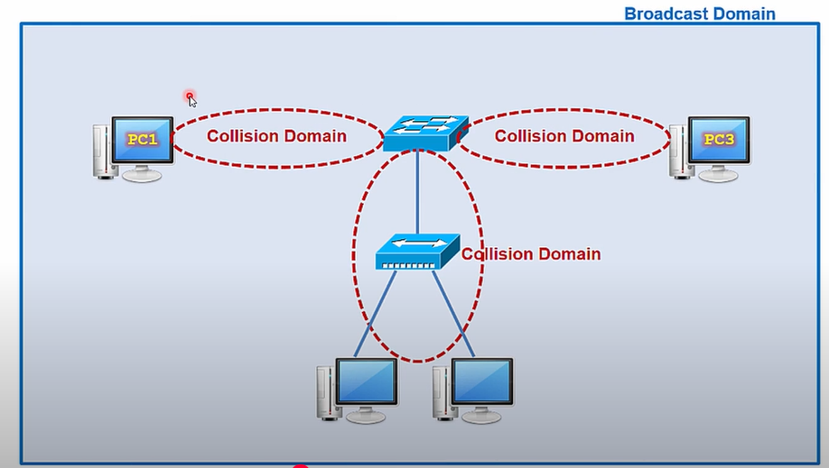
- Một BD thì có thể chứa nhiều CD 
- Càng có nhieuf CD càng tốt 
- Để trành được nguy cơ đụng độ xảy ra thì các tb phải có **cơ chế chống đụng độ CSMA/CD** (Đa truy cập cảm biến xung mạng)<p>
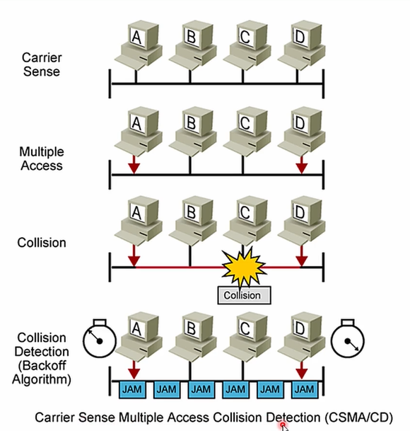
- Tự động bật nếu ở chế độ half duplex 
  - Cơ chế: Trước khi máy tính dụng độ thì nó sẽ lắng nghe mt truyền có ai truyền hay không và nếu không thì truyền trên mt này 
  - Nếu 2 tb cùng lắng nghe và thấy mọi mt đều đang rãnh và truyền dl thì đụng độ sẽ xảy ra 
    - Khi đó nó sd thuật toán Backoff đề xuất gt ngẫu nhiên và gửi 1 tín hiệu báo nghẽn và đợi hết tg rồi truyền dữ liệu
    - Tự đề xuất tham số time
- Xác định số lượng CD và BD
	- mỗi Port của sw có 1 CD 
	- Mỗi port của Router có 1 BD
### 3.10.2. Full Duplex (Switch)
- Chúng có thể truyền và nhận dữ liệu đồng thời
- Nên sử dụng
## 3.11. Chuẩn cáp Ethernet LAN
- Phân biệt cáp UTP và cáp chống nhiễu STP
### 3.11.1. Cáp đồng
	- Bên trong có 8 cứ 2 sợi thì lại xoắn lại với nhau để chống nhiễu
	- Có 2 loại UTP (0 có bọc chống nhiễu )và STP (có bọc chống nhiểu)
	- Có nhiều chuẩn phổ biến: 100BASE-TX và 1000BASE-TX
    	- Chữ T gọi là twisted pair 2 sợi nhỏ xoắn lại, giúp chống nhiễu và làm chắc
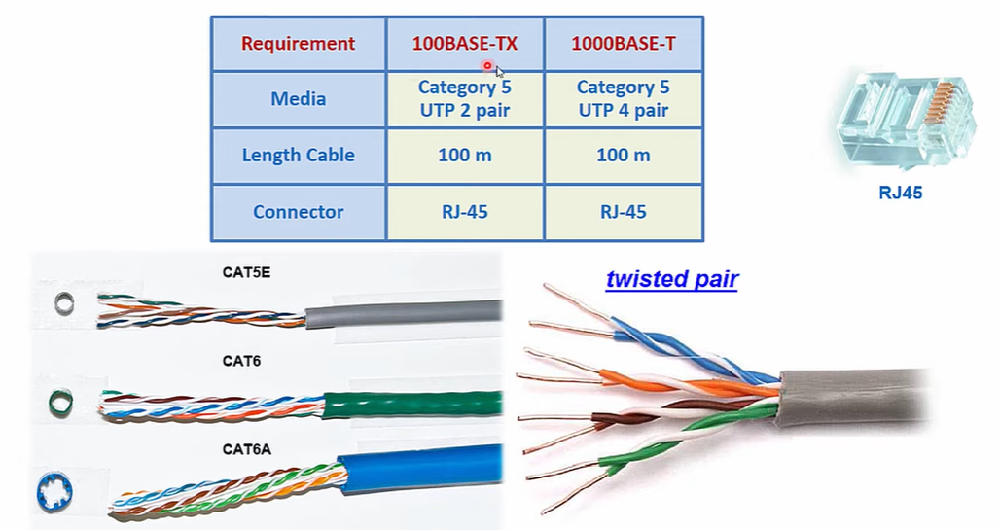
	- CAT càng cao thì loại Cáp đó càng tốt: CAT5E, CAT6, CAT6A sợi đồng càng dầy tốc độ tốt hơn
### 3.11.2. Cáp thẳng (Straight-Through)và cáp chéo (Cross-Over)
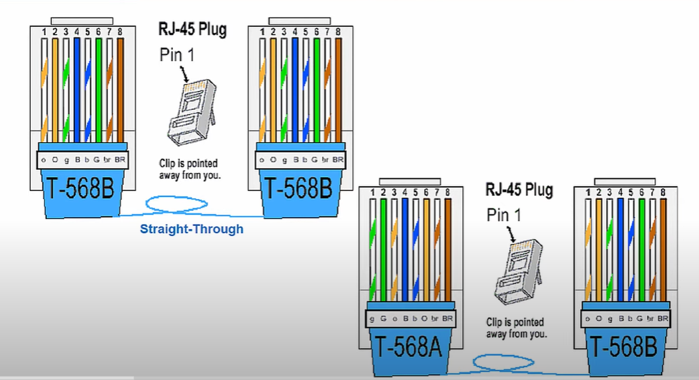
#### 3.11.2.1. Cáp thẳng 
- Đầu cáp được bấm theo chuẩn T-568B - T-568B
- Thứ tự màu sắc:B **`Trắng Cam, Cam Trắng xanh lá, Xanh dương, trắng xanh dương, xanh lá, trắng nâu, nâu`**
- Chân 1 tính từ trái sang phải theo màu sắc ở trên
- Các thiết bị khác nhau sẽ nối với nhau qua cáp thẳng
	- VD: sw - rt, sw - pc
	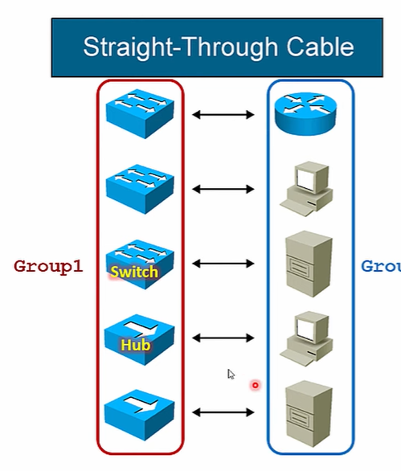
#### 3.11.2.2. Cáp chéo 
- Đầu cáp được bấm theo chuẩn T-568A - T-568B
- Thứ tự màu sắc:A **`Trắng xanh lá, xanh lá, trắng cam, xanh dương, trắng xanh dương, cam, trắng nâu, nâu`** 
- Chân 1 tính từ trái sang phải theo màu sắc ở trên
- Các thiết bị giống nhau sẽ nối với nhau qua cáp chéo 
	- VD: sw - sw, rt - rt, rt - pc, pc - pc 
	
	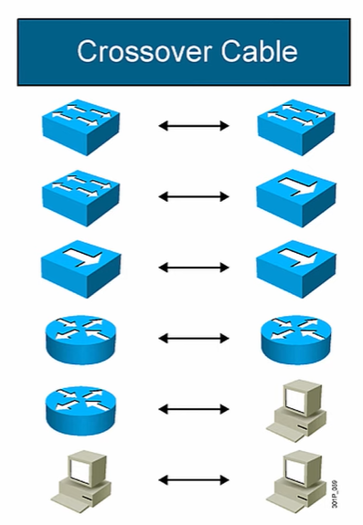
# 4. Địa chỉ IP 
## 4.1. IPv4
- Cấu trúc `IPv4` chia thành 2 phần 

	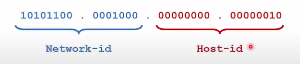
- net-id và host-id
- `Net-id` **giúp phân biệt mạng này với mạng khác còn** `host-id` **giúp định danh từng thiết bị bên trong vùng mạng**
- Địa chỉ IPv4 được thể hiện dưới dạng nhị phân thì có chiều dài là **`32bit`** nhị phân. Trên thế giới có khoảng **2<sup>32</sup> địa chỉ IPv4** **(4,29 tỉ địa chỉ)** và đã cạn kiệt từ lâu 
- Chuyển đổi số nhị phân sang số thập phân: **32 con số chia thành 4 cụm bằng nhau và mỗi cụm như vậy được gọi là `octet`**<p>
	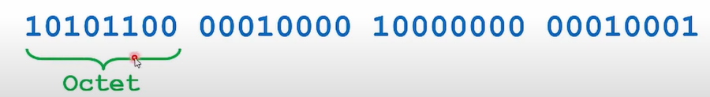
- Cứ `8bit nhị phân` thì sẽ đổi thành `1 số thập phân` <p>
	

### 4.1.1. Tổng quan về các lớp địa chỉ IPv4
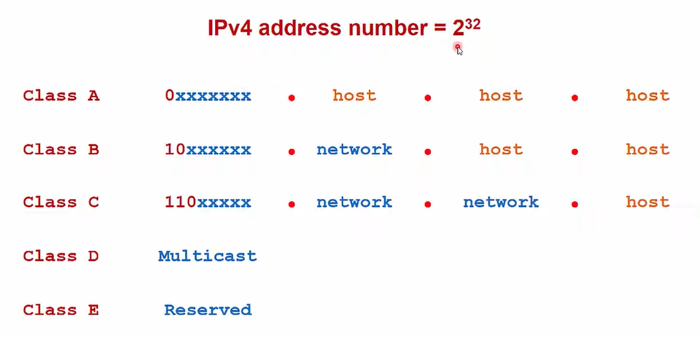
- Chia thành 5 lớp A, B, C, D, E
  - **Dãy D dùng trong công nghệ multicast** 
  - **Dãy E mang tính chất dự phòng**
  - Lớp C: `8bit` cuối cùng đóng vai trò là host-id vậy trong lớp mạng C có khoảng **2<sup>8</sup> địa chỉ IPv4**
  - Lớp B: `16bit` cuối cùng đóng vai trò là host-id vậy trong lớp mạng B có khoảng **2<sup>16</sup> địa chỉ IPv4** 
  - Lớp A: `24bit` cuối cùng đóng vai trò là host-id vậy trong lớp mạng A có khoảng **2<sup>24</sup> địa chỉ IPv4** 
- Một trong những lý do ngta chia thành các lớp A, B, C là tùy theo **quy mô, kích thước** của hệ thống mạng. Mục tiêu cuối cùng là `tiết kiệm không giam IPv4 `
- Để **phân loại lớp A, B, C** người ta dựa vào  `octect đầu tiên` cụ thể đối với: 
	- Lớp A: Trong số `8bit` đầu tiên thì `bit đầu tiên` luôn luôn bằng **0**. Chạy từ **[1 - 127]** thay đổi 7 bit còn lại
	- Lớp B: trong số `8bit` đầu tiên thì `2bit đầu tiên` luôn luôn bằng **10**:  **[128 - 191]** thay đổi 6 bit còn lại
	- Lớp C: trong số `8bit` đầu tiên thì `3bit đầu tiên` luôn luôn bằng **110**: **[192 - 223]** thay đổi 5 bit còn lại
- Chuyển đổi từ `prefix length thành subnet mask`
	- Đựa vào `net-id` để đổi thành prefix length
	- VD: 10.0.0.8 -> `lớp A`, 8 bit đầu làm net-id -> **/8** 
	- Chuyển thành subnet mask 
		- VD: **/24** thì viết ra 24 số 1 và các số sau bằng 0 hết cho thành 1 dãy địa chỉ IP và đổi từng cụm thành số thập phân 
		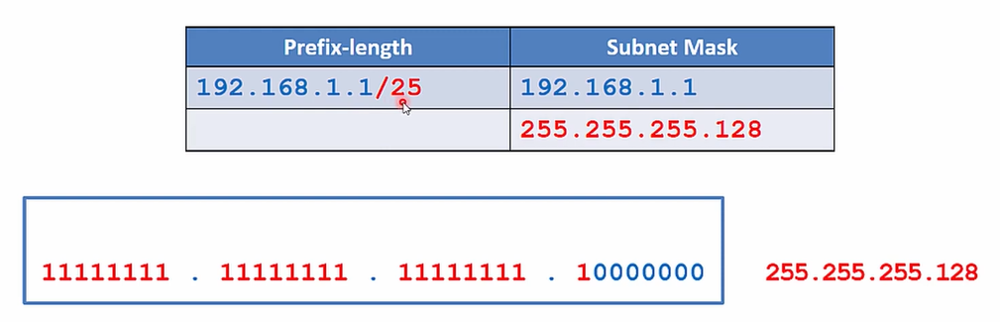
- Đổi từ nhị phân sang thập phân 
	- Chia 32 con số thành 4 cụm bằng nhau và đổi 8 bit thành 1 số thập phân
	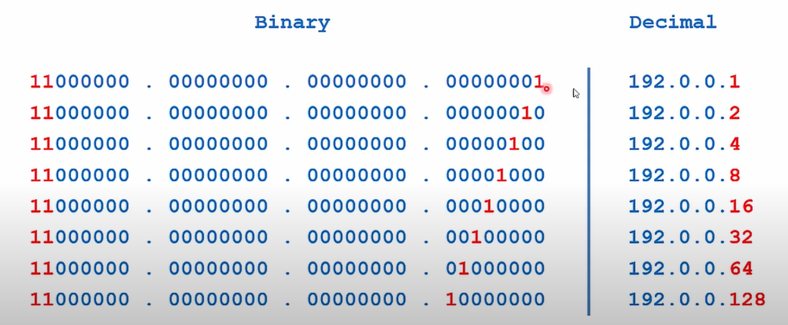
	- Tăng theo cấp số nhân `1, 2, 4, 8, 32, 64, 128`
	- Chuyển dổi octect từ nhị phân sang thập phân
	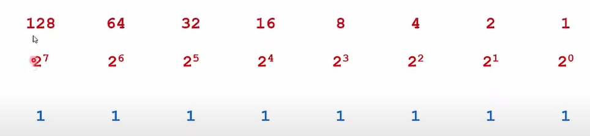
	- Chuyển đổi thập phân sang nhị phân
		- Đầu tiên viết 8 số giảm dần `1, 2, 4, 8, 32, 64, 128` sau đó đưa số đó vào phần lớn nhất rồi còn lại đưa vào các ô khác sao cho vừa đủ rồi đánh các số có khớp ở dưới thành 1 và các số không khớp ở dưới đánh 0
		- VD: 192 = 128 + 64 = 1100000
		- VD: 80 = 64 + 16 = 01010000
		- 170 = 128 + 32 = 160 + 8 + 2 = 10101010
		- Cộng chẵn lại còn lại thì chuyển đổi
		- VD: 187 = (128 + 32) + 27 = 160 + (16+8) + (2+1) = 10111011
### 4.1.2. Chức năng của địa chỉ mạng và địa chỉ Broadcast 
- Trong địa chỉ mạng dùng để đảm nhiệm cho 1 dãy IP nhất định nào đó
	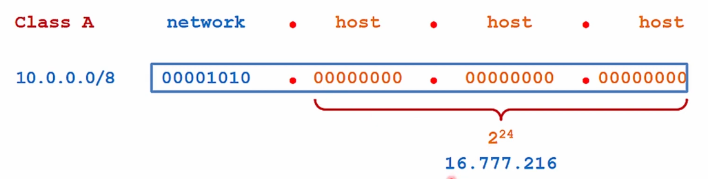
- Với các bit host bằng 0 hết thì là địa chỉ mạng
	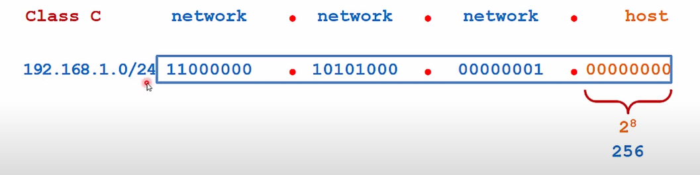
- Với dãy mạng trên thì ta có dãy địa chỉ từ [0-255] và địa chỉ đầu là net-add và địa chỉ cuối là Broadcast-add và không thể gán 2 địa chỉ ip này cho hệ thống 
	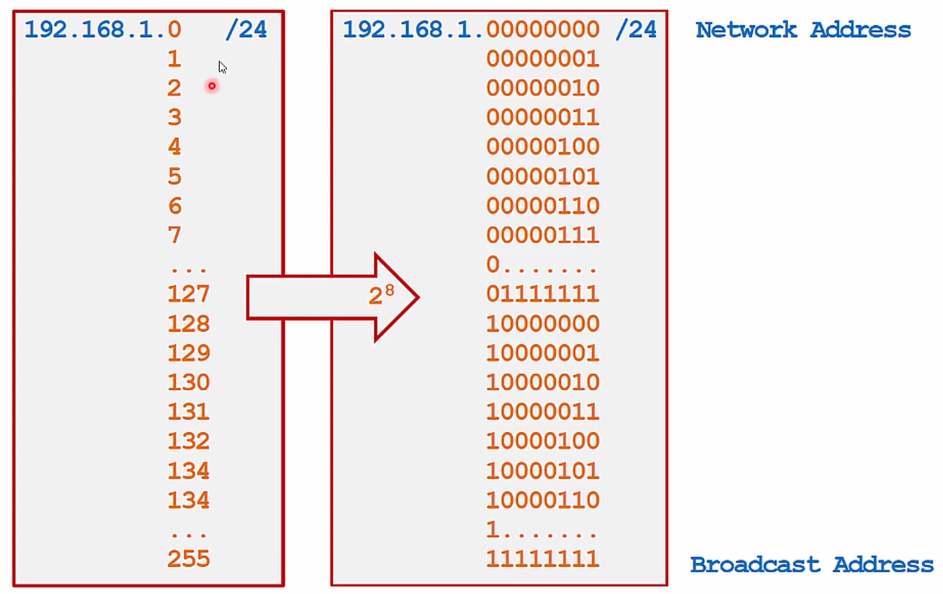
### 4.1.3. Chia mạng con Subnet
- Chia mạng lớn thành nhiều lớp mạng nhỏ 
	
    - Có nhiều bit đầu giống nhau thì gom nó thành 1 mạng mới 
- Số lượng mạng con subnet và địa chỉ IP trong mỗi subnet
	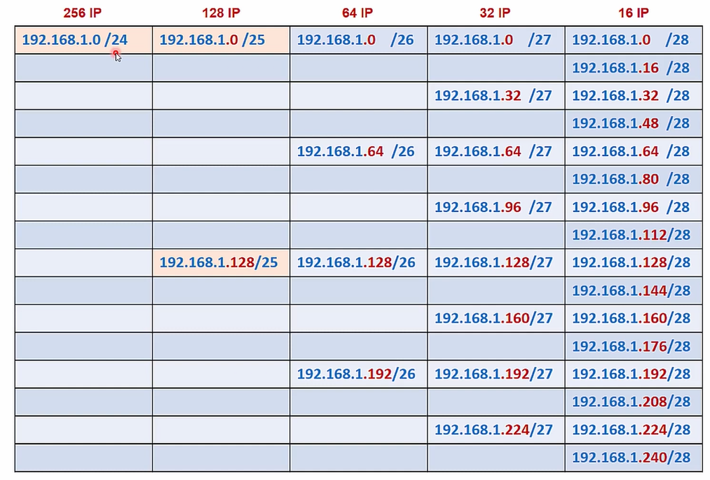
	- Chia đối số lượng host-id sẽ ra số lượng mạng con nhỏ hơn và một mạng lớn sẽ chia ra 2 mạng nhỏ 
	- VD: `/24` -> có `256 địa chỉ` -> /2 = 128 -> có 2 lớp mạng `/25` với mỗi lớp mạng sẽ có `128` địa chỉ IP
	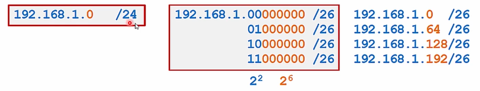
	- Từ `/24` -> `/26` -> mượn 2 bit của **host-id** còn `6bit ở host-id` với 2^2 -> 4 mạng con chia ra 4 trường hợp 00 01 10 11 và các bit sau cùng là 0 hết thì ra địa chỉ mạng lớp `/26` 
	- Hoặc sử dụng phương pháp bước nhảy host-id có 2^6 = 64 cứ lấy từ 0 + 64 rồi + tiếp cho 64 thì sẽ ra lớp mạng tiếp theo
	- Dễ hiểu thì lấy bit net mượn 2^n = m thì có m lớp mạng con tương ứng và bit host còn lại 2^t = j cho biết j là lớp mạng mới 
### 4.1.4. Quy hoạch IPv4
- Xác định số lượng địa chỉ mạng tối đa mà cần phải có 
	
- VD: quy hoạch địa chỉ `192.168.1.0/24` 
	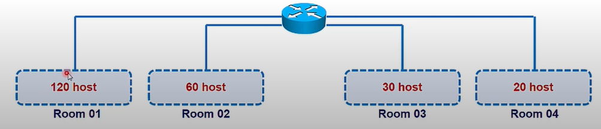
	- Ta sẽ đi từ vùng mạng cần nhiều IP nhất sau đó đến lần lượt các mạng con sau
	- 120 host -> `/25` -> 192.168.1.128/25
	- 60 host -> `26` -> 192.168.1.64/26 -> 192.168.1.127/26
	- 30 host -> `27` -> 192.168.1.32/27 -> 192.168.1.63/27
	- 20 host -> `27` -> 192.168.1.0/27 -> 192.168.1.31/27
### 4.1.5. Địa chỉ Public và Private
- Địa chỉ Public phải mua và được cấp từ nhà mạng
	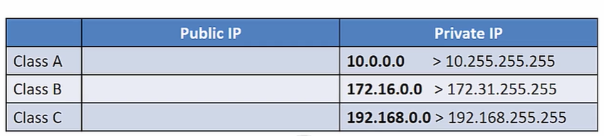
## 4.2. IPv6
# 5. Router 
## 5.1. Cấu hình router cisco
### 5.1.1. Các câu lệnh
- User EXEC Mode: > `enable`
- Privileged EXEC Mode: # config t
- Global Config Mode: (config)#
- Show run 
- int f...
  - ip add `ip subnet` hoặc ip add dhcp
  - no shut
- Xem địa chỉ ip trên các cổng: `show ip int brief`
- show int f...
- Chống trôi dòng lệnh: `logging syschronous` giúp xuống dòng và chố bỏ qua các dòng lệnh, thông báo quan trọng
- Phân giải tên miền ip: `ip domain-lookup`
	- ip host PCA 192.168.1.2
	- ping PCA
- Lưu cấu hình: wr copy run
- Xóa cấu hình và khởi động lại tb với cấu hình trắng: `erase start -> reload`
- Mã hóa password: `service password-encryption`
- Lưu cấu hình lên TFTP 
	- copy run tftp: 
	- copy tftp: run
- Lưu cấu hình lên FTP server
	- ip tfp username anphuc
	- ip tfp password anphuc
	- copy run ftp:
	- copy ftp: run
- Lưu hệ điều hành lên TFTP: 
	- show flash: 
	- copy flash: tftp: 
### 5.1.2. Thiêt lập mật khẩu Console và MK enable
- MK console
    - Câu lệnh `line console 0` (0 là cổng console mặc định nếu router có 1 cổng )
    	- `password abc`
    	- `login`
- MK Enable password:
	- enable password
- Tính năng tự đăng xuất Exec-Timeout: `exec-timeout 1 30 `(1 phút 30s)
# 6. Giao thức CDP (Cisco Discovery Protocol)(Phát hiệt thiết bị láng giềng)
- Xem các thiết bị láng giềng: `show cdp neighbors` 
	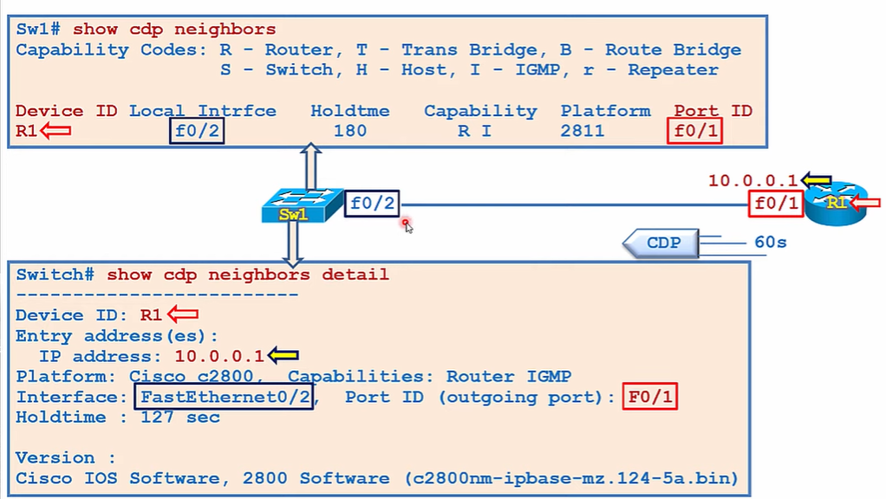
- Phát hiện được là router hay firewall hay port nào kết nối 
- Biết được dòng sản phẩm
-  show cdp neighbors detail
-  CDP được kích hoạt mặc đinh trên các thiết bị cisco và cứ định kì 60s 1 lần sẽ gửi CDP qua thiết bị gần đó và nó chứa tất cả thông tin liên quan đến thiết bị gửi 
-  Khi tb nhận nhận được CDP của bên láng giềng gửi cho nó thì nó lưu giữ thông tin trong vòng 180s
- Cơ chế là nó sẽ gửi Broadcard ra tất cả các tb mỗi 60s 1 lần 
- Tắt cdp bằng cách truy cập vào port và: `no cdp enable`
- Tắt cdp ra tất cả các port: `no cdp run`
- Giao thức tương tự **lldp (link layer Discovery Protocol)** hỗ trợ trên những hãng khác nữa
	- lldp run
	- lldp enable (trên cổng )
	- show lldp neighbors
# 7. Telnet
- Kỹ thuật kết nối từ xa cho thiết bị phục vụ cho việc cấu hình 
- Sử dụng `port 23`
## 7.1. Cấu hình 
- Bật telnet trên Cisco: 

	```
	line vty 0 4 (5 người được phép đồng thời telnet)
	password anphuc
	login
	```
- Kiểm tra người kết nối: `show users`
- Xóa phiên kết nối: `clear line ...`
- Thay đổi hoặc gỡ bỏ mk telnet: `no password`
### 7.1.1. Cấu hình xác thực bằng Username và mật khẩu
	```
	username anphuc password anphuc123
	line vty 0 4 
		no password
		login local
	enable password anphuc (phải bật mk enable lên thì mới được)
	```
### 7.1.2. Cấu hình telnet không cần mật khẩu
	```
	line vty 0 4 
		no login
	enable password anphuc
	```
- Cấp độ mức của tài khoản: `privilege level 15` mỗi tài khoản khi cấu hình sẽ có 1 mức độ giới hạn truy cập khác nhau nếu điều chỉnh level
### 7.1.3. Config lock: **Chỉ cho phép 1 người cấu hình thiết bị tại 1 thời điểm**: `configurlation mode exclusive auto`
	- `do show configuration log`
### 7.1.4. Thay đổi port dịch vụ
- Sử dụng 1 port khác thay vì port 23, tạo access list cho phép truy cập vào port 3001 sau đó áp dụng access-list đó lên router và mở port 3001
	```
	access-list 101 permit tcp any any eq 3001
		- any đầu liên là bất kỳ địa chỉ nào tới 
		- any thứ 2 là bất kỳ địa chỉ nào trên con router
	line vty 0 4
		rotary 1 (+3000 = 3001)
		access-class 101 in
		password ...
		login
	enable pass ...
	```
- Cách xem được mk sd wireshark khi telnet
	- Chọn đúng card mạng
	- Sau đó lọc các luồn `TELNET`
	- Chuột phải -> Follow -> TCP stream
- nếu truy cập bằng port 3001 
	- tcp.port==3001
## 7.2. Kỹ Thuật AAA hỗ trợ xác thực và phân quyền Telnet trên thiết bị
# 8. SSH (Secure Shell)cấu hình thiết bị từ xa
- Hỗ trợ dịch vụ mã hóa, mọi tt username và password, và mọi câu lệnh thực thi cũng đều được mã hóa 
- Sử dụng port mặc định là `22`
	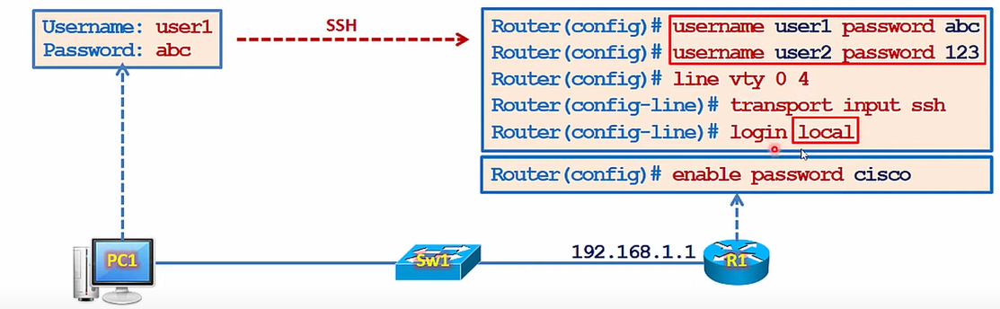
	- transport input ssh: nếu ssh không đươch thì telnet
- Mọi thông tin về username, password trước khi được gửi tới router thì nó sẽ được mã hóa bằng 1 password hay còn gọi là key
- Key được thỏa thuận giữa 2 bên và key này được sử dụng để mã hóa dữ liệu
	- SSHv1: 3DES
	- SSHv2: AES
	- Được mã hóa thông qua mã hóa bất đối xứng SSH server đứng ra sinh ra 1 cặp `public key` và `private key`. Có ưu điểm nếu muốn sd public key để mã hóa dữ liệu thì muốn giải mã thì cần private key 
- Quá trình thỏa thuận gtri password của mã hóa bdx diễn ra như sau :
	- R1 là SSH-server sẽ sinh ra cặp `public key và private key`
	- Public key thì sẽ **`công khai` cho client biêt được** - PC1 phát sinh ra password này bằng `1 thuật toán ngẫu nhiên`
	- Tiến hành lấy `pulic key` kết hợp với `thuật toán mã hóa bất đối xứng RSA` để `mã hóa` password thành chuỗi bị mã hóa 
	- `Private key` kết hợp với `RSA` để `giải mã`
	- Và chỉ có Router sở hữu cái private key mới có thể giải mã được mã hóa này
	- tìm cách gửi bí mật cái mật khẩu này cho R1
	- Sử dụng mật mã này để mã hoa dữ liệu
## 8.1. Câu lênh cấu hình
- Khai báo host name sau đó khai báo ip domain-name 
	```
	hostname DN
	ip domain-name anphuc.vn
		crypto key generate rsa (Khai báo rsa)
		768 (Khai báo chiều dài pulic key và private key)
	ip ssh version 2
	show ip ssh 
	show ssh
	```
# 9. Định tuyến
## 9.1. Định tuyến tĩnh (Static Route)
- Đối với các dãy mạng khác nhau nhưng đều nằm cùng trên 1 con router thì không cần khai báo định tuyến tĩnh chỉ cần các thiết bị trong vùng mạng trỏ đúng tới cái default-gateway thì nó sẽ thông được với nhau 
- Kiểm tra định tuyến: `show ip route`
	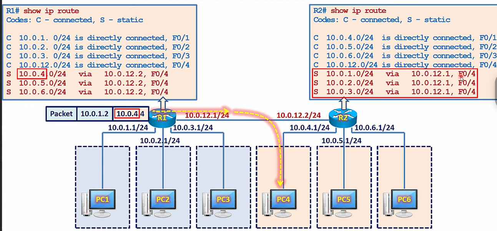
- Nếu 2 router khác nhau thì các dãy mạng ở mỗi router không thể kết nối được với nhau bởi vì bảng định tuyến ở mỗi router đều không có đường đi đến lẫn nhau cho nên phải thêm đường đi cho chúng 
	- R1
	```
	ip route 10.0.4.0 255.255.255.0 10.0.12.2
	ip route 10.0.5.0 255.255.255.0 10.0.12.2
	ip route 10.0.6.0 255.255.255.0 10.0.12.2
	```
	- R2
	```
	ip route 10.0.1.0 255.255.255.0 10.0.12.1
	ip route 10.0.2.0 255.255.255.0 10.0.12.1
	ip route 10.0.3.0 255.255.255.0 10.0.12.1
	```
### 9.1.1. Cơ chế hoạt động của Static Route
- Đọc vào IP đích , kiểm tra bản định tuyến sau đó hồi đáp về lại theo đúng cổng với dữ liệu có trong bản định tuyến
- Nếu nó thấy IP không nằm trong bản định tuyến thì nó sẽ tiến hành hủy bảng tin. 
- Default route: Thông thường trên 1 Router muốn gửi dữ liệu ra ngoài internet thì bản thân con router này phải có 1 route đặc biêt là `default route` nó sẽ đại điện cho tất cả các route có thể có ở ngoài internet
	- ip route 0.0.0.0 0.0.0.0 f0/0 (Hạn chế sử dụng outbout interface -> giảm hiệu năng trong quá trình sử dụng)
	
- Và muốn dữ liệu mạng bên trong đi ra được internet thì ta cần NAT để có thể đi ra được internet
	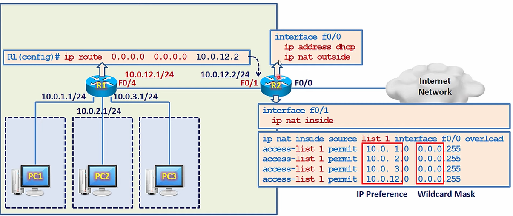
### 9.1.2. Cơ chế Proxy ARP trong định tuyến
- Proxy ARP nếu không sd cẩn thận thì nó sẽ làm tăng hiệu năng sử dụng mạng
- Nếu IP next-hop là 1 địa chỉ IP thì nó sẽ dễ dàng đi tới được đích hơn là để cổng 
- Ví dụ có 2 vùng mạng từ PCA sang PCB như ở hình:
	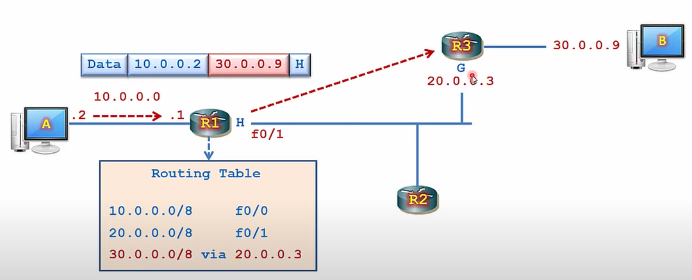
	- Thì PCA sẽ soạn thảo bản tin [data|10.0.0.2|30.0.0.9] có ip nguồn và ip đích
	- Sau đó nó chuyển đến router, router sẽ đọc vào IP đích và tìm trong bản định tuyến và nó thấy muốn đi đến lớp mạng `30.0.0.9` thì cần gửi bản tin qua ip net-hop `20.0.0.3` 
	- Thường thì trước khi gửi bản tin qua phân đoạn mạng chính xác thì nó phải bổ xung thêm, MAC nguồn và MAC đích nữa 
	- Và lúc này MAC Nguồn là MAC của chính nó, MAC đích là MAC của next-hop `20.0.0.3` và để xác định được thì nó phải gửi ra 1 bản tin `ARP request` để hỏi thăm xem địa chỉ MAC tương ứng với next-hop đó là gì
	- Và khi R2 có địa chỉ `20.0.0.3` nhận được `ARP request` từ R1 gửi tới thì nó sẽ hồi đáp lại bằng `ARP reply` với `địa chỉ MAC` tương ứng của nó
	- Và lúc này R1 chỉ cần bổ xung thêm MAC đích vừa nhận được sau đó gửi dữ liệu đi khi R3 nhận được thì nó sẽ sử lý bản tin của nó.Nó đọc vào IP đích và gửi ngược về lại đúng với địa chỉ IP đích cần gửi
	- Đứng tại R1 có thể kiểm tra được thông tin ARP do R3 hồi đáp trở về: `show arp`
- Tuy nhiên thay vì trỏ tới `Ip net-hop` thì ta vẫn có thể chọn giải pháp `outbout interface`, tuy nhiên nó làm chậm hiệu năng của hệ thống và làm chậm quá trình định tuyến của hạ tầng mạng 
- Tiếp tục với trường hợp gửi dữ liệu trên thì thay vì là net-hop thì sẽ thay thành cổng 
	- Dữ liệu đi đến R1 thì vẫn gắn MAC nguồn MAC đích, và gửi ARP request ra và R2 gửi ARP reply gửi về bởi vì R2 biết đường đi đến địa chỉ đích nên nó tuyên bố `30.0.0.9` tương ứng là địa chỉ MAC của chính nó, dù là địa chỉ này không phải là địa chỉ của R2 nhưng nó biết đường đi đến.
	- Là khi R1 nhận được ARP reply về thì nó lưu trữ về cache ARP, và quá trình gửi dữ liệu thành công
	- Tuy nhiên nếu IP đích là `30.0.0.8` thì nó lại request xong đó R2 nó cũng tuyên bố tương tự là MAC của chính nó tương tự với các địa chỉ trong cùng lớp mạng đó -> Và bản ARP table thành ra rất nhiều nên sẽ làm ảnh hưởng đến hiệu năng và khả năng định tuyến của Router này
### 9.1.3. Cấu hình cân bằng tải Loadbancing
- Tại router ta có 2 đường đi đến mạng đích thì lúc này ta có thể cấu hình 2 static route đến cùng mạng đích này 
	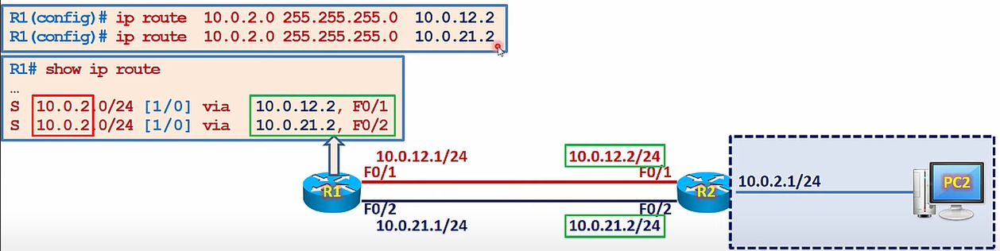
- Lúc này thì dữ liệu sẽ được cân bằng tải theo cả 2 hướng là F0/1 và F0/2 với tỉ lệ 50% và khi một cổng bất kì gặp sự cố thì tất cả các lưu lượng sẽ đổ qua cổng còn lại đảm bảo không bị gián đoạn dữ liệu trên hệ thống.
	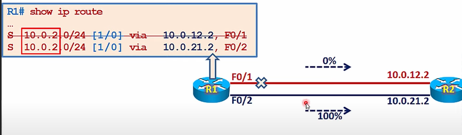
#### 9.1.3.1. Định hướng lưu lượng bằng cách hiệu chỉnh tham số AD (Administrative Distance) của Static route
- Theo nguyên tắc là AD càng nhỏ thì đường đó càng tin cậy 
	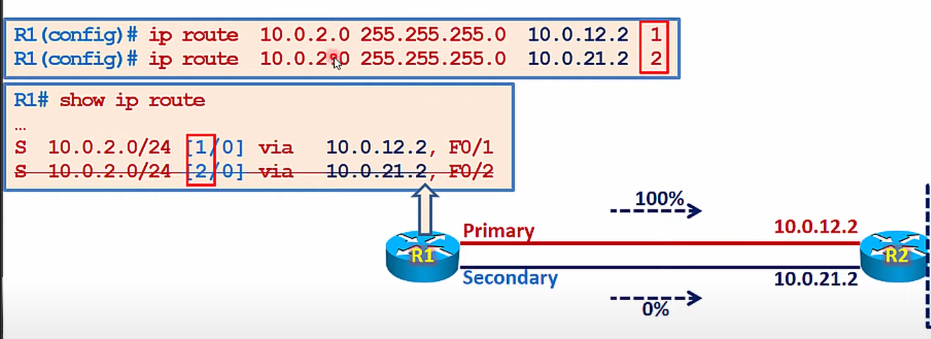
	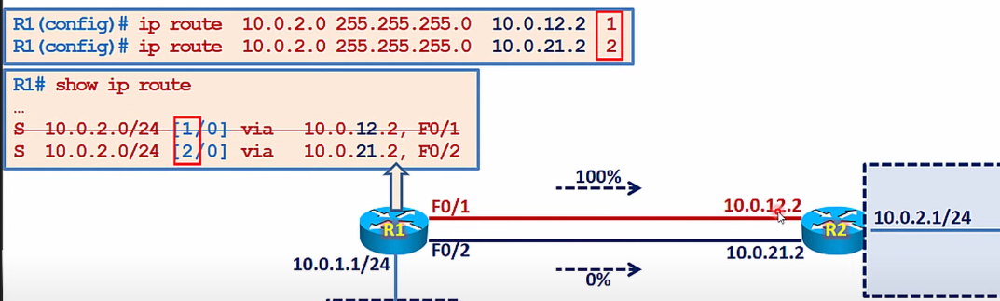
	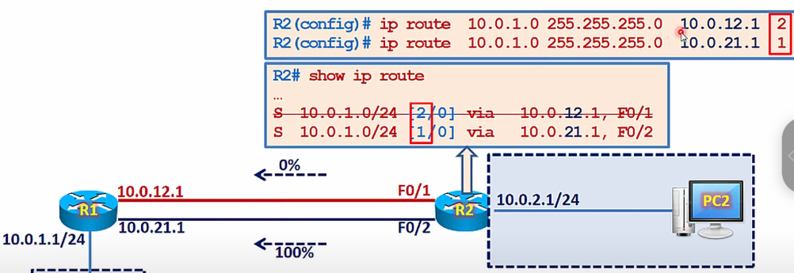
- Đường LAN trên đi đường trên, LAN dưới đi đường dưới 
- Nếu muốn 2 đường bằng nhau thì chỉnh AD bằng nhau 
#### 9.1.3.2. Tối ưu định tuyến bằng kỹ thuật Summary (CIDR) (Classless Inter-Domain Routing)
- Nếu áp dụng giúp định tuyến của ta nhanh hơn 
- Nếu ta muốn định tuyến cho 255 mạng thì ta phải cấu hình bằng  tay rất lâu 
	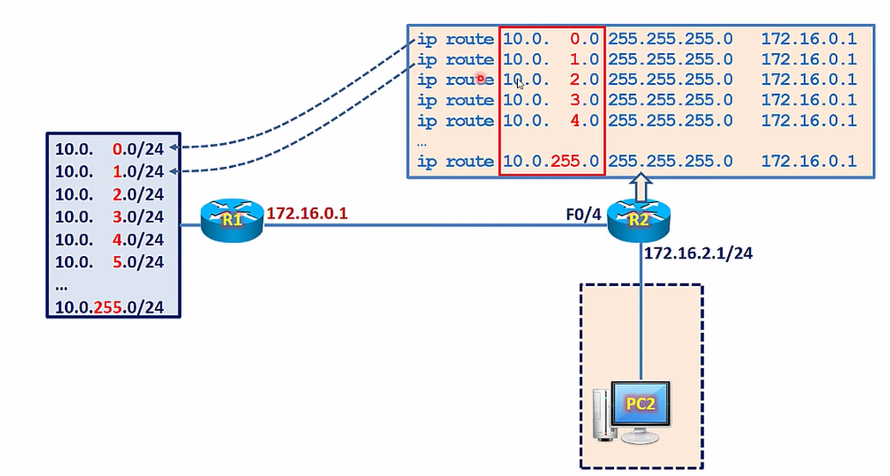
- Nếu áp dụng kỹ thuật summary thì R 2 có thể gửi được dữ liệu đến tất cả mạng LAN 
	- `ip route 10.0.0.0 255.255.0.0 172.168.0.1`
	- Gom các bit giống nhau 
## 9.2. Định tuyến động (Dymaic Routing protocol)
- Các loại giao thức định tuyến động thường thấy: BGP, RIP, OSPF, IS-IS
- Định tuyến phân loại thành 2 nhóm giao thức: `Interior Gateway` và `Exterior Gateway`
### 9.2.1. Interior Gateway (Định tuyến nội vùng)
- Được chia thành 2 nhóm giao thức:
#### 9.2.1.1. Distence Vector 
- Giao thức phổ biến `RIP`
- Ưu điểm: `Không tiêu tốn nhiều tài nguyên xử lý của thiết bị` bởi vì thuật toán chọn đường đi của Distence Vector **tương đối đơn giản**
- Nhược điểm: Tiêu tốn quá nhiều thời gian để chọn được 1 đường đi hợp lý
##### 9.2.1.1.1. RIP (Routing Information Protocol)
- Câu lệnh kiểm tra bản rip: `show ip route rip`
- Khi từ 1 Router có nhiều đường đi tới mạng đích thì ta nên triển khai mô hình định tuyến động
	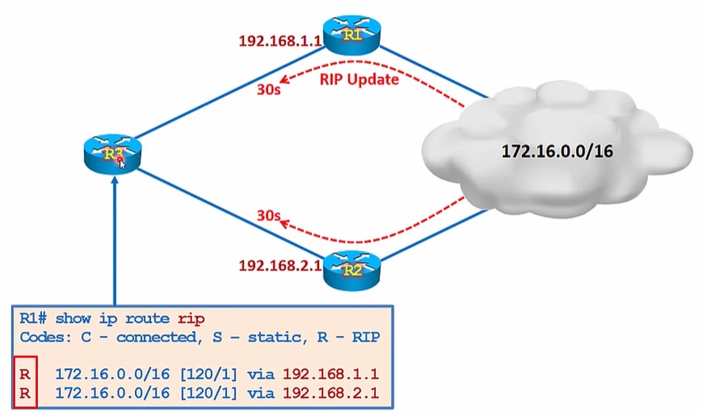
- Và các Router đã bật RIP thì nó sẽ quảng bá cái mạng của mình cho các thiết bị lân cận mỗi 30s 1 lần 
- Và các Router nhận được thông tin quảng bá đến thì nó sẽ học được đường đi đến các mạng khác.
- Nếu phân đoạn mạng bất kỳ mà gặp sự cố thì Router sẽ thông báo cho các Router còn lại cái đường đó không còn truy cập được nữa và các router sẽ xóa cái đường đi đó trên bản định tuyến của mình
- Lựa chọn đường đi tối ưu dựa vào tham số AD (Adminstrative Distance) 
	- Những Route học được từ giao thức RIP sẽ có AD là 120 còn nếu học được từ giao thức OSPF sẽ có ad là 110 
	- AD càng thấp thì sẽ được ưu tiên, tin cậy
	- Route có ad thấp hơn sẽ được sử dụng trong suốt quá trình trao đổi dữ liệu
- *Metric: Đường nào có Metric thấp hơn thì đường đó sẽ tốt hơn
	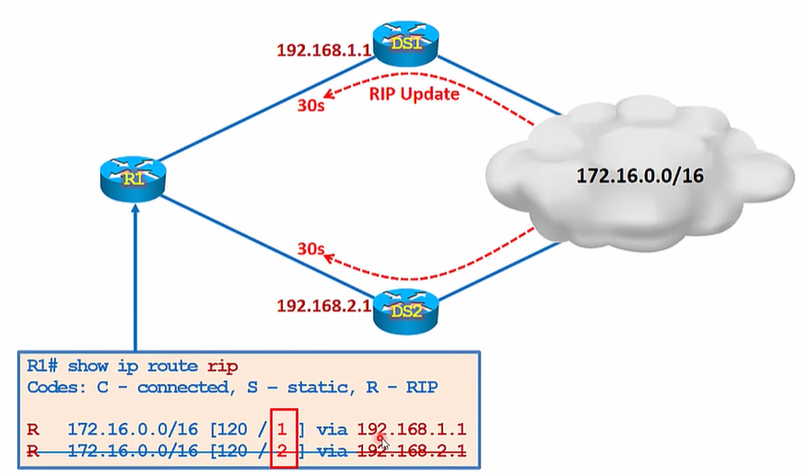
	- Nếu đường có metric nhỏ hơn gặp sự cố thì cái đường có metric cao hơn sẽ xuất hiện trong bản định tuyến và đi theo đường này 
	- Cách tính metric: dựa vào hop count 
- Cơ chế hoạt động của RIP:
	- Sẽ quảng bá những thông tin mà nó biết cho R2 láng giềng cứ mỗi 30s 1 lần 
	- Và sau khi R2 láng giềng học được các mạng của R1 thì nó lại tiếp tục quảng bá cho R3 
	- Và khi R3 nhận được bản tin định tuyến từ R2 gửi qua thì nó cập nhật lại bảng định tuyến của nó
	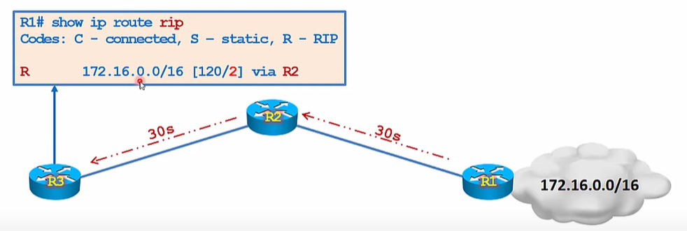
	- Từ R3 ta thấy muốn đi qua mạng 172.16.0.0/16 thì phải đi qua 2 router R1 và R2 nên -> Hop Count = 2 
	- Nếu có 1 đường từ R1 -> R3 thì R3 sẽ học được đường đó và cập nhật lại bảng định tuyến với Hop Count = 1 và có 2 hướng đi đến mạng `172.16.0.0/26` thì nó quyết định đường tốt hơn và ẩn đường còn lại
	
	- Cách tính đường đi dựa vào Hop Count sẽ gây ra nhiều vấn đề: 
		- Chỉ quan tâm đường nào ngắn nhất nhưng tốc độ băng thông đường đó lại thấp hơn so với đường có Hop Count lớn hơn
	- Tóm tắt cơ chế hoạt đông: cứ 30s 1 lần thì Router sẽ có những thông tin gì trong bảng định tuyến thì nó sẽ gửi hết qua cho thiết bị láng giềng với metric là 0 và router láng giềng sẽ kiểm tra những mạng mà router vừa gửi qua có trong bảng định tuyến của nó hay chưa nếu mà chưa có thì nó sẽ cập nhật vào bảng định tuyến và nó sẽ + metric thêm 1 và gửi ngược lại tất cả mạng mà nó biết qua router láng giềng lại. Và sau 1 khoảng 1 tg nhất định thì các con router sẽ học đươc route của nhau
    - **Cơ chế chống loop Split Horizon**
    	- Nếu mạng ở router gặp sự cố và ngay lập tức nó sẽ xóa cái đường đi đến mạng đó sau đó router láng giềng vẫn còn cái thông tin đi đến mạng đó và nó bắt đầu quảng bá ngược lại cái đường đi cho route và nó sẽ học được và + metric thêm 1 đơn vị và nó có nguy cơ bị loop.
    	- Vì bản thân con router đã quảng bá cái mạng đó và nó lại học ngược trở về cái mạng đó. Đó là nguyên nhân khiến nó bị loop 
    	- Để tránh loop xảy ra ta nên bật cơ chế chống loop: Nếu mà đứng tại R2 học được đường đi đến mạng `10.0.0.0/8` từ R1 và khi mà nó quảng bá ngược về mạng mà nó biết trong bảng đinh tuyến từ router láng giềng nó sẽ loại các mạng mà nó học được từ láng giềng này trước đó và R1 không học được đường đi tới và loop không còn xuất hiện nữa
    	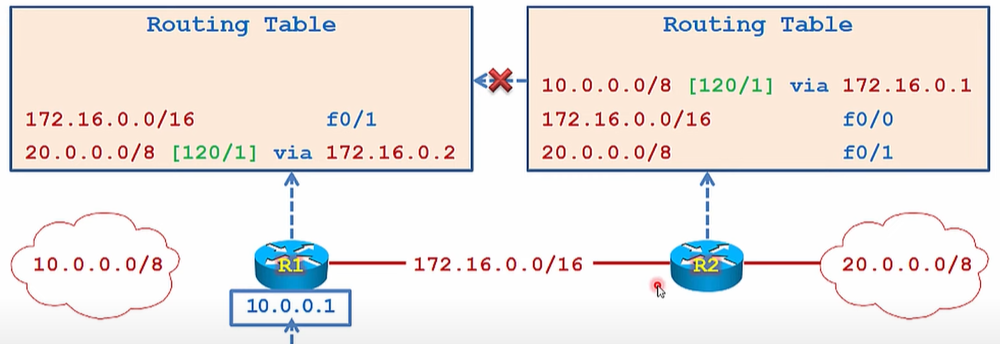
    	- Cơ chế này tự động được bật khi cấu hình RIP
    	- Có thể tắt bằng cách vào cổng đó và `no ip split-horizon`
- Đối với giao thức RIP thì cái metric tối đa chỉ là 16 mà thôi 
	- Nếu đường có metric = 16 thì nó không bao giờ sd vì đường có nguy cơ bị loop 
- Các bộ Timer trong RIP
	- Để khảo sát độ hội tụ của Timeer ta cần khảo sát 3 bộ Timer sau:
		- Update: 30s
		- Invalid: 180s 
		- Flush: 240s
	- Trường hợp đường đi đên mạng gặp sự cố và sau 30s vẫn không nhận được thông tin định tuyến thì nó vẫn duy trì cái đường đi đó trong vòng 180s nữa kể từ lúc nhận được thông tin định tuyến từ router láng giềng gửi qua
	- Sau khoảng 180s mà Router vẫn không nhận được thông tin định tuyến từ Router láng giềng thì nó sẽ tăng metric tối đa là 16 và tiếp tục quảng bá cái mạng này cho những con router khác biết ám chỉ mạng này đang gặp sự cố và nó sẽ duy trì trạng thái đó trong vòng 60s nữa và sau 240s thì chính thức xóa mạng đó khỏi thông tin định tuyến.
	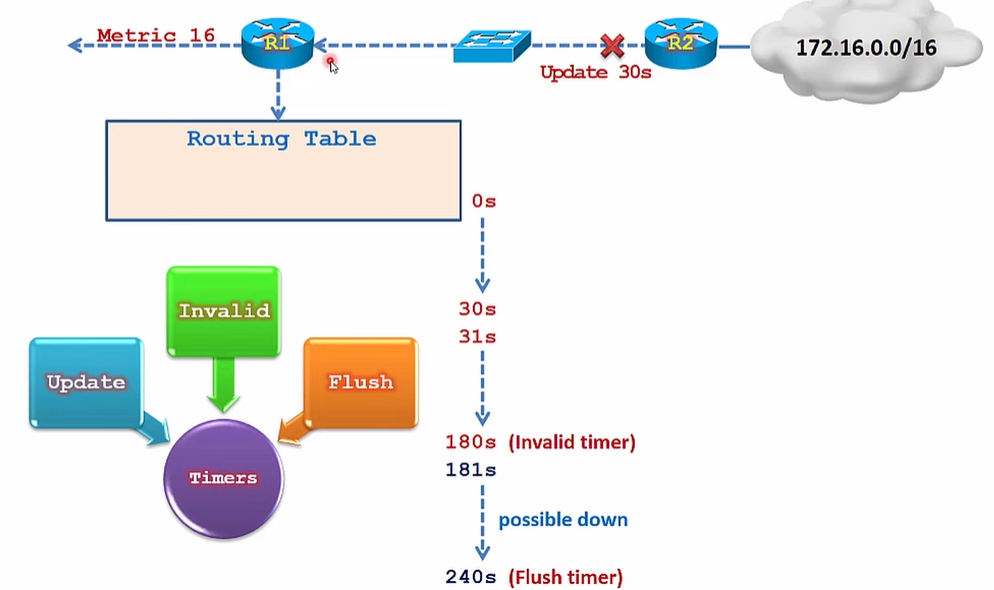
- RIPv1 và RIPv2
	- RIPv2 ra đời để khắc phục nhược điểm của RIPv1 
	- Những tb chạy RIPv2 không có khả năng tương thích với RIPv1 và các con router sẽ không học được route của nhau 
	- Bởi vì ở RIPv1 sẽ quảng bá những mạng thông qua giao thức là `broadcase` còn RIPv2 sẽ quảng bá thông qia giao thức `Multicase` `224.0.0.9` chỉ có những con router nào đang chạy RIPv2 thì mới nhận được bản tin từ RIPv2 gửi tới
	- Và RIPv1 được xếp vào nhóm giao thức `classful` khi mà quảng bá định tuyến thì nó chỉ quảng bá `địa chỉ mạng` mà thôi còn RIPv2 được xếp vào nhóm giao thức `classless` tức là nó sẽ quảng bá `địa chỉ mạng và subnet mask`
		- Sự khác nhau chính là router nếu đọc vào ocetec từ RIPv1 gửi tới thì nó sẽ tự quyết định lớp mạng A, B hay C còn RIPv2 có subnet mask thì sẽ biết chính xác prefix length cụ thể là bao nhiêu
	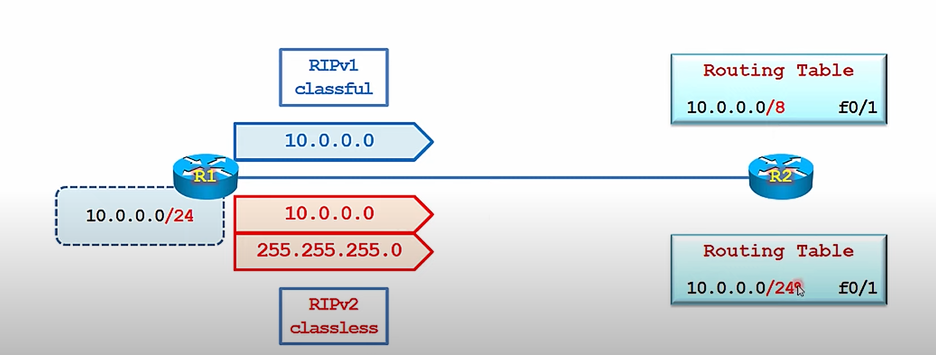
- <h3>Major Network</h3>
	- Là 1 mạng lớn mà chưa bị chia nhỏ ra và lớp mạng và prefix lenght phải khớp với nhau thì được gọi là major net work
	- VD: `10.0.0.0/8` -> Lớp A trùng với prefix leght mặc định của nó -> Major network, `10.0.0.0/24` -> lớp A, được gọi là `subnet mạng con` của major network 10.0.0.0/8 
	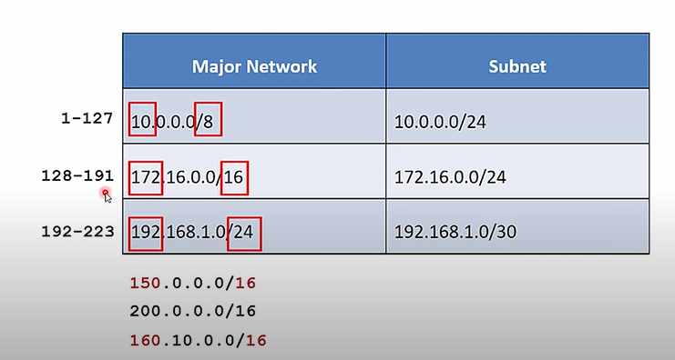
- Cấu hình RIP
	```
	router rip 
		version 2 
		network 192.168.1.0 
		network 172.16.0.0 
		no auto-summary (để học chính xác được 2 lớp mạng subnet)
	show ip route rip
	```
	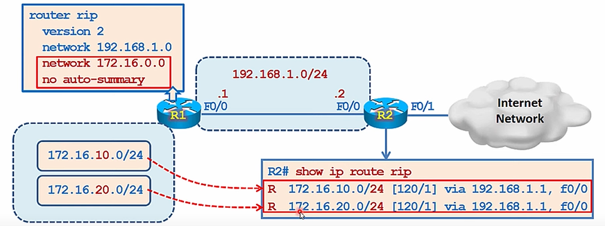
	- Quản bá default route: default -information originate trên con router biên kết nối trực tiếp với internet và quảng bá default route vào các tb bên trong nếu route biên mà bị gắt kết nối với internet thì ở bản định tuyến sẽ tự động xóa thông tin định tuyến
#### 9.2.1.2. Link-State 
- Giao thức phổ biến OSPF, EIGRP, IS-IS
- Ưu điểm: Nếu muốn hệ thống mạng tương thích nhanh với những thay đổi có khả năng xuất hiện trên htm 
- Nhược điểm: Tiêu tốn nhiều tài nguyên xử lý của thiết bị như RAM và memmory để lưu trữ cái tài nguyên database thông tin về cái đường đi có thể có để khi có bất kỳ hệ thống mạng gặp sự cố thì nó có đường khác thay thế, dự phòng 
##### 9.2.1.2.1. <h3>OSPF</h3>
- Giải pháp mã nguồn mở với cộng đồng lớn
- Sẽ quảng bá thông qua giao thức `Partial Update` 
	- `Partial Update`: Chỉ cần quảng bá những mạng mới nhất mà thôi chứ không cần quảng bá lại mạng trước đó đã gửi qua cho router láng giếng nữa 
	- Khi 2 router thiết lập láng giềng với nhau thì nó sẽ quảng bá những thông tin cập nhật định tuyến của nó qua cho router láng giềng thông qua địa chỉ multicase đặc biệt là `224.0.0.5` dành riêng cho giao thức OSPF thì cái bảng topology chứa tất cả các đường đi có thể có và nó sẽ quảng bá hết cho router láng giềng và sau này nó cập những thông tin định tuyến mới này và không cần quan tâm đến những cái route mà trước đó nó đã học được
	- Quá trình trên đảm bảo các router trên router là hoàn toàn giống nhau nên đứng tại 1 con router bất kỳ thì ta có thể quan sát được bảng topology của toàn bộ hệ thống mạng trong cùng 1 vùng area 
	- Sử dụng giải thuật `Dijkstra algorithm` để tính toán trên bảng topology cái đường nào là tốt nhất sau đó đưa những đường này vào bảng đinh tuyến và router sẽ định tuyến gói tin dựa vào bảng `routing table`
	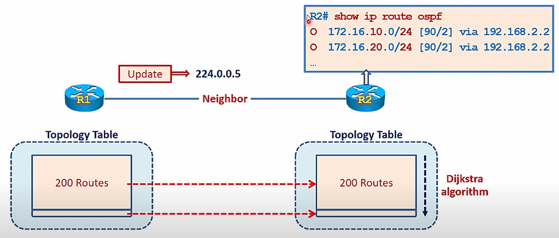
- Cấu hình OSPF
	```
	router ospf 1 (số process định danh tiến trình mà ta đang triển khai, không cần giống nhau giữa các router và chỉ mang tính chất local)
		network 192.168.1.0 0.0.0.255 area 0 (xác định cổng nào sẽ tham gia vào việc định tuyến )
	```
	- area: là kỹ thuật giúp tối ưu hóa một htm mà triển khai ospf giúp hiệu năng của thiết bị trở nên mượt mà hơn
	- ip tham chiếu và widecard mask 
	- Định kỳ gửi bản tin `hello` 10s 1 lần tới địa chỉ multicase đặc biệt dành riêng cho ospf `224.0.0.5` giúp các router thiết lập mối quan hệ neighbor với nhau và thông qua bảng tin hello này giúp giám sát trạng thái của thiết bị mạng láng giềng
	- Dựa vào IP tham chiếu và widecard mask bất kể cổng giao tiếp nào mà có 24 bit đầu tiên trùng vs IP tham chiếu thì sẽ được tham gia vao định tuyến 
	- Có thể đặt cổng giao tiếp thành `network 192.168.1.1 0.0.0.0 area 0` để cho cổng đó tham gia vào định tuyến hoàn toàn được và nó sẽ quảng bá nguyên cái mạng 192.168.1.0/24
	- Vào để xác định chính xác 1 cổng có tham gia vào định tuyến thì ta vào cổng đó và thiết lập ospf lên
	```
	int e0/1
		ip ospf 1 area 0
	```
	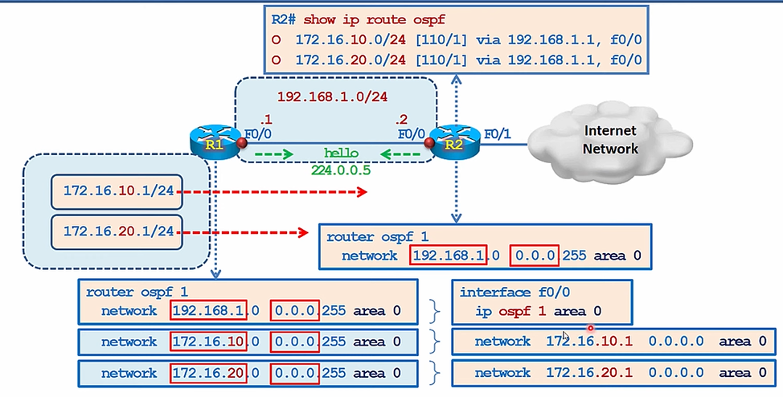
	- Để tất cả các cổng trên router tham gia đinh tuyến thì: `network 0.0.0.0 255.255.255.255 area 0 `
	- Kiểm tra các cổng tham gia vào đinh tuyến: `show ip ospf int brief`
- Area:
	- KT area giúp bảng topology của 1 con router chạy OSPF trở nên nhỏ gọn hơn, giúp tố ưu chi phí thiết bị
	- Nếu hệ thống mạng quá lớn thì ta nên chia ra thành nhiều vùng area giúp hiệu năng của tb trở nên nhẹ hơn
	- Nếu có 2 area, giả sử 1 route bất kỳ trong vùng area 1 gặp sự cố up, down liên tục thì lúc này nó sẽ lan truyền cái thông tin không ổn này với những con router thuộc area 1 mà thôi, và khi nhận được thông tin về sự bất ổn định thì nó sẽ chạy giải thuật `Dijkstra` hay `Sort part first`: SPF để tính toán đường khác thay thế, và các con router ở vùng area 0 thì sẽ không bị ảnh hưởng bởi vùng area 1
	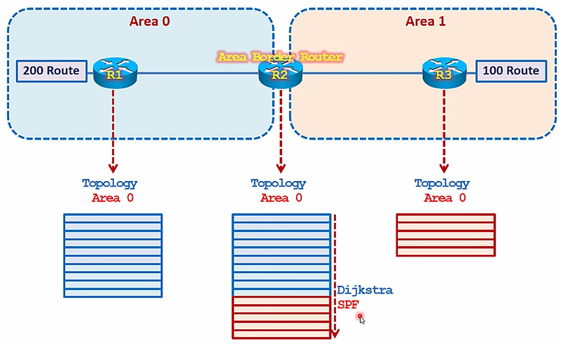
- Default route:
	- Không nên triển khai định tuyến tĩnh trên cái môi trường có dự phòng bởi không có khả năng tương thích nhanh với hệ thống mạng.
	```
	ip route 0.0.0.0 0.0.0.0 f0/0
	router ospf 1
		default-information originate
	```
	- Nếu có 2 hướng đi ra internet thì nó tự động cân bằng tải 50 50 nếu 1 bên gặp sự cố và nó sẽ không quảng bá default route nữa và xóa đi, nếu khôi phục trở về thì tiếp tục quảng bá
	- Bảng tin hello 10s 1 lần và sau 4 lần 40s mà không nhận được quảng bá thì nó tự động xóa tất cả các route bị lỗi khỏi bảng đinh tuyến của nó
- Metric: 
	- Đường nào có metric thấp hơn thì sẽ tốt hơn
	- Cách tính metric:
		- Xác định cost của từng int đến mạng đích và cộng dồn chúng lại
		- Băng thông 
		- Cost = preference Bandwidth (Băng thông tham chiếu) /bandwidth = 10^8/bandwidth (bps)
		- Có thể hiệu chỉnh reference bandwidth:	
			```
			router ospf 1 
				auto-cost reference-bandwidth 100
			```
		- thiết lập cost trên 1 interface: `ip ospf cost 10`
		- `show ip ospf int f0/1`
		- Hiệu chỉnh metric = nhau để dữ liệu có thể đi qua 2 đường
- Hiệu chỉnh router-id
	- router-id là định danh của 1 con router khi tham gia vào đinh tuyến, không được trùng nhau và nếu trùng thì sẽ 0 thể trùng route của nhau 
	- Dùng để tránh loop trong suốt quá trình quảng bá thông tin các mạng, khi nó quảng bá mạng thì nó kèm theo router-id của chính nó để xác định rằng nó là chủ nhân của route đó, và nếu router đó nhận được quảng bá và nhận được router-id của chính nó thì nó sẽ không học vào bảng đinh tuyến của nó
	- Cấu hình router-id: `router-id 10.0.0.2`và khởi động lại tiến trình `clear ip ospf process`
	- Nếu không cấu hình router-id thì nó sẽ ưu tiên lấy ip cao nhất `ip loopback` làm `router id`
- Hello Timer và Dead Timer
	- Các router thiết lập neighbor với nhau thông qua bản tin hello 10s 1 lần 
	```
	int e0/0
		ip ospf hello-interval 10
		ip ospf dead-interval 40
	```
	- Các giá trị này phải đồng nhất với nhau trên mỗi router cần định tuyến
- Điều kiện thiết lập neighbor
	- Phải thỏa mãn 5 yêu cầu dưới thì mới có thể thiết lập được neighbor với nhau
		- Area các cổng định tuyến phải giống nhau
		- Subnet & prefix-length
		- Hello & Dead Timer
		- Authentication khai báo mật mã phải giống nhau
		- MTU (Maxminum Transmition Unit)trên các cổng phải giống nhau, môi trường truyền dẫn khác nhau 
	- Kiểm tra neighbor: `show ip ospf neighbor detail`
- Network Type (point-to-point vs Broadcast Multiaccess)
	- Point-to-point: Môi trường kết nối 2 con Router với nhau thông qua công nghệ `Lease Line` cho phép kết nối 2 hệ thống mạng LAN cách xa nhau từ vài chục đến vài chục đến vài trăm cây số với nhau, thông qua môi trường truyền dẫn cáp quang hoặc cáp đồng tùy theo nhà cung câps dịch vụ mà ta sd
		- Các Router sẽ thiết lập mối quan hệ neighbor ngang hàng với nhau 
	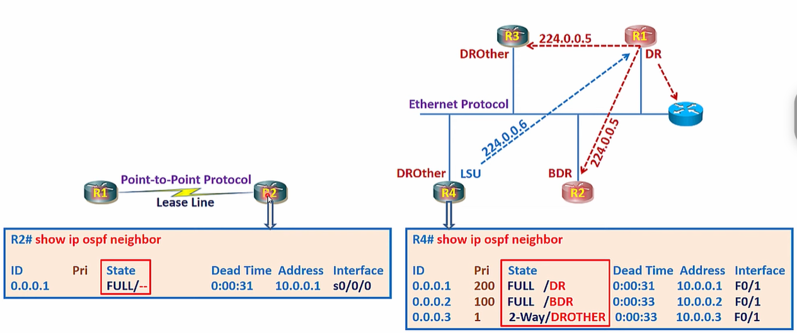
	- Ethernet Protocol: từ 1 Router có thể kết nối đến 1 switch và từ 1 switch có thể được kết nối với nhiều các môi trường khác nữa gọi và mặc định network type là Broadcast Multiaccess
		- Cần phải trải qua quá trình bầu chọn BR, BDR và DROTHER và quá trình bầu chọn diễn tra trong 40s
			- `DR (Designated Router)`: đứng ra để phân phối quá trình trao đổi thông tin đinh tuyến giữa tất cả các con router mà tham gia vào cái môi trường Multiaccess này 
			- `BDR (Backup Designated Router)`: đóng vai trò là backup cho DR và tất cả các thiết bị còn lại đóng vai trò là `DROTHER` 
		- Khi thông thường khi các con router thành viên có thông tin định tuyến gì mới thì nó sẽ soạn 1 bảng tin `SLU (Link state Update)` và gửi về cho DR với Multicast đặc biệt là `224.0.0.6` và khi DR nhận được bảng tin đó thì nó sẽ gửi ra tất cả các Router thành viên còn lại. Nếu lắp đặt 1 Router mới thì DR đứng ra quảng bá tất cả các thông tin định tuyến trên htm mới này
		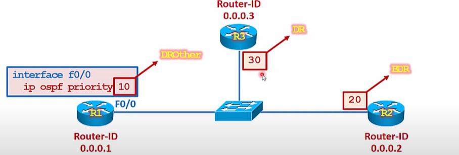
		- Tiến trình bầu chọn DR, BDR dựa vào 2 tham số `priority` và `router-id`:
			- priority (chỉ số ưu tiên) thiết bị nào có chỉ số ưu tiên cao nhất thì thiết bị đó là DR và cao nhì là BDR còn lại là DROTHER
				```
				int f0/0
					ip ospf priority 10
				```
			- Nếu chỉ số ưu tiên đều bằng nhau thì nó sẽ dựa vào router-id để quyết định. Router-id lớn nhất là DR, nhì là BDR còn lại DROTHER 
			- Quá trình cũng tuân theo quy tắc `Non-Preempt`. Nếu tb DR gặp sự cố thì ngay lập tức thiết bị đóng vai trò là BDR sẽ làm DR các router còn lại sẽ tranh chức BDR với nhau. Và nếu DR cũ đã khôi phục lại dù priority và router-id cao nhưng vẫn chỉ đóng vai trò là DROTHER mà thôi. Nên do vậy ta cần phải clear lại tiến trình ospf là sẽ hoạt động lại đúng như ban đầu: `clear ip ospf process`
			- Priority = 0 thì luôn đóng vai trò là DROTHER và không tham gia vào quá trình bầu chọn DR hoặc BDR. 
			- Lựa chọn thiết bị nào mạnh để đóng vai trò là DR hoặc BDR
			- Quá trình bầu chọn DR và BDR diễn ra trên từng phân đoạn mạng nếu không cần thiết và cấu hình chỉ có 2 thiết bị kết nối với nhau ta nên hiệu chỉnh network type thành `State Point_to_point`
				```
				int e0/0
					ip ospf network-type point-to-point
				```
			- FULL và 2-Way: đối với DR và BDR thì Router sẽ thiết lập đầy đủ với 2 thiết bị này gửi trực tiếp thông tin định tuyến, còn 2-Way thì không bao giờ trao đổi trực tiếp được mà phải qua trung gian
### 9.2.2. Exterior Gateway (Định tuyến ngoại vùng)
- Giao thức điển hình là BGP thường được các nhà mạng trên thế giới sử dụng 
- Được định tuyến dựa trên các AS với nhau 
- AS là Autonomous System: là tập hợp các router thuộc cùng 1 chính sách quản trị trực tuyến ,có vùng mạng cung cấp giống nhau thì sẽ gom vào 1 AS
	- VD: tất cả các con router của nhà mạng VNPT gom hết thành 1 AS và được định danh bằng số AS
- Và mỗi AS được định danh bằng 1 số AS, thông thường mỗi nhà cung cấp sẽ có 1 số AS và số AS này là duy nhất trên toàn thế giới
#### 9.2.2.1. <h3>BGP (Border Gateway Protocol)</h3>
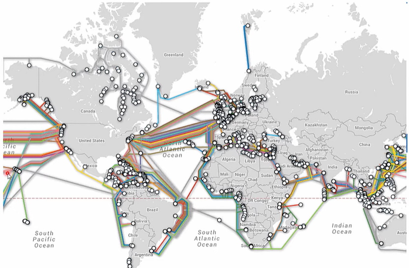
- Là giao thức định tuyến động mà hiện này hệ thống mạng internet toàn cầu đang sử dụng để định tuyến giữa các nhà cung cấp dịch vụ mạng
- Phải cấu hình `filter route` nếu không phải học hơn 700.000 routers từ môi trường internet chuyển tới, filter để chỉ học những cái mạng của nhà mạng mà thôi nhưng vẫn có thể đi được cái default routers trỏ tới con router của nhà mạng
- Cấu hình
	```
	router bgp 10 (as của mình)
		bgp router-id 9.0.0.1 (lấy ip cao nhất, lp)
		neighbor 9.0.0.2 
		remote-as 20 (khai báo  ip của thiết bị láng giềng mà ta muốn thiết lập neighbor, as của láng giềng) 
	```
	- as: là tập hợp của tất cả các con router tham gia vào cùng 1 vùng định tuyến của 1 nhà cung cấp dịch vụ mạng nhất định
	- iana: cơ quan quản lý mạng quốc tế mỗi nhà cung cấp dịch vụ mạng sẽ được định doanh duy nhất bằng 1 số ASN.
	- Dãy AS Number(Public): giao động từ 1 - 64495
	- Private AS Number: 64512-65534
	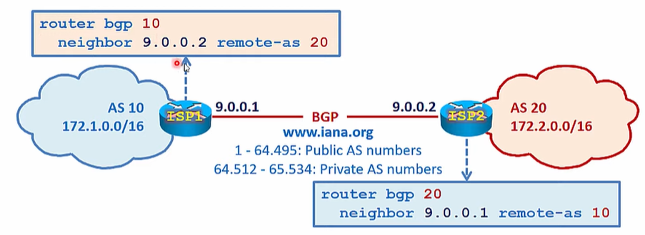
	- Định kỳ gửi `hello` 60s 1 lần 
	- Kiểm tra bgp: `show ip bgp summary`
	
# 10. ICPM
# 11. VLAN (Virtual LAN) ảo hóa Switch
- Mỗi VLAN tương ứng như 1 switch vật lý, tất cả các phòng ban sẽ kết nối hết vào 1 vlan 
- Nếu trong 1 Vlan nhận được 1 bảng tin `broadcast` thì tất cả cá port thuộc cùng vlan đo nhận được thôi nên mỗi vlan là 1 `broadcast domain`
## 11.1. Cấu hình 
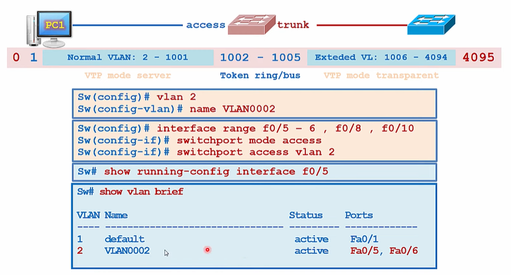
- Thực hiện
	```
	vlan 2
		name VLAN guest
	int f0/5
		switchport mode access
		switchport access vlan 2
	show vlan brief
	```
- Kết nối switch qua switch ta kết nối nó qua mode trunk 
## 11.2. Trunk 
- Kết nối giữa các switch gom tất cả các switch vật lý trở thành 1 switch vật lý 
- Nếu trên 2 switch vật lý cùng tạo VLAN 2 và kết nối trunk thì 2 PC trên mỗi vlan sẽ giao tiếp được với nhau
	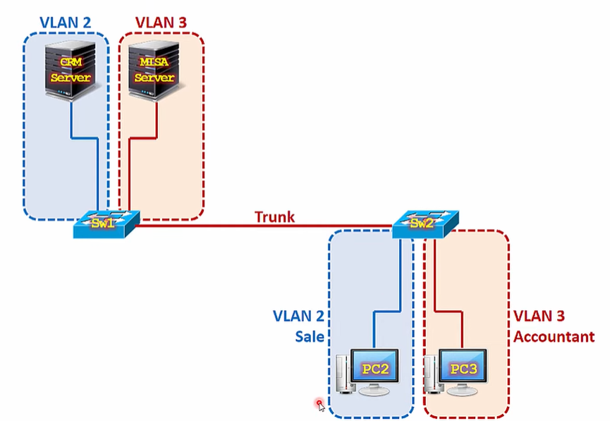
- VLAN và Trunk có thể được phối hợp với nhau để phục vụ việc bảo mật và nếu muốn các VLAN có thể truy cập được với nhau thì ta cần phải có 1 con router hoặc switch layer 3
- Ở router mỗi cỗng sẽ ứng với gateway của VLAN và thuộc vlan đó nhằm mục đích định tuyến với các vlan khác và truy cập internet
- Giúp tiết kiệm port và số lượng kết nối nếu mode access thì cần phải có nhiều dây tương ứng còn trunk thì chỉ cần 2 port và 1 dây 
- Khi 1 pc ở vlan 2 dữ liệu tới pc ỏ vlan 2 phía bên kia switch thì đầu tiên nó phải `gắn nhãn` thông tin `VLAN` mà PC thuộc về mà căng cứ vào vlan nào sẽ nhận được
### 11.2.1. Cấu hình trunk 
- Trunk có 2 kiểu đóng gói 1 dot1q kiểu quốc tế, 2 ISL trunk độc quyền cisco
	```
	int f0/1
		sw trunk encapsulation dot1q
		sw mode trunk
		sw trunk native vlan 
	```
- `Native vlan`: Nếu sw nhận được dữ liệu từ VLAN mà VLAN này trùng với Native vlan thì nó không cần gán nhãn VLAN như thường lệ và cứ thế mà gửi sang switch đầu xa. Khi switch đầu xa nhận được mà không thấy bất kỳ nhãn nào thì nó mặc định là VLAN của Native vlan, với những VLAN không phải Native vlan thì nó vẫn phải gán nhãn như bình thường 
- Các giao thức CDP, STP, VTP, DTP thông thường được lan truyền qua Native Vlan
- Theo quy tắc thì 
đường trunk cho phép tất cả vlan qua đường này và mình có thể cấu hình để điều chỉnh: `sw trunk allow vlan 1-2`, cho phép lưu lượng vlan 1 và 2 đi qua trunk 
- Hiệu chỉnh `Native vlan`: có thể sử dụng dot1q và hiệu chỉnh native vlan để cái port đó thuộc thành viên của native vlan
- Giao thức DTP tự động thiết lập trunk giữa các switch
	- Giao thức độc quyền Cisco và được bật tự động
	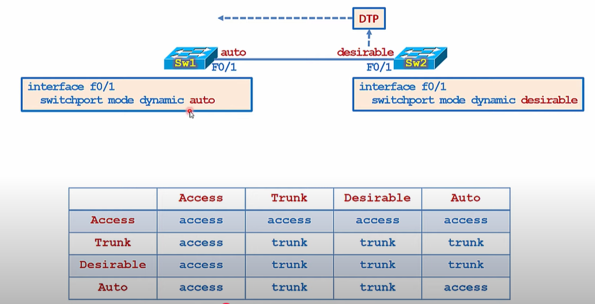
	- Mặc định thì ở các tb cisco thì trên các cổng thường cấu hình mặc định `desirable` còn lại là `auto`
	- Định kỳ gửi DTP để thiết lập đường trunk và thiết bị nhận được sẽ hồi đáp về bảng tin DTP này và kết nối giữa 2 sw là trunk 
	- Tắt giao thức DTP: `switchport nonegotiate` 
- Giao thức VTP (VLAN trunking protocol)đồng hóa thông tin VLAN giữa các switch
	- Đảm bảo database VLAN giữa các switch sẽ được đồng hóa với nhau để tránh lỗi 
	- VTP domain: dạy vlan và đồng bộ hóa tên vlan, cần phải tham gia vào cùng 1 vtp domain: `vtp domain AnPhuc` và hoạt động ở chế độ `server` hoặc `client` hoặc `Transparent` 
	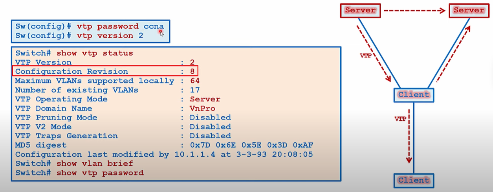
### 11.2.2. Định tuyến giữa các vlan 
- Các vlan khác nhau muốn đi qua được với nhau thì phải đi qua router
- Router on a Stick: Chỉ cần 1 cổng và tạo các cổng ảo để trỏ đén từng vlan
- Thiết lập trunk trên switch và router 
	- Trên switch thì trên cổng giao tiếp cấu hình trunk 
	- Trên router tiến hành tạo các sub interface và tiến hành đặt ip cho int này và sẽ là default gateway cho các vlan 
		```
		int f0/0.3
			encapsulation dot1q 3 (vlan 3)
			ip add 30.0.0.1 255.0.0.0
		```

# 12. Giao thức chống Loop STP
## 12.1. Mô hình thiết kế hạ tầng mạng 3 phân lớp
- Một hệ thống 3 phân lớp: core, distribution, Access
	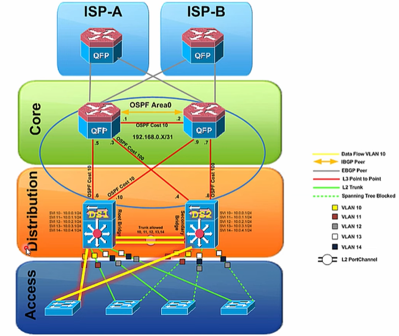
	- Ở tầng access: có thể sd những thiết bị cấp thấp hỗ trợ các port với các tb đầu cuối, hỗ trợ cấp nguồn PPOE và hỗ trợ bảo mật L2
	- Distribution: hỗ trợ những dòng SWL3 mạnh mẽ hơn, đảm bảo các cổng phù hợp để kết nối đến tầng core, hỗ trợ policy, giữa những sw với nhau thì nên để các cổng là 1Gi hoặc 10Gi
	- Core: trang bị cặp thiết bị mang tính chất dự phòng, nguồn, CPU và các cổng có tốc độ cao, hạn chế các policy ở tầng này
- Ở một số doanh nghiệp nhỏ thì chỉ cần sử dụng 2 phân lớp gom core và distribution mà thôi 
## 12.2. Nguyên nhân xảy ra loop 
- Thường bị khi kết nối ở dạng vòng `ring`
	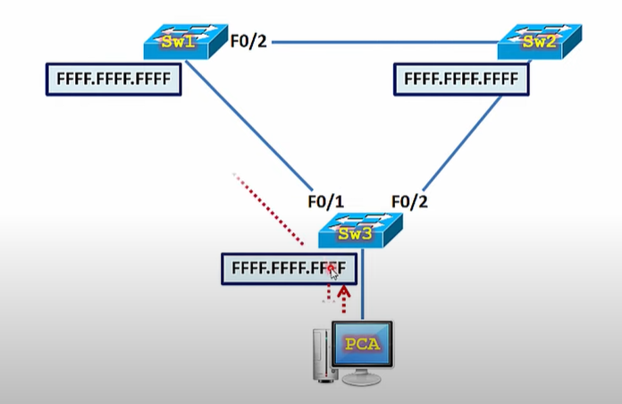
	- Khi có 3 sw kết nối dạng vòng và gửi đi bảng tin `broadcast` thì nó sẽ lan truyền cho nhau và sw đều nhận được frame này và nó sẽ hình thành loop
- Khi 2 switch kết nối với nhau sử dụng 2 dây 2 sw sẽ liên tục gửi qua gửi lại
	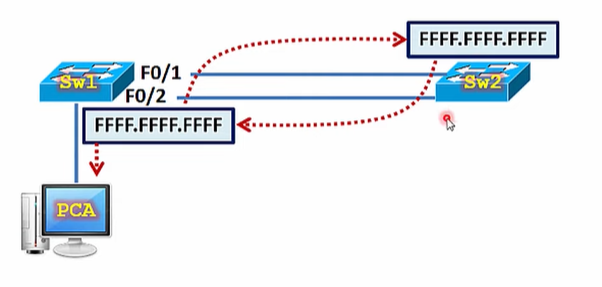
## 12.3. Cơ chế chống Loop của STP
### 12.3.1. Block port (alternated Port)
- Sử dụng cơ chế block port để hạn chế loop trên htm
- Khi STP được bật nó sẽ phối hợp với nhau và tính toán xem nên khóa cổng nào và từ đó tránh được nguy cơ bị loop trên hệ thống mạng, và không thể nhận được tin `broadcast hay bất kì bản tin nào` nên sẽ chống loop được.
## 12.4. Root Bridge và vai trò Port Role của các Port
- STP sẽ trải 1ua 4 giai đoạn để tính toán port nào là block port và đưa vào trạng thái xóa 
### 12.4.1. Bầu chọn Root Bridge
- Root Bridge chỉ có 1 Router làm và tất cả các lưu lượng sẽ đổ hết về RB 
- Chỉ có RB mới được quyền gửi bản tin hello các port còn lại 
- Đinh kỳ gửi hello 2s 1 lần các port còn lại chuyển tiếp từ port designated port đến được tới sw láng giềng
- Nguyên tắc bầu chọn:
	- Dựa vào tham số bridge-id (priority + MAC): sw nào có bridge-id nhỏ nhất thì đóng vai trò RB 
	- `Show spanning-tree` để kiểm tra 
	- Hiệu chỉnh giá trị priority: `spanning-tree vlan 1 prioriity 28672`
	- Nếu giá trị priority bằng nhau thì nó bầu chọn trên nguyên tắc chọn MAC nhỏ nhất thì đóng vai chò BR
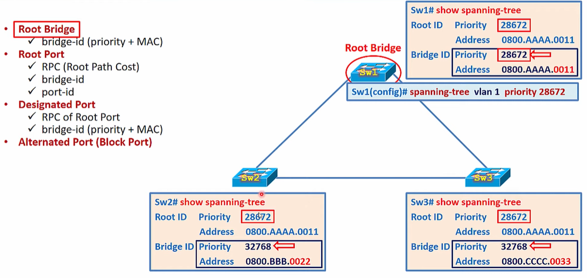
### 12.4.2. Bầu chọn Root Port
- Không bao giờ xảy ra trên Root Bridge, và sẽ tiến hành trên các sw là non RB 
- Ở 1 sw nếu nối với 3 sw thì chỉ có 1 port đóng vai trò là root port 
- Root port là port gửi dữ liệu nhanh nhất đến RB từ đó có thể đi ra ngoài được internet
- Nguyên tắc bầu chọn:
	- Dựa trên tham số: RPC (Root Path Cost) nào có số thấp hơn thì đóng vai trò Root Port
	- Xác định Cost của từng port `show spanning-tree` do cisco quy ước mặc định đều bằng nhau
	- RPC sẽ được tính bằng cộng dồn các cost của các sw mà sẽ phải đi tới được RB
	- Tinh chỉnh cost: 
		```
		int f/01
		spanning-tree vlan 1 cost 20
		```

### 12.4.3. Bầu chọn designated port
- STP có bao nhiêu phân đoạn mạng thì điều đó đồng nghĩa với việc có bấy nhiêu Designated Port 
- Có 3 phân đoạn mạng thì ít nhất có 3 Designated port
- Thường là các cổng trên RB
- Định kỳ gửi 1 bản tin hello, thông qua bản tin này STP cảm nhận có sự thay đổi của htm đã xảy ra hay chưa do đó nó quyết đinh có nên mở port block trở thành port bt và cho phép lưu lượng đi qua 
- Có quyền gửi bản tin hello
- Port không nhận được bản tin hello sau 10 lần thì nó khẳng định đoạn mạng đó gặp sự cố và mở port block
### 12.4.4. Alternated Port(Block port)
- Port dự phòng, cho phép dữ liệu đi qua 
