# 1. Mạng cơ bản 
- Về bản chất, khi 2 thiết bị có thể **chia sẻ tài nguyên** (file, máy in, dữ liệu,...) và **kết nối được với nhau** qua một phương tiện truyền dẫn nào đó, thì đã có thể gọi đó là một hệ thống mạng (network)
## 1.1. Các đặc điểm của 1 hệ thống mạng 
- Khi thiết kế/đánh giá 1 hệ thống mạng, cần quan tâm đến các đặc điểm sau:
	- **Topology (Sơ đồ hình học)**: cách bố trí vật lý (Physical Topology - dây cáp, thiết bị đặt ở đâu) và cách bố trí logic (Logical Topology - luồng dữ liệu di chuyển như thế nào) của hệ thống mạng
	- **Speed (Tốc độ)**: băng thông tối đa mà hệ thống mạng có thể đáp ứng được
	- **Cost (Chi phí)**: chi phí đầu tư thiết bị, hạ tầng, đường truyền
	- **Security (Bảo mật)**: khả năng chống lại các truy cập trái phép, tấn công mạng
	- **Availability (Tính sẵn sàng)**: khả năng hệ thống luôn sẵn sàng phục vụ, thường đo bằng tỷ lệ % thời gian hoạt động (uptime)
	- **Scalability (Khả năng mở rộng)**: khả năng hệ thống mạng dễ dàng mở rộng thêm khi có nhu cầu tăng trưởng (thêm thiết bị, thêm người dùng) mà không phải thiết kế lại từ đầu
	- **Reliability (Độ tin cậy)**: khả năng hệ thống hoạt động ổn định, ít xảy ra sự cố, hoặc nếu có sự cố thì có khả năng phục hồi nhanh (thường gắn liền với các cơ chế dự phòng - redundancy)
## 1.2. Phân loại mạng theo quy mô địa lý
- **LAN (Local Area Network)**: mạng cục bộ, phạm vi nhỏ như 1 tòa nhà, 1 văn phòng, tốc độ cao, chi phí đầu tư thấp, thường do 1 tổ chức tự quản lý
- **WAN (Wide Area Network)**: mạng diện rộng, kết nối nhiều mạng LAN ở cách xa nhau về mặt địa lý (khác thành phố, khác quốc gia), thường phải thuê đường truyền từ nhà cung cấp dịch vụ (ISP), tốc độ thấp hơn LAN và chi phí cao hơn
- **MAN (Metropolitan Area Network)**: mạng quy mô đô thị, phạm vi lớn hơn LAN nhưng nhỏ hơn WAN, thường trong phạm vi 1 thành phố
- **PAN (Personal Area Network)**: mạng cá nhân, phạm vi rất nhỏ như kết nối giữa điện thoại với tai nghe qua Bluetooth
## 1.3. Vai trò thiết bị trong mô hình mạng
- **Client-Server**: các máy Client gửi yêu cầu đến 1 máy Server tập trung để lấy dữ liệu hoặc dịch vụ, mô hình phổ biến trong doanh nghiệp vì dễ quản lý tập trung
- **Peer-to-Peer (P2P)**: các máy tính có vai trò ngang hàng nhau, không có máy nào giữ vai trò trung tâm cố định, mỗi máy vừa có thể là Client vừa có thể là Server, phù hợp cho hệ thống mạng nhỏ, ít máy tính

# 2. Mô hình OSI và TCP/IP
## 2.1. OSI
- Mô hình OSI (Open Systems Interconnection) là mô hình tham chiếu gồm **7 tầng**, mô tả cách dữ liệu được xử lý và truyền đi giữa các thiết bị trong hệ thống mạng, mỗi tầng chỉ giao tiếp trực tiếp với tầng ngay trên và ngay dưới nó
- Thứ tự 7 tầng từ trên xuống: **Application (7) – Presentation (6) – Session (5) – Transport (4) – Network (3) – Data Link (2) – Physical (1)**
### 2.1.1. Lớp Application (Tầng 7)
- Là tầng mà người dùng **tiếp xúc trực tiếp và thường xuyên nhất** thông qua các ứng dụng như trình duyệt web (Chrome), phần mềm gửi nhận mail (Outlook),...
- Cần lưu ý đây **không phải** là bản thân ứng dụng, mà là các **giao thức chuẩn hóa** mà ứng dụng đó sử dụng để giao tiếp qua mạng
- Các giao thức tiêu biểu: 
	- **SMTP (Simple Mail Transfer Protocol)**: dùng để **gửi** mail đi (từ Client lên Server, hoặc giữa các Mail Server với nhau), port mặc định `25`
	- Lấy mail **về** có 2 lựa chọn:
    	- **POP3 (Post Office Protocol v3)**: Tải mail về máy cục bộ và **xóa mail trên server** sau khi tải xong (mặc định), port `110`
    	- **IMAP (Internet Message Access Protocol)**: Đồng bộ và giữ **bản sao** của mail, không xóa mail trên server, cho phép xem cùng 1 hộp thư từ nhiều thiết bị khác nhau, port `143`
	- **FTP (File Transfer Protocol)**: Truyền/chia sẻ file giữa FTP Client và FTP Server, sử dụng **2 kênh** riêng biệt: port `21` (điều khiển - control) và port `20` (truyền dữ liệu - data)
	- **HTTP/HTTPS**: giao thức truyền tải nội dung web
		- `HTTP` (HyperText Transfer Protocol): port `80`, dữ liệu truyền dạng **rõ (plain-text)**, không mã hóa
		- `HTTPS` (HTTP Secure): port `443`, là HTTP được bọc thêm lớp mã hóa `TLS/SSL` (hoạt động ở tầng Presentation) giúp bảo mật dữ liệu truyền đi
    
	<div align="center">
		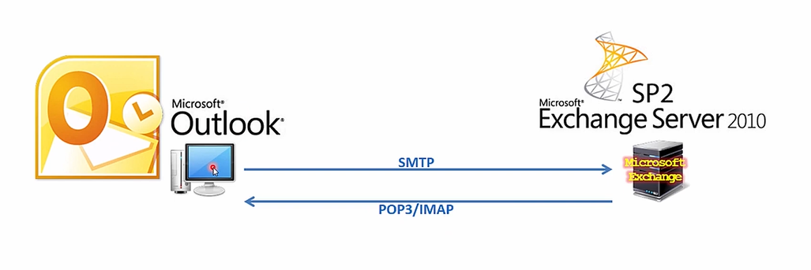
		<br>
		<em></em>
	</div>

	- Ngoài ra còn có các giao thức khác cũng hoạt động ở tầng này: `DNS` (port 53 - phân giải tên miền thành địa chỉ IP), `DHCP` (port 67/68 - cấp phát IP tự động), `Telnet` (port 23)/`SSH` (port 22) (truy cập từ xa)

> **Bảng port quen thuộc hay được hỏi trong đề thi CCNA (bổ sung mới):**

| Giao thức | Port | Transport |
|---|---|---|
| FTP (control/data) | 21 / 20 | TCP |
| SSH | 22 | TCP |
| Telnet | 23 | TCP |
| SMTP | 25 | TCP |
| DNS | 53 | TCP/UDP |
| DHCP (Server/Client) | 67 / 68 | UDP |
| TFTP | 69 | UDP |
| HTTP | 80 | TCP |
| POP3 | 110 | TCP |
| NTP | 123 | UDP |
| IMAP | 143 | TCP |
| SNMP (agent/trap) | 161 / 162 | UDP |
| HTTPS | 443 | TCP |
| Syslog | 514 | UDP |
### 2.1.2. Lớp Presentation (Tầng 6)
- Chịu trách nhiệm **định dạng, mã hóa (encryption) và nén (compression)** dữ liệu để tầng Application phía bên nhận có thể hiểu được đúng định dạng dữ liệu mà bên gửi đã gửi đi
- Các chuẩn định dạng phổ biến ở tầng này: `JPEG, GIF, PNG` (hình ảnh), `MP3, MPEG` (âm thanh/video), `ASCII` (văn bản)
- Các giao thức bảo mật như `SSL/TLS` cũng hoạt động chủ yếu ở tầng này để mã hóa dữ liệu trước khi truyền đi (VD: HTTPS = HTTP + TLS)
### 2.1.3. Lớp Session (Tầng 5)
- Chịu trách nhiệm **thiết lập, duy trì và kết thúc phiên làm việc (session)** giữa 2 ứng dụng đang giao tiếp với nhau, đảm bảo dữ liệu của các phiên làm việc khác nhau không bị lẫn lộn vào nhau
- Ví dụ: khi mở nhiều tab trình duyệt để đăng nhập nhiều tài khoản khác nhau trên cùng 1 website, tầng Session giúp phân biệt và duy trì trạng thái đăng nhập riêng biệt cho từng phiên
### 2.1.4. Lớp Transport (Tầng 4)
- Chịu trách nhiệm đảm bảo quá trình **truyền dữ liệu tin cậy từ đầu cuối đến đầu cuối (end-to-end)**, thực hiện phân mảnh dữ liệu (segmentation), điều khiển luồng (flow control) và báo nhận (acknowledgment)
- 2 giao thức chính hoạt động ở tầng này: `TCP` (tin cậy, hướng kết nối) và `UDP` (nhanh, không hướng kết nối) — sẽ được trình bày kỹ ở mục 2.3 và 2.4
- Đơn vị dữ liệu ở tầng này gọi là `Segment`
### 2.1.5. Lớp Network (Tầng 3)
- Chịu trách nhiệm **định tuyến (routing)** dữ liệu để tìm ra đường đi tốt nhất từ nguồn đến đích khi 2 thiết bị không nằm cùng 1 mạng cục bộ, dựa vào **địa chỉ IP** (địa chỉ logic)
- Thiết bị hoạt động chủ yếu ở tầng này: **Router**
- Giao thức tiêu biểu: `IP (IPv4/IPv6)`, `ICMP`, các giao thức định tuyến như `RIP, OSPF, EIGRP, BGP`
- Đơn vị dữ liệu ở tầng này gọi là `Packet`
### 2.1.6. Lớp Data Link (Tầng 2)
- Chịu trách nhiệm đóng gói dữ liệu thành `Frame`, gắn địa chỉ **MAC** (địa chỉ vật lý) để truyền dữ liệu trong phạm vi 1 mạng cục bộ (LAN), đồng thời kiểm tra lỗi ở mức cơ bản trong quá trình truyền
- Thiết bị hoạt động chủ yếu ở tầng này: **Switch**
- Tầng này được chia làm 2 lớp con: `LLC (Logical Link Control)` chịu trách nhiệm giao tiếp lên tầng Network phía trên, và `MAC (Media Access Control)` chịu trách nhiệm quy định cách truy cập đường truyền vật lý và gắn địa chỉ MAC
- Đơn vị dữ liệu ở tầng này gọi là `Frame`
### 2.1.7. Lớp Physical (Tầng 1)
- Chịu trách nhiệm truyền **tín hiệu vật lý** (điện, ánh sáng, sóng radio) qua môi trường truyền dẫn thực tế như cáp đồng, cáp quang, sóng không dây
- Thiết bị hoạt động chủ yếu ở tầng này: **Hub, cáp mạng, đầu nối (connector), repeater**
- Đơn vị dữ liệu ở tầng này gọi là `Bit`
### 2.1.8. Quá trình đóng gói dữ liệu (Encapsulation) và mở gói (De-encapsulation)
- **Encapsulation**: khi dữ liệu đi từ tầng Application xuống tầng Physical (ở máy gửi), mỗi tầng sẽ gắn thêm phần `Header` (và có thể cả `Trailer`) riêng của tầng đó vào dữ liệu, giống như việc gói 1 món đồ vào nhiều lớp bao bì trước khi gửi đi
- **De-encapsulation**: khi dữ liệu đến máy nhận, quá trình diễn ra ngược lại — dữ liệu đi từ tầng Physical lên tầng Application, mỗi tầng sẽ bóc bỏ phần Header/Trailer tương ứng của tầng đó ra để lấy được dữ liệu gốc ban đầu
- Đây chính là lý do vì sao đơn vị dữ liệu có tên gọi khác nhau ở từng tầng: `Data (tầng Application/Presentation/Session) -> Segment (tầng Transport) -> Packet (tầng Network) -> Frame (tầng Data Link) -> Bit (tầng Physical)`
## 2.2. TCP/IP

<div align="center">
  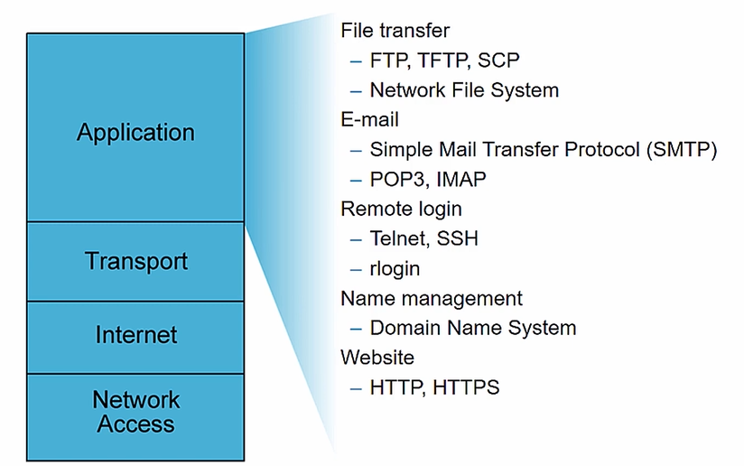
  <br>
  <em></em>
</div>

- Chỉ có 4 phân lớp như ảnh trên
- 3 lớp trên cùng gom thành 1 nhóm là Application
- Mỗi card mạng có 1 địa chỉ mac và các địa chỉ này đều khác nhau trên mỗi card mạng

L3: packet (data, ip)
L2: frame (data, ethernet)
- Quá trình gửi nhận dữ liệu: giữa 2 PC 

<div align="center">
  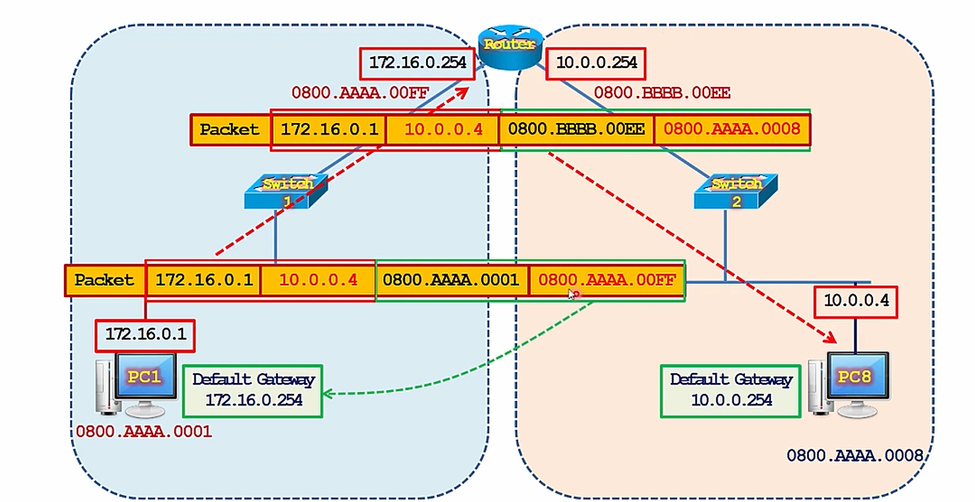
  <br>
  <em></em>
</div>

  - 2 PC khác mạng muốn liên kết được với nhau (default gateway) 
  - Nó sẽ soạn thảo 1 bản tin (IP Nguồn, IP Đích, MAC Nguồn, MAC đích)
  - MAC Nguồn: MAC của PC 1 
  - MAC Đích: MAC của Default Gateway (router)
  - Phân giải địa chỉ ARP 
  - PC1 xác định địa chỉ MAC đích của IP gateway sau đó gắn địa chỉ mac đích vào 
  - PC1 sẽ gửi cho gateway và nó thấy là bản tin gửi cho nó nên nó thực hiện thao tác định tuyến dựa vào IP đích 
  - Nó sẽ gỡ bỏ thông tin MAC nguồn và MAC đích đi và nó gắn 1 MAC nguồn và đích mới với:
    - MAC Nguồn là MAC của gateway
    - MAC Đích là MAC của PC2
## 2.3. Giao thức vận chuyển dữ liệu UDP và TCP
### 2.3.1. Kích thước tối đa của 1 phân mảnh dữ liệu segment
- Nhiệm vụ chủ yếu của lớp transport là đảm bảo quá trình truyền thông tin cậy từ đầu cuối đến đầu cuối 
- Dữ liệu khi được lấy về sẽ bị phân mảnh và được tải về máy trạm
L4: Segment (data, tcp)
L3: packet (data,ip)
## 2.4. TCP và UDP
- Ghép phiên kết nối session: Chỉ có 1 card mạng nhưng có thể mở nhiều phiên làm việc khác nhau
- Phân mảnh dữ liệu segmentation:  Phân mảnh 1 file có kích thước N Mbps được phân mảnh thành nhiều phân mảnh khác nhau trước đó phải trải qua quá trình bắt tay ba bước để quyết định xem dữ liệu được phân mảnh có kích thước bao nhiêu
- Bắt tay ba bước
- Đảm bảo quá trình truyền thông tin cậy
- Điều khiển luồng 
### 2.4.1. UDP
- UDP Header

	
<div align="center">
  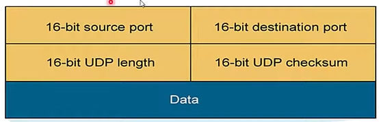
  <br>
  <em></em>
</div>

- Cơ chế hoạt động truyền thông:
### 2.4.2. TCP
- Gắn thêm TCP Header và IP Header

	
<div align="center">
  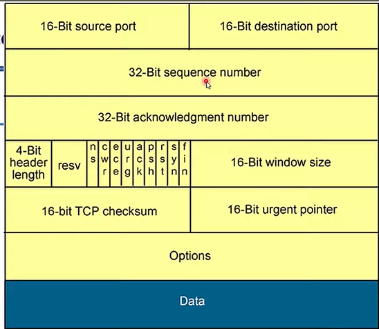
  <br>
  <em></em>
</div>

- Cơ chế hoạt động truyền thông: với 2 Máy tính 
  - Bắt tay ba bước: Giúp thỏa thuận tham số mà 2 thiết bị hỗ trợ `kích thước segment và tốc độ` (Connection-oriented)
    - PC1: Máy truyền Gửi 1 tính hiệu SYN thăm dò thiết bị đầu cuối đã sẵn sàng quá trình truyền nhận dữ liệu hay không, nếu đủ tài nguyên 
    - PC2: Báo nhận ACK sẵn sàng quá trình truyền nhận và đồng thời lúc này nó bảo gửi 1 tín hiệu SYN của chỉnh nó để hỏi xem máy truyền đã sẵn sàng truyền nhận dữ liệu hay chưa 
	- PC1: Và máy truyền sẽ hồi đáp về 1 bản tin ACK chấp nhận quá trình truyền thông này, và quá trình truyền nhận dữ liệu bắt đầu diễn ra.
	- Trước khi truyền thì nó phân mảnh dữ liệu ra thành rất nhiều phân mảnh và đánh stt cho các segment để phục vụ cho quá trình báo nhận ACK 
	- Khi máy nhận nhận được 1 segment nó bắt buộc phải báo nhận bằng 1 bản tin ACK báo rằng tôi đã nhận segment 1 thành công và khi máy truyền nhận được ACK thì nó gửi tiếp cái segment tiếp theo nó lặp lại cho đến khi kết thúc đảm bảo rằng không bị mất dữ liệu.
	- Khi segment được gửi đi mà không nhận được hồi đáp về, bị mất mát trong quá trình truyền thông thì máy truyền ở 1 thời gian nhất định khi gửi segment 3 mà không thấy hồi áp ACK trở về thì nó sẽ chủ động gửi lại segment cho đến khi nhận được hồi đáp ACK.
	- Không bị mất mát dữ liệu.
#### 2.4.2.1. Cơ chế điều khiển luồn Flow Control 
- Để cải thiện tốc độ thì TCP sử dụng tham số `Windown size` áp dụng trong kỹ thuật **Flowc Control** luồn lưu lượng trong hệ thống
	- 32 bit sequence number: đánh số thứ tự 
	- 32 bit Acknowledgment number: báo nhận ACK 
	- Windown size là trường có trong `TCP header` 

- Biểu diễn luồng. Trong quá trình bắt tay ba bước giứa 2 hiết bị
	-  2 máy thỏa thuận giá trị windown size = 1 Tại 1 thời điểm thì máy gửi chỉ gửi được 1 segment 
	- Và khi máy nhận nhận được segment 1 thì làm thao tác với ack là 2 ngầm báo cho máy gửi tiếp muốn nhận cái segment là 2 và báo là segment 1 đã nhận thành công rồi.
	- Khi mà máy gửi nhận được ACK là 2 rồi gửi tiếp cái segment thứ 2 và máy nhận sẽ báo ack là 3 và tiếp tục cho đến khi nhận hết dữ liệu
	
	- Và để cải thiện dữ liệu thì thay vì thỏa thuận giá trị ws =1 thì thay bằng window size = 3 máy sẽ chuyển tiếp 3 segment rồi sau đó mới đợi hồi đáp ACK 
	- Máy gửi gửi segment 1,2,3 và nếu mà máy nhận đều nhận được cả 3 thì nó gửi lại 1 ACK là 4 và báo segment 1,2,3 đã nhận được và yêu cầu gửi tiếp segment là 4 
	- Tiếp tục gửi các segment 4, 5, 6 đến khi nhận đủ hết dữ liệu
#### 2.4.2.2. Silding Windowing
- Khi nào 2 thiết bị tự động điều chỉnh Windown size: khi hệ thống mạng bị nghẽn thì sẽ tự động tăng giảm giá trị này tùy vào hệ thống mạng hiện tại dựa vào Silding Windowing
- Nếu ở 2 PC 1 bên có ws =3 và 1 bên có ws=2 thì trong quá trình truyền bên nhận chỉ nhận được 2 segment và báo ack = 3 kèm theo ws = 2 tiếp đến máy gửi sẽ điều chỉnh ws theo máy nhận và tiếp tục truyền dữ liệu.
- Cần phân biệt rõ 2 loại "window size" trong TCP:
	- **Receive Window (rwnd)**: là giá trị Window size được 2 bên **thỏa thuận trong quá trình bắt tay 3 bước**, phản ánh khả năng bộ nhớ đệm (buffer) của bên nhận, đây chính là cơ chế `Flow Control` đã nói ở mục 2.4.2.1 và ví dụ ws=3, ws=2 ở trên — giá trị này thay đổi tùy theo dung lượng buffer còn trống của bên nhận chứ không tự tăng theo cấp số nhân
	- **Congestion Window (cwnd)**: đây mới là giá trị **tăng theo cấp số nhân**, thuộc cơ chế `Congestion Control` của TCP (khác với Flow Control), hoạt động qua 2 giai đoạn:
		- `Slow Start`: cwnd tăng gấp đôi sau mỗi vòng RTT nhận được ACK thành công (tăng theo cấp số nhân) cho đến khi đạt ngưỡng `ssthresh`
		- `Congestion Avoidance`: sau khi vượt ngưỡng, cwnd chỉ tăng tuyến tính (mỗi vòng +1 segment) để tránh gây nghẽn mạng
	- Kích thước cửa sổ gửi thực tế = `min(rwnd, cwnd)` — nghĩa là 2 bên vừa bị giới hạn bởi khả năng buffer của bên nhận, vừa bị giới hạn bởi tình trạng nghẽn của đường truyền
#### 2.4.2.3. MAC vs IP add
- Trên 1 thiết bị ta có thể cài đặt rất nhiều dịch vụ. HTTP, FTP,... Khi mà gói tin muốn truy cập tới dịch vụ nào thì nó sẽ căng cứ đến cái port đích
- 1-1023: Đã được định danh cho các dịch vụ trước rồi VD: port 80 http,...
- Đứng tại máy 1 ta có thể mở được nhiều phiên làm việc và mỗi phiên làm việc được định danh phân biệt với nhau được gọi là định danh port nguồn 

<div align="center">
  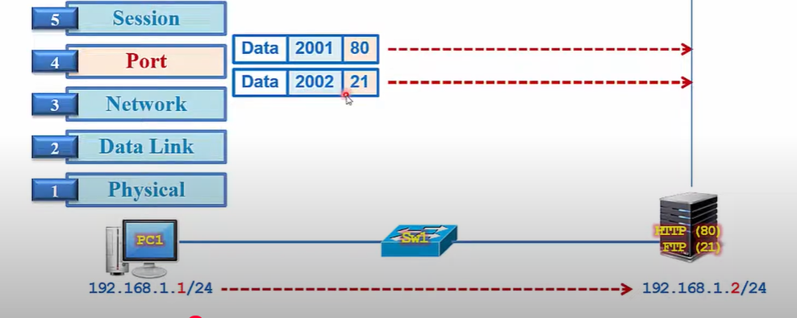
  <br>
  <em></em>
</div>

- Tự định danh port ngẫu nhiên port nguồn
- Ví dụ như ở giao diện web mở đồng thời 2 trình duyệt và cùng truy cập tới google.com thì dựa vào port nguồn để server có thể đẩy đúng cái phiên để xử lý 
### 2.4.3. UDP (Connectionless)
- Cơ chế hoạt động truyền thông: với 2 Máy tính 
	- Không cần trải qua việc bắt tay 3 bước và lúc này khi có dữ liệu cần truyền thì nó sẽ phân mảnh dữ liệu ra thành nhiều phần và lần lượt gửi các phân mảnh dữ liệu đi mà không cần phải đánh stt và gửi với tốc độ ồ ạt và nhanh, nhưng không có khả năng phục hồi lại dữ liệu đã mất 
- Ví dụ trong một cuộc điện thoại VoIP mà muốn  thiết lập thì nó vẫn sử dụng TCP rồi nó sẽ chủ động thiết lập 2 luồng UDP: 1 luồng để truyền tín hiệu từ trái sang phải và 1 luồng UDP khác từ phải sang trái 
- Chứa Port nguồn và Port Đích

## 2.5.Cấu trúc Header quan trọng cần nhớ

### 2.5.1. IPv4 Header (tầng Network)
- **Version**: phiên bản IP (4 cho IPv4)
- **Header Length (IHL)**: độ dài phần header
- **TOS/DSCP**: đánh dấu mức ưu tiên QoS cho gói tin
- **Total Length**: tổng độ dài gói tin (header + data)
- **Identification, Flags, Fragment Offset**: phục vụ cho việc phân mảnh (fragmentation) gói tin khi kích thước vượt quá MTU cho phép của đường truyền
- **TTL (Time To Live)**: giới hạn số hop gói tin được phép đi qua, mỗi khi qua 1 Router thì TTL giảm 1, về 0 thì gói tin bị hủy và gửi lại bản tin ICMP `Time Exceeded` — cơ chế này giúp tránh gói tin đi lặp vô hạn khi bị loop
- **Protocol**: cho biết dữ liệu bên trong thuộc giao thức tầng trên nào (6 = TCP, 17 = UDP, 1 = ICMP)
- **Source IP / Destination IP**: địa chỉ IP nguồn và đích — 2 trường này **không đổi** trong suốt hành trình gói tin đi qua nhiều Router (khác với địa chỉ MAC ở tầng 2 sẽ bị thay đổi ở mỗi chặng, như đã trình bày ở mục 3.7)

### 2.5.2. TCP Header (tầng Transport)
- **Source Port / Destination Port**: định danh ứng dụng/phiên làm việc nguồn và đích
- **Sequence Number**: số thứ tự của byte đầu tiên trong segment, phục vụ sắp xếp lại dữ liệu đúng thứ tự ở bên nhận
- **Acknowledgment Number**: số thứ tự byte tiếp theo mà bên nhận đang mong đợi nhận, dùng để báo nhận (ACK)
- **Flags (Control Bits)**: các cờ điều khiển quan trọng: `SYN` (yêu cầu thiết lập kết nối), `ACK` (báo nhận), `FIN` (yêu cầu kết thúc kết nối một cách bình thường), `RST` (buộc hủy kết nối ngay lập tức khi có lỗi), `PSH` (yêu cầu đẩy dữ liệu ngay cho tầng trên không cần đợi buffer đầy)
- **Window Size**: kích thước cửa sổ nhận (rwnd) — đã giải thích chi tiết ở mục 2.4.2.1

### 2.5.3. UDP Header (tầng Transport)
- Chỉ gồm **4 trường** nên header rất nhẹ (8 byte, so với TCP header tối thiểu 20 byte): **Source Port, Destination Port, Length (độ dài), Checksum (kiểm tra lỗi cơ bản)**
- Không có Sequence Number, không có Acknowledgment, không có Window Size — đây chính là lý do UDP nhanh nhưng không tin cậy như đã nói ở mục 2.4.3

# 3. Ethernet LAN
## 3.1. Local Area Network (LAN)
- LAN (Local Area Network) là hệ thống mạng cục bộ, kết nối các thiết bị trong 1 phạm vi địa lý nhỏ (1 phòng, 1 tòa nhà, 1 khuôn viên công ty)
- Đặc điểm: tốc độ truyền dữ liệu cao, độ trễ thấp, thuộc quyền sở hữu và quản lý của 1 tổ chức duy nhất (không phải thuê từ ISP như WAN)
- Công nghệ nền tảng phổ biến nhất để xây dựng mạng LAN hiện nay là **Ethernet**, hoạt động dựa trên 2 thiết bị chính: **Switch** (kết nối các thiết bị trong cùng 1 mạng) và **Router** (kết nối và định tuyến giữa các mạng LAN khác nhau)
## 3.2. MAC (Hexa)
- Các thiết bị tham gia cùng 1 mạng LAN được định danh với khái niệm là địa chỉ MAC 
- Mỗi máy tính muốn tham gia vào mạng LAN cần phải có card mạng (NIC) và trên mỗi card mạng có 1 địa chỉ MAC riêng, được **"đốt cứng" (burned-in)** vào phần cứng khi sản xuất
- Địa chỉ MAC dài **48 bit nhị phân**, được biểu diễn dưới dạng **12 số Hexa**

<div align="center">
  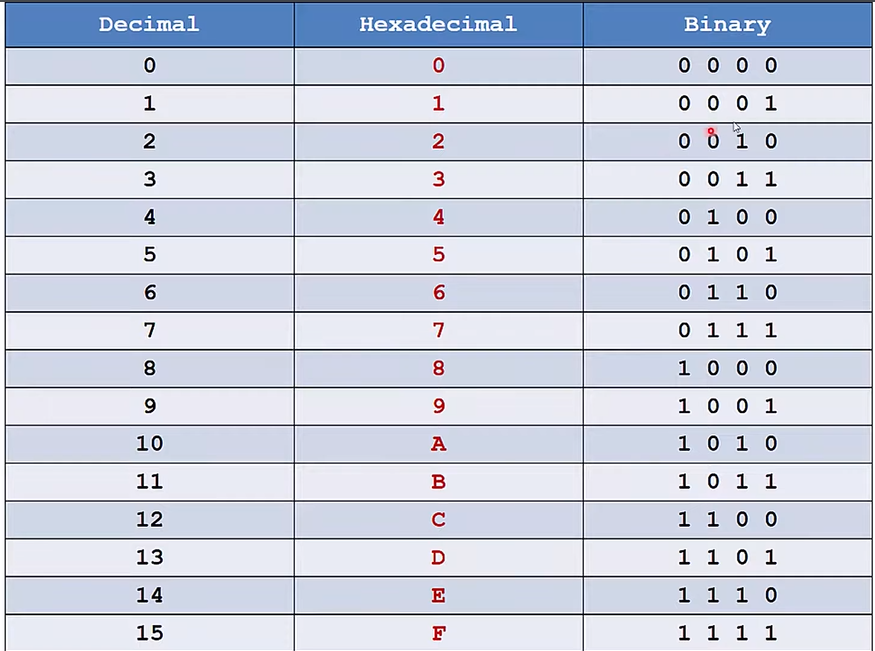
  <br>
  <em></em>
</div>

## 3.3. Quá trình trao đổi dữ liệu trên LAN
- Các thiết bị đầu cuối muốn trao đổi dữ liệu trong mạng LAN cần 2 thông tin 1 địa chỉ MAC và 2 là địa chỉ IP 

<div align="center">
  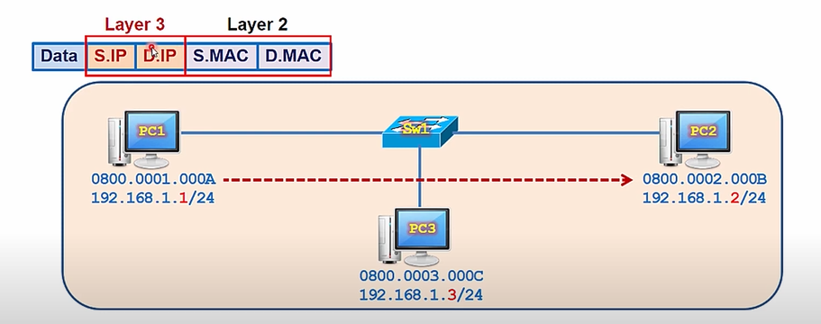
  <br>
  <em></em>
</div>

Nguyên lý hoạt động
- PC1 muốn giao tiếp với PC2 sẽ soạn ra 1 gói tin với IP nguồn và IP đích sau đó nó sẽ gửi bản tin tới switch tuy nhiên switch chỉ có khả năng xử lý thông tin L2 header thôi do vậy PC1 phải gắn thêm MAC nguồn và MAC đích như trên hình và được gọi là một frame
- PC1 gửi frame trên tới switch và nó sẽ căng cứ vào mac đích và gửi chính xác đến PC2 chứ k gửi ra tất cả các port 
- Ở góc độ PC2 khi nhận được bản tin thì nó phải đọc vào địa chỉ MAC đích xem có phải gửi cho nó hay không nếu phải thì nó tiến hành đọc tiếp vào L3 Header vào địa chỉ IP đích, nếu khớp PC sẽ tiến hành sử lý bản tin và gửi phản hồi lại PC1
## 3.4. Cơ chế chuyển mạch trên switch
Switch nhận `frame` trên 1 port rồi đẩy đến các port khác để xử lý, gọi là `quá trình chuyển mạch`
- Để thực hiện chức năng chuyển mạch thì switch cần dựa vào 1 bảng dữ liệu gọi là `MAC Table` 

	
<div align="center">
  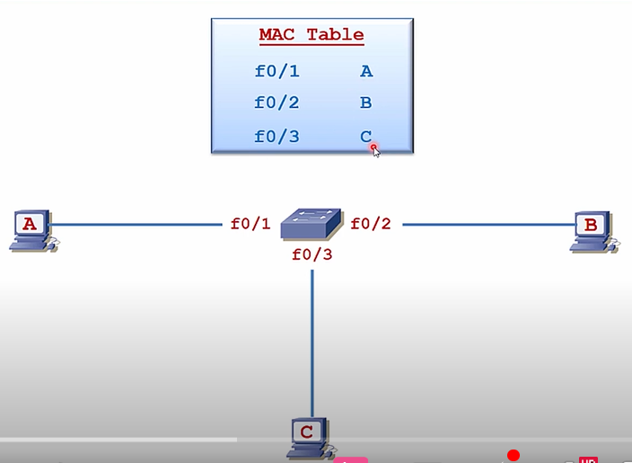
  <br>
  <em></em>
</div>

- Có `2 cột` 
  - 1 là **danh sách cổng kết nối đến switch (ex: f0/1)**
  - 2 là **địa chỉ MAC tương ứng**
- Khi Từ một máy có địa chỉ MAC là **A** muốn gửi dữ liệu đến MAC đích là MAC **B** thì nó sẽ tìm kiếm MAC B trong cái bảng `MAC Table` từ trên xuống dưới và nó phát hiện nếu muốn đi đến MAC B thì phải đẩy dữ liệu đến port f0/2 (tương tự với MAC C)
### 3.4.1. Cách switch xây dựng bảng MAC 
Khi Switch mới mua về hoặc chưa cấu hình thì sẽ không có bất kỳ dữ liệu nào và switch sẽ xây dựng MAC Table một cách tự động
- Khi nhận được bất kì một cấu trúc `frame` nào thì nó sẽ thực hiện 2 thao tác
	- **Học MAC nguồn** 
	- **Forward địa chỉ MAC đích** 
	- B1: Nếu nó nhận được MAC nguồn là A trên port f0/1 thì lúc này nó sẽ cập nhật MAC A tương ứng với port f0/1  
	- B2: MAC đích lúc này là B tuy nhiên trong bảng MAC Table vẫn chưa có biết MAC B nên đi port nào nên nó sẽ `forward ra tất cả các port trừ port nhận vào` 
- Mỗi dòng thông tin trong bảng MAC Table chỉ được lưu trữ trong khoảng thời gian giới hạn **khoảng 5 phút** trong khoảng thời gian đó nếu không có bất kỳ dữ liệu nào được gửi tới port này nữa thì nó sẽ bị xóa khỏi bảng MAC Table: mục tiêu là làm tinh gọn bảng `MAC Address Table` làm tăng hiệu năng tiêu thụ 
- Để kiểm tra được bảng MAC address-table trên switch cisco thì ta dùng lệnh: **`show mac address-table`**
## 3.5. Các kiểu truyền thông trên mạng LAN
### 3.5.1. Unicast: 
- 1 máy tính gửi dữ liệu cho 1 máy tính 
### 3.5.2. Broadcast: 
- 1 máy tính gửi dữ liệu cho toàn bộ máy tính cùng mạng (FFFF.FFFF.FFFF)
#### 3.5.2.1. Broadcast Domain trên LAN
- Một BD khi mà một máy tính gửi ra lưu lượng này thì tất cả các thiết bị còn lại trong vùng mạng sẽ nhận được thông tin này 
- Trên 1 BD chỉ được sử dụng 1 lớp mạng duy nhất được thôi

<div align="center">
  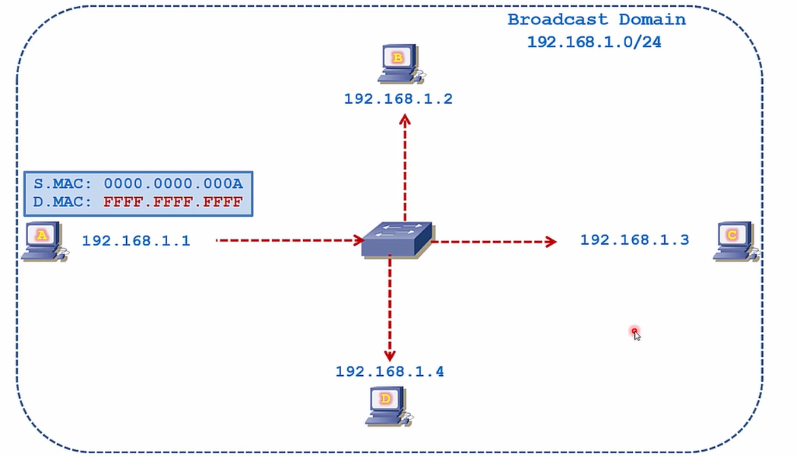
  <br>
  <em></em>
</div>

- BD mà quá lớn sẽ ảnh hưởng đến hiệu năng (performance) của hệ thống và nguy cơ về bảo mật
- Nên chia 1 BD lớn thành nhiều BD nhỏ
- Mỗi cổng của Router được coi là 1 BD và sử dụng các lớp mạng khác nhau 
### 3.5.3. Multicast: 
- 1 máy tính gửi cho một nhóm thiết bị máy tính còn lại

## 3.6. Cơ chế hoạt động của giao thức ARP (Address Resolution Protocol) phân giải địa chỉ IP thành địa chỉ MAC
- Máy tính sử dụng giao thức ARP sử dụng để phân giải địa chỉ IP thành địa chỉ MAC tương ứng
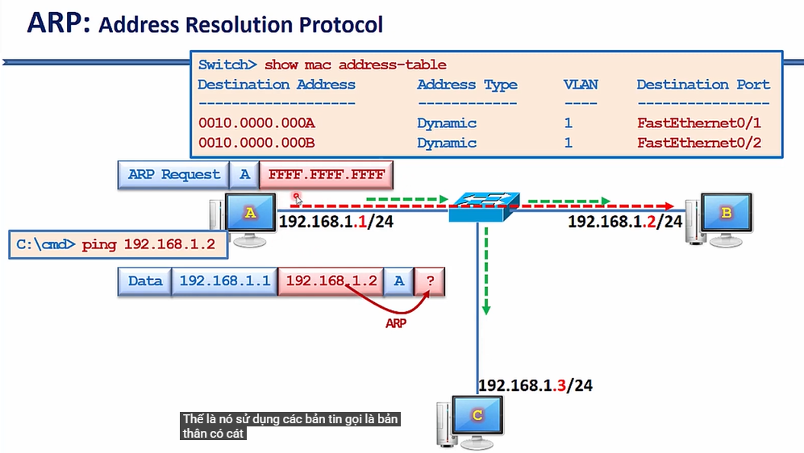
- Khi một Máy tính A muốn gửi dữ liệu cho Máy tính B thì nó sẽ soạn thảo ra một cấu trúc `frame (data, IP nguồn, IP đích)` nó phải gắn thêm MAC nguồn và MAC đích nữa nhưng mà máy tính không biết MAC B là bao nhiêu nó phải căn cứ vào địa chỉ IP đích và nó phân giải được địa chỉ MAC đích tương ứng là gì 
- Để phân giải được từ địa chỉ IP sang MAC thì nó phải soạn thảo 1 bản tin là `ARP request` với MAC nguồn là A và MAC đích là FFFF.FFFF.FFFF nó sẽ gửi ra tất cả các máy tính còn lại và hỏi Ai có IP này thì hồi đáp địa chỉ MAC tương ứng
- Và request này khi gửi đến switch thì căn cứ vào địa chỉ MAC đích và sẽ đẩy địa chỉ ra tất cả các port trừ port nhận vào và PC nào có IP đó thì sẽ hồi đáp về PC A thông qua bản tin `ARP reply` 
- Và khi đó PC A sẽ biết được địa chỉ MAC B là của ai rồi sẽ bổ sung vào địa chỉ MAC đích của mình sau đó nó sẽ gửi dữ liệu đến switch và switch sẽ căn cứ vào địa chỉ MAC B này và đẩy ra đúng port với PC B
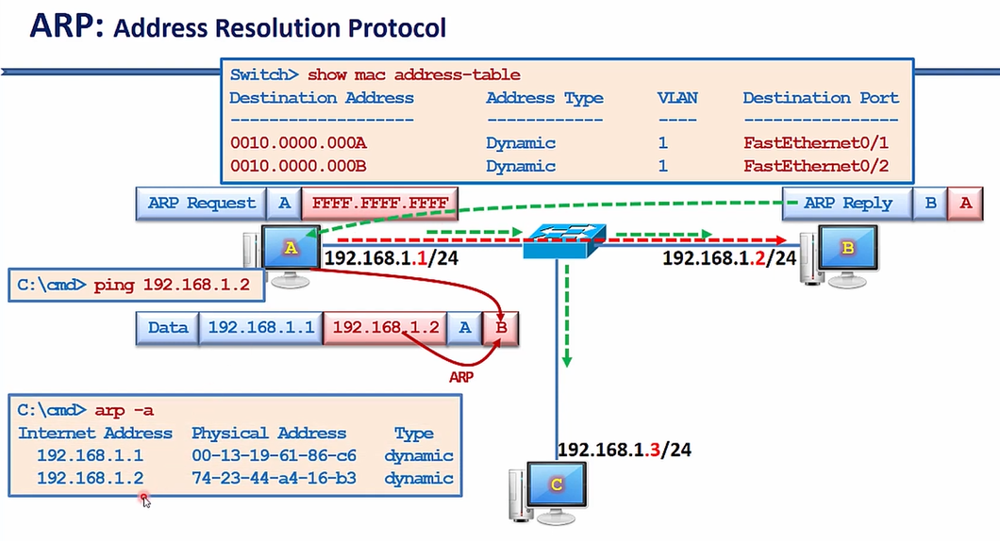
- Sau khi PC A nhận được bản tin `ARP reply` từ PC B hồi đáp về thì nó sẽ lưu trữ về cái bản `arp cache table`: `arp -a` và khi mà gửi dữ liệu cho PC B thì nó không cần phân giải thêm 1 lần nào nữa

## 3.7. Quá trình trao đổi dữ liệu giữa các phân vùng mạng LAN
Quá trình trao đổi dữ liệu giữa các phân vùng mạng LAN liên quan đến 2 đơn vị dữ liệu tại lớp 2 (frame) và lớp 3 (packet) 
	- cấu trúc packet có ý nghĩa trên toàn vùng, cấu trúc frame có ý nghĩa trên từng phân vùng

<div align="center">
  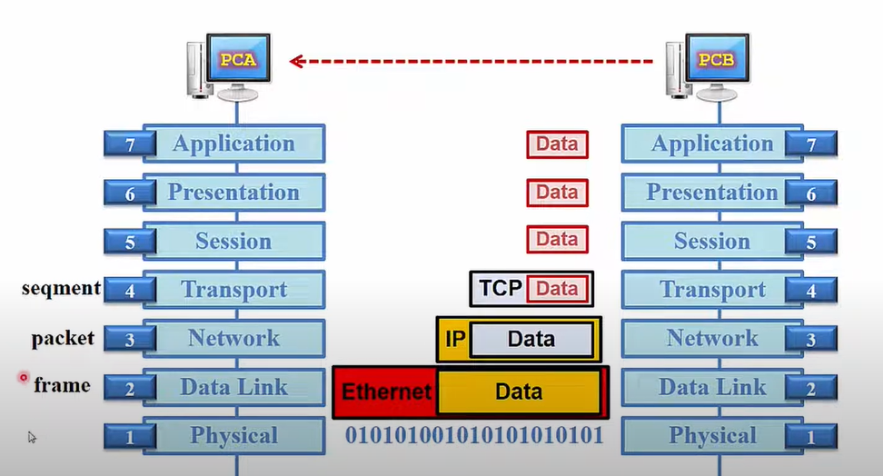
  <br>
  <em></em>
</div>

- Cấu trúc L3 header không bị thay đổi còn L2 header thì bị thay đổi trong quá trình truyền 
- Ngoài Ethernet L2 còn có các công nghệ khác như PPP truyền dữ liệu với khoảng cách xa hơn

## 3.8. Cấu trúc của địa chỉ MAC
- `L2 Header` (Dest MAC, Source MAC, Type - cho biết nội dung Data chứa bản tin IPv4 hay IPv6 hay bản tin ARP)
- Data
- `FCS (Frame Check Sequence)`: dùng để kiểm tra lỗi, căn cứ vào trường này để xem cấu trúc frame có bị lỗi trong quá trình truyền hay không
- Địa chỉ MAC 48 bit chia làm 2 phần
  - 24 bit đầu tiên gọi là OUI (Organization Unique Identifier): ta có thể biết được do hãng nào sản xuất ra thường phải liên hệ với tổ chức cung cấp dải địa chỉ MAC để xin và mua được 24 con OUI này 
  - 24 bit cuối cùng (Vendor Assigned): để định danh cho từng card mạng họ sản xuất ra 
- Địa chỉ MAC được viết dưới dạng số `hexa` nếu địa chỉ MAC dài 48 bit nhị phân thì cứ 4 bit nhị phân gom thành 1 số hexa vậy nên người ta gom thành `12 số hexa`
- Cấu trúc số hexa như sau: cứ 2 hexa được ngăn cách bởi dấu `:` hoặc `-` hoặc `cứ 4 số hexa ngăn cách nhau bằng dấu chấm` 
  - VD: địa chỉ MAC `6400.6A12.3456` thì `6400.6A` (24 bit đầu - OUI) cho biết card mạng này do hãng nào sản xuất (có thể tra cứu online qua các trang "MAC address lookup"), còn `12.3456` (24 bit cuối) là mã định danh riêng cho từng card mạng của hãng đó
## 3.9. Các tiêu chuẩn công nghệ ethernet LAN
### 3.9.1. Ethernet
- IEEE 802.3, chuẩn `10BASE-T`, tốc độ 10 Mbps, chạy trên cáp đồng UTP
### 3.9.2. Fast Ethernet
- IEEE 802.3u, tốc độ 100 Mbps, gồm `100BASE-TX` (cáp đồng) và `100BASE-FX` (cáp quang)
### 3.9.3. Gigabit Ethernet
- IEEE 802.3z, chuẩn `1000BASE-X`, tốc độ 1000 Mbps (1 Gbps), chạy trên cáp quang
- IEEE 802.3ab, chuẩn `1000BASE-T`, tốc độ 1000 Mbps (1 Gbps), chạy trên cáp đồng UTP Cat5e trở lên
- IEEE 802.3x: đây là chuẩn quy định cơ chế **Full Duplex và Flow Control (PAUSE frame)**, đi kèm hỗ trợ cho Gigabit Ethernet chứ không phải là 1 chuẩn tốc độ riêng

**Tóm gọn theo tốc độ: 10 Mbps -> 802.3 (10BASE-T) | 100 Mbps -> 802.3u (100BASE-TX/FX) | 1000 Mbps -> 802.3z (cáp quang) & 802.3ab (cáp đồng)**
## 3.10. Hub và Switch 
Cơ chế hoạt động của HUB: **Hub là thiết bị hoạt động ở tầng Physical (tầng 1)**, khi nhận được tín hiệu điện trên 1 port thì nó chỉ đơn giản **khuếch đại tín hiệu đó lên rồi phát (broadcast) ra tất cả các port còn lại mà không hề đọc hay xử lý bất kỳ thông tin địa chỉ nào,** hoạt động như 1 thiết bị khuếch đại tín hiệu thuần túy

**So sánh Switch và HUB**
- Switch là thiết bị lớp 2 vì nó có thể đọc vào `L2 Header` đọc vào cấu trúc Ethenet header dựa vào MAC nguồn và MAC đích `đẩy cấu trúc frame vào chính xác port` 
- HUB là thiết bị lớp 1 vì nó `không có khả năng đọc vào L2 Header đọc vào cấu trúc Ethenet header` khi mà chúng nhận được frame và chúng hiểu rằng frame này có tín hiệu 0101 trên môi trường truyền và lúc này sẽ khuếch đại tín hiệu này lên và gửi ra tất cả các port trừ port nhận vào, mặc định là nó sẽ đẩy Broadcard nếu nó nhận được thông tin từ bất cứ đâu gây giảm hiệu năng hệ thống và vấn đề bảo mật
### 3.10.1. Half Duplex (HUB)
Chỉ có thể truyền thông: tại 1 thời điểm chỉ có 1 thiết bị có thể truyền dữ liệu còn các thiết bị khác phải chờ 
- **Gây ra giảm tốc độ chia sẻ băng thông tốc độ tối đa sẽ chia ra trên từng phân đoạn mạng**
#### 3.10.1.1. Conllision Domain và cơ chế tránh đụng độ CSMA CD 
Khi sử dụng HUB thì xảy ra `Collision Domain`, HUB chỉ có khả năng hoạt động `Half Duplex` nên **nếu các thiết bị truyền dữ liệu đồng thời thì có nguy cơ xảy ra đụng độ** 


<div align="center">
  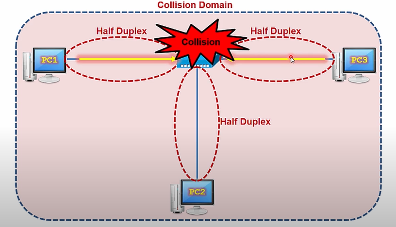
  <br>
  <em></em>
</div>

- Để hạn chế đụng độ thì nên sử dụng switch, vì **mỗi port của switch được coi là 1 Collision Domain riêng**, giúp chia 1 Collision Domain lớn thành nhiều Collision Domain nhỏ 

	
<div align="center">
  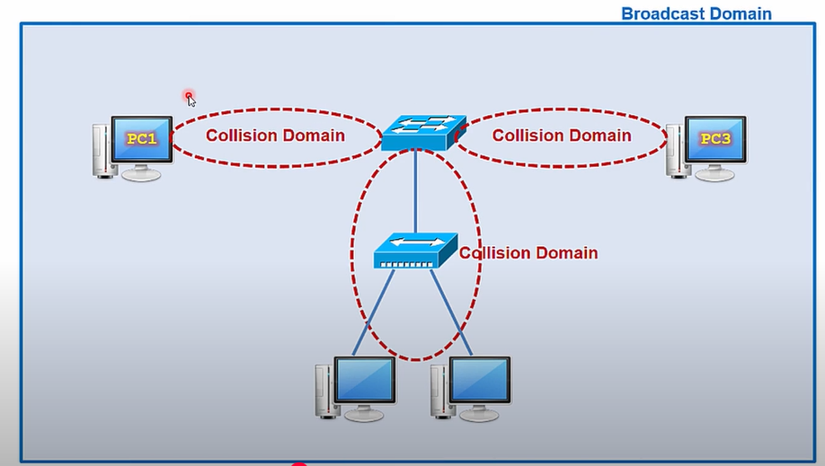
  <br>
  <em></em>
</div>


- Một BD thì có thể chứa nhiều CD, càng có nhiều CD càng tốt 
- Để tránh được nguy cơ đụng độ xảy ra thì các thiết bị phải có **cơ chế chống đụng độ CSMA/CD** (Carrier Sense Multiple Access with Collision Detection - Đa truy cập cảm biến sóng mang với khả năng phát hiện đụng độ)


<div align="center">
  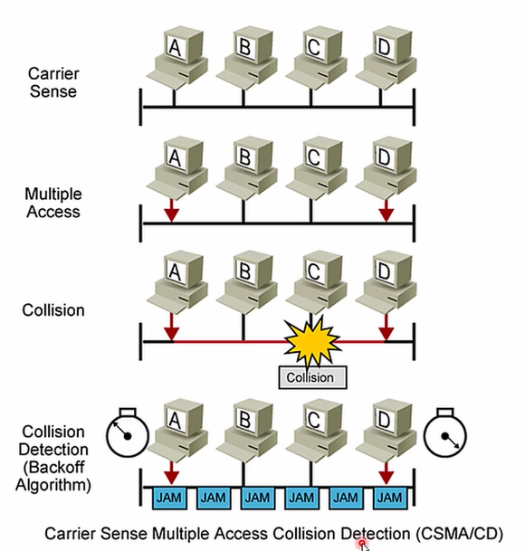
  <br>
  <em></em>
</div>

- Cơ chế CSMA/CD tự động được bật khi thiết bị hoạt động ở **chế độ Half Duplex**
  - Cơ chế hoạt động: trước khi truyền dữ liệu, máy tính sẽ lắng nghe xem có thiết bị nào khác đang truyền trên môi trường truyền hay không, nếu không có thì mới bắt đầu truyền trên môi trường này 
  - Nếu 2 thiết bị cùng lắng nghe và thấy môi trường đang rảnh rồi cùng truyền dữ liệu 1 lúc thì đụng độ sẽ xảy ra 
    - Khi đó thiết bị sử dụng thuật toán Backoff để đề xuất 1 giá trị thời gian chờ ngẫu nhiên, đồng thời gửi 1 tín hiệu báo nghẽn (jam signal) và đợi hết khoảng thời gian đó rồi mới truyền lại dữ liệu
    - Tự đề xuất tham số time
- Xác định số lượng CD và BD
	- mỗi Port của sw có 1 CD 
	- Mỗi port của Router có 1 BD
### 3.10.2. Full Duplex (Switch)
Chúng có thể truyền và nhận dữ liệu đồng thời cùng lúc trên cùng 1 kết nối mà không xảy ra đụng độ
- Nên sử dụng Full Duplex thay vì Half Duplex vì tận dụng được tối đa băng thông của đường truyền theo cả 2 chiều (VD: đường truyền 100Mbps Full Duplex thực chất tương đương 100Mbps gửi + 100Mbps nhận đồng thời)
- Vì mỗi thiết bị đều có đường truyền riêng (không dùng chung môi trường vật lý như HUB) nên **không xảy ra đụng độ**, do đó **không cần dùng đến CSMA/CD** khi hoạt động ở chế độ Full Duplex
- Switch hiện đại mặc định hoạt động Full Duplex khi kết nối điểm-điểm (point-to-point) với 1 thiết bị khác qua cáp UTP, cơ chế `Auto-Negotiation` giúp 2 đầu cổng tự động thương lượng tốc độ (speed) và chế độ song công (duplex) phù hợp với nhau
## 3.11. Chuẩn cáp Ethernet LAN
Phân biệt cáp UTP và cáp chống nhiễu STP
### 3.11.1. Cáp đồng
- Bên trong có 8 sợi cứ 2 sợi thì lại xoắn lại với nhau để chống nhiễu
- Có 2 loại: **UTP (Unshielded Twisted Pair - không có lớp bọc chống nhiễu)** và **STP (Shielded Twisted Pair - có lớp bọc kim loại chống nhiễu)**, STP thường dùng ở môi trường công nghiệp nhiều nhiễu điện từ nhưng giá thành cao hơn UTP
- Có nhiều chuẩn phổ biến: 100BASE-TX và 1000BASE-TX
  	- Chữ T gọi là twisted pair 2 sợi nhỏ xoắn lại, giúp chống nhiễu và làm chắc

	<div align="center">
		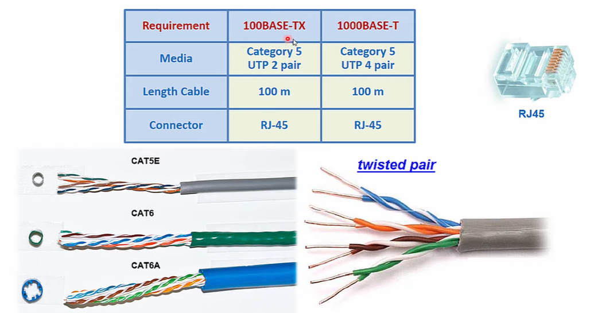
		<br>
		<em></em>
	</div>

- CAT càng cao thì loại Cáp đó càng tốt: CAT5E, CAT6, CAT6A sợi đồng càng dầy tốc độ tốt hơn

### 3.11.2. Cáp thẳng (Straight-Through)và cáp chéo (Cross-Over)

<div align="center">
  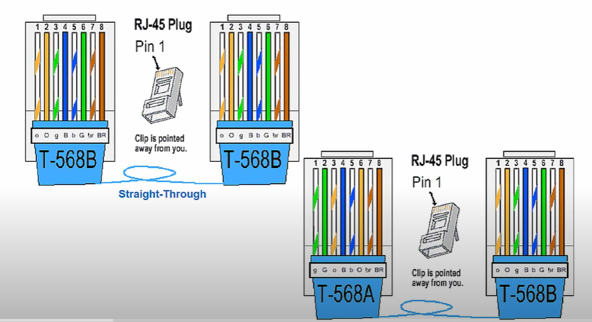
  <br>
  <em></em>
</div>

#### 3.11.2.1. Cáp thẳng 
- Đầu cáp được bấm theo chuẩn T-568B - T-568B
- Thứ tự màu sắc chuẩn B: **`Trắng Cam, Cam, Trắng xanh lá, Xanh dương, trắng xanh dương, xanh lá, trắng nâu, nâu`**
- Chân 1 tính từ trái sang phải theo màu sắc ở trên
- Các thiết bị khác nhau sẽ nối với nhau qua cáp thẳng
	- VD: sw - rt, sw - pc
	
<div align="center">
  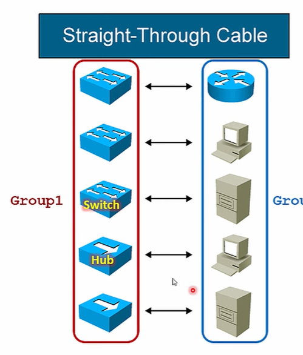
  <br>
  <em></em>
</div>

#### 3.11.2.2. Cáp chéo 
- Đầu cáp được bấm theo chuẩn T-568A - T-568B
- Thứ tự màu sắc chuẩn A: **`Trắng xanh lá, xanh lá, trắng cam, xanh dương, trắng xanh dương, cam, trắng nâu, nâu`** 
- Chân 1 tính từ trái sang phải theo màu sắc ở trên
- Các thiết bị giống nhau sẽ nối với nhau qua cáp chéo 
	- VD: sw - sw, rt - rt, rt - pc, pc - pc 
	
	
<div align="center">
  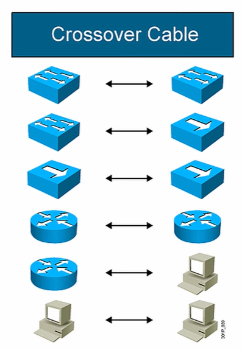
  <br>
  <em></em>
</div>

- Quy tắc phân biệt cáp thẳng/cáp chéo ở trên đúng về mặt lý thuyết và vẫn còn giá trị khi thi lý thuyết hoặc gặp thiết bị đời cũ. Tuy nhiên trong thực tế hiện nay, hầu hết switch/router/NIC đời mới đều hỗ trợ tính năng **Auto-MDIX (Automatic Medium-Dependent Interface Crossover)**, giúp cổng mạng tự động nhận diện và đảo chiều cặp dây tín hiệu cho phù hợp bất kể cắm cáp thẳng hay cáp chéo. Vì vậy trên thực tế đa số trường hợp **không còn bắt buộc phải chọn đúng loại cáp** như quy tắc truyền thống nữa, nhưng vẫn nên hiểu và nắm quy tắc này vì đề thi CCNA vẫn thường hỏi.
# 4. Địa chỉ IP 
## 4.1. IPv4
Cấu trúc `IPv4` chia thành 2 phần 
- net-id và host-id
- `Net-id` **giúp phân biệt mạng này với mạng khác còn** `host-id` **giúp định danh từng thiết bị bên trong vùng mạng**
	
<div align="center">
  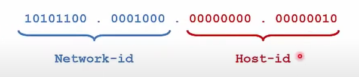
  <br>
  <em></em>
</div>

- Địa chỉ IPv4 được thể hiện dưới dạng nhị phân thì có chiều dài là **`32bit`** nhị phân. Trên thế giới có khoảng **2<sup>32</sup> địa chỉ IPv4** **(4,29 tỉ địa chỉ)** và đã cạn kiệt từ lâu 
- Chuyển đổi số nhị phân sang số thập phân: **32 con số chia thành 4 cụm bằng nhau và mỗi cụm như vậy được gọi là `octet`**
	
<div align="center">
  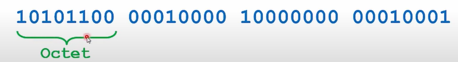
  <br>
  <em></em>
</div>

- Cứ `8bit nhị phân` thì sẽ đổi thành `1 số thập phân`
	
<div align="center">
  
  <br>
  <em></em>
</div>


### 4.1.1. Tổng quan về các lớp địa chỉ IPv4

<div align="center">
  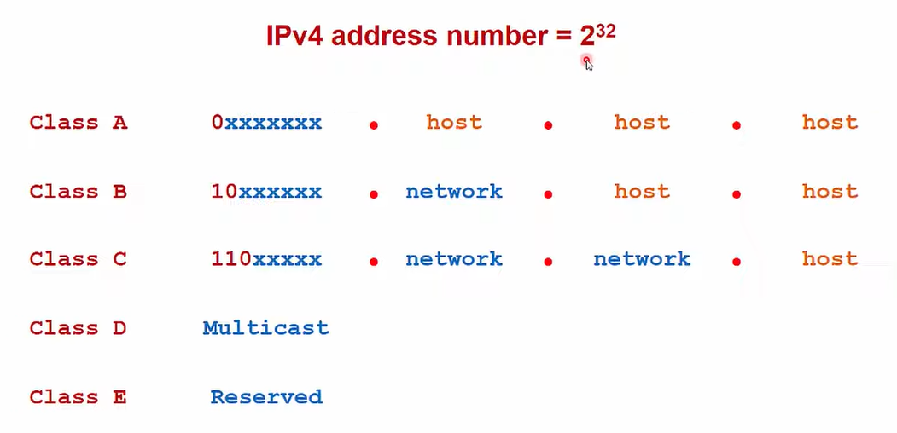
  <br>
  <em></em>
</div>

- Chia thành 5 lớp A, B, C, D, E
  - **Dãy D dùng trong công nghệ multicast** 
  - **Dãy E mang tính chất dự phòng**
  - Lớp C: `8bit` cuối cùng đóng vai trò là host-id vậy trong lớp mạng C có khoảng **2<sup>8</sup> địa chỉ IPv4**
  - Lớp B: `16bit` cuối cùng đóng vai trò là host-id vậy trong lớp mạng B có khoảng **2<sup>16</sup> địa chỉ IPv4** 
  - Lớp A: `24bit` cuối cùng đóng vai trò là host-id vậy trong lớp mạng A có khoảng **2<sup>24</sup> địa chỉ IPv4** 
- Một trong những lý do người ta chia thành các lớp A, B, C là tùy theo **quy mô, kích thước** của hệ thống mạng. Mục tiêu cuối cùng là `tiết kiệm không gian địa chỉ IPv4`
- Để **phân loại lớp A, B, C** người ta dựa vào `octet đầu tiên`, cụ thể đối với:
	- Lớp A: Trong số `8bit` đầu tiên thì `bit đầu tiên` luôn luôn bằng **0**. Chạy từ **[1 - 127]** thay đổi 7 bit còn lại
	- Lớp B: trong số `8bit` đầu tiên thì `2bit đầu tiên` luôn luôn bằng **10**:  **[128 - 191]** thay đổi 6 bit còn lại
	- Lớp C: trong số `8bit` đầu tiên thì `3bit đầu tiên` luôn luôn bằng **110**: **[192 - 223]** thay đổi 5 bit còn lại

> **⚠️ Quan trọng (Bổ sung bảng tổng hợp còn thiếu)**:
>
> | Lớp | Octet đầu | Subnet mask mặc định | Prefix mặc định | Số bit host |
> |---|---|---|---|---|
> | A | 1 - 127 | 255.0.0.0 | /8 | 24 |
> | B | 128 - 191 | 255.255.0.0 | /16 | 16 |
> | C | 192 - 223 | 255.255.255.0 | /24 | 8 |
>
> Lưu ý: dải `127.x.x.x` tuy về mặt lý thuyết nằm trong lớp A nhưng **không được dùng để đánh địa chỉ cho thiết bị** vì đã được dành riêng làm dải Loopback (xem mục 4.1.5)
- Chuyển đổi từ `prefix length` thành `subnet mask`
	- Dựa vào `net-id` để đổi thành prefix length
	- VD: 10.0.0.8 -> `lớp A`, 8 bit đầu làm net-id -> **/8** 
	- Chuyển thành subnet mask 
		- VD: **/24** thì viết ra 24 số 1 và các số sau bằng 0 hết cho thành 1 dãy địa chỉ IP và đổi từng cụm thành số thập phân 
		
	<div align="center">
		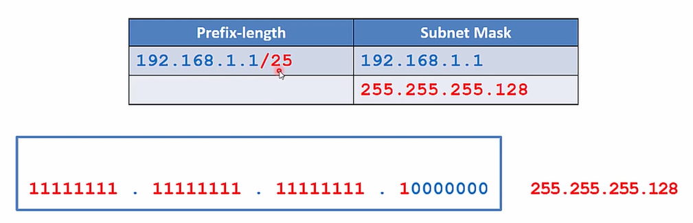
		<br>
		<em></em>
	</div>

- Đổi từ nhị phân sang thập phân 
	- Chia 32 con số thành 4 cụm bằng nhau và đổi 8 bit thành 1 số thập phân
	
	<div align="center">
		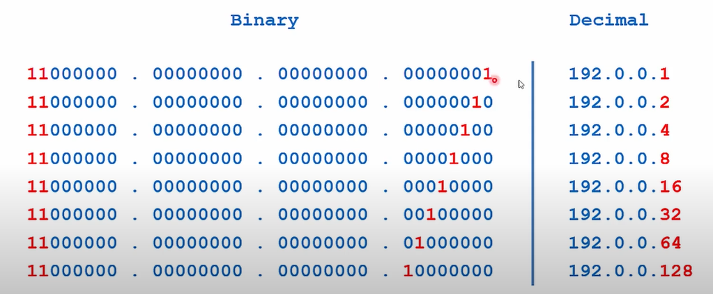
		<br>
		<em></em>
	</div>

	- Tăng theo cấp số nhân `1, 2, 4, 8, 32, 64, 128`
	- Chuyển đổi octet từ nhị phân sang thập phân
	
	<div align="center">
		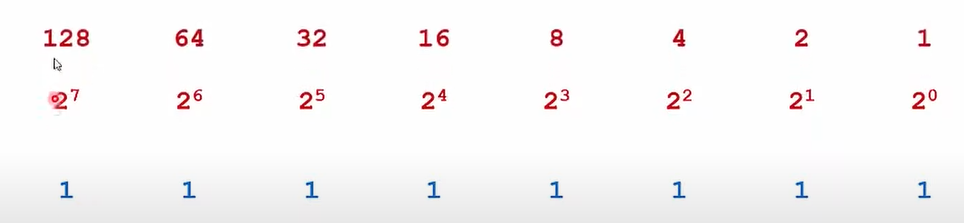
		<br>
		<em></em>
	</div>

	- Chuyển đổi thập phân sang nhị phân
		- Đầu tiên viết 8 số giảm dần `1, 2, 4, 8, 16, 32, 64, 128` sau đó đưa số đó vào phần lớn nhất rồi còn lại đưa vào các ô khác sao cho vừa đủ rồi đánh các số có khớp ở dưới thành 1 và các số không khớp ở dưới đánh 0
		- VD: 192 = 128 + 64 -> `11000000`
		- VD: 80 = 64 + 16 -> `01010000`
		- VD: 170 = 128 + 32 + 8 + 2 -> `10101010`
		- Cộng chẵn lại còn lại thì chuyển đổi
		- VD: 187 = 128 + 32 + 16 + 8 + 2 + 1 -> `10111011`
### 4.1.2. Chức năng của địa chỉ mạng và địa chỉ Broadcast 
- Trong địa chỉ mạng dùng để đảm nhiệm cho 1 dãy IP nhất định nào đó
	
	<div align="center">
		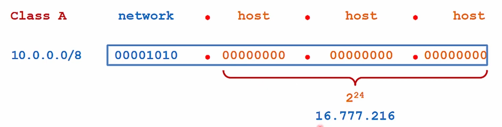
		<br>
		<em></em>
	</div>

- Với các bit host bằng 0 hết thì là địa chỉ mạng
	
	<div align="center">
		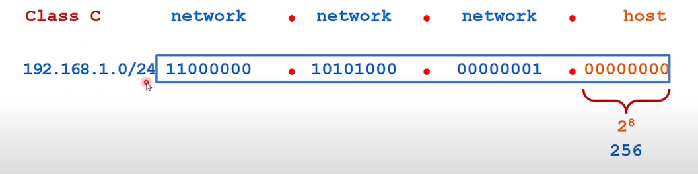
		<br>
		<em></em>
	</div>

- Với dãy mạng trên thì ta có dãy địa chỉ từ [0-255] và địa chỉ đầu là net-add và địa chỉ cuối là Broadcast-add và không thể gán 2 địa chỉ ip này cho hệ thống 

> **⚠️ Quan trọng (Bổ sung công thức còn thiếu)**: Số lượng địa chỉ IP **thực sự gán được** cho thiết bị trong 1 mạng con luôn là:
> **Số host khả dụng = 2^(số bit host) − 2** (trừ đi 1 địa chỉ mạng - network address và 1 địa chỉ quảng bá - broadcast address, vì 2 địa chỉ này không được gán cho thiết bị)
> - VD: mạng `/24` có 8 bit host -> 2^8 − 2 = **254 host** khả dụng (chứ không phải 256)
> - VD: mạng `/30` (thường dùng cho kết nối point-to-point giữa 2 router) có 2 bit host -> 2^2 − 2 = **2 host** khả dụng, vừa đủ cho 2 đầu router
	
	<div align="center">
		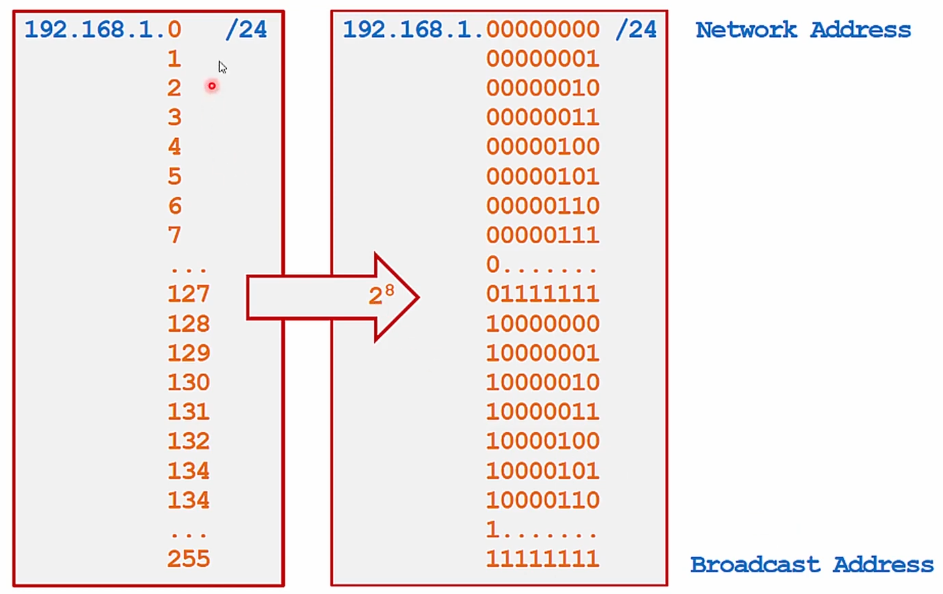
		<br>
		<em></em>
	</div>

### 4.1.3. Chia mạng con Subnet
- Chia mạng lớn thành nhiều lớp mạng nhỏ 
	
	<div align="center">
		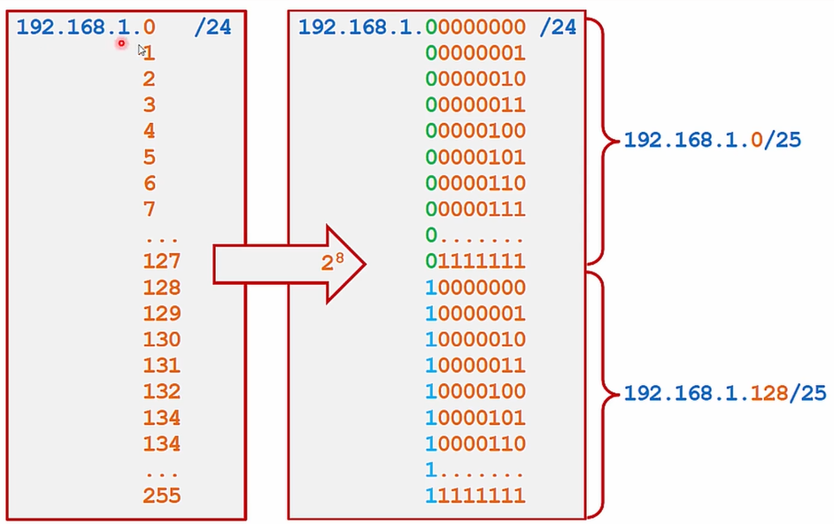
		<br>
		<em></em>
	</div>

    - Có nhiều bit đầu giống nhau thì gom nó thành 1 mạng mới 
- Số lượng mạng con subnet và địa chỉ IP trong mỗi subnet
	
	<div align="center">
		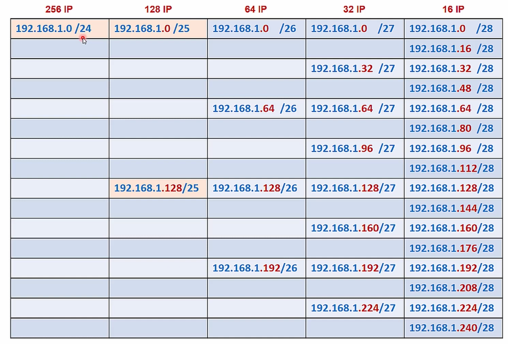
		<br>
		<em></em>
	</div>

	- Chia đôi số lượng host-id sẽ ra số lượng mạng con nhỏ hơn, cứ mỗi lần mượn 1 bit thì 1 mạng lớn sẽ chia ra thành 2 mạng nhỏ
	- VD: `/24` -> có `256 địa chỉ` -> /2 = 128 -> có 2 lớp mạng `/25` với mỗi lớp mạng sẽ có `128` địa chỉ IP
	
	<div align="center">
		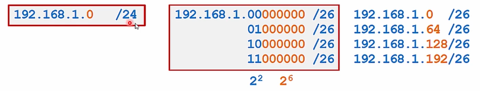
		<br>
		<em></em>
	</div>

	- Từ `/24` -> `/26` -> mượn 2 bit của **host-id** còn `6bit ở host-id` với 2^2 -> 4 mạng con chia ra 4 trường hợp 00 01 10 11 và các bit sau cùng là 0 hết thì ra địa chỉ mạng lớp `/26` 
	- Hoặc sử dụng phương pháp bước nhảy host-id có 2^6 = 64 cứ lấy từ 0 + 64 rồi + tiếp cho 64 thì sẽ ra lớp mạng tiếp theo
	- Dễ hiểu thì lấy bit net mượn 2^n = m thì có m lớp mạng con tương ứng và bit host còn lại 2^t = j cho biết j là lớp mạng mới 
### 4.1.4. Quy hoạch IPv4
- Xác định số lượng địa chỉ mạng tối đa mà cần phải có 
	
	<div align="center">
		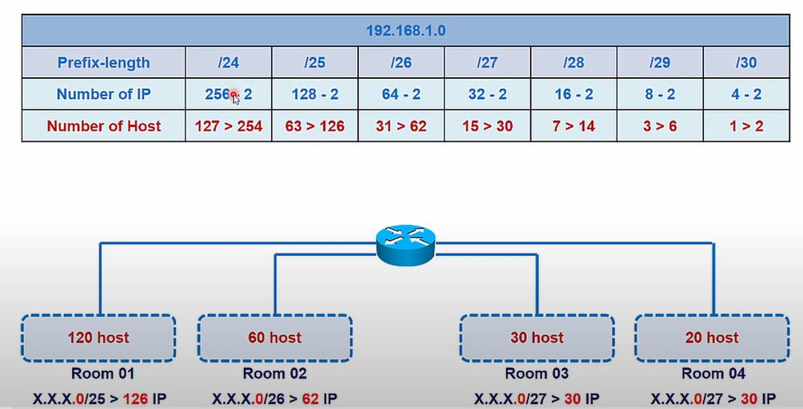
		<br>
		<em></em>
	</div>

- VD: quy hoạch địa chỉ `192.168.1.0/24` 
	
	<div align="center">
		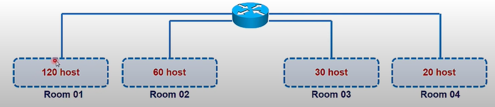
		<br>
		<em></em>
	</div>

	- Ta sẽ đi từ vùng mạng cần nhiều IP nhất sau đó đến lần lượt các mạng con sau
	- 120 host -> `/25` -> 192.168.1.128/25
	- 60 host -> `/26` -> 192.168.1.64/26 -> 192.168.1.127/26
	- 30 host -> `27` -> 192.168.1.32/27 -> 192.168.1.63/27
	- 20 host -> `27` -> 192.168.1.0/27 -> 192.168.1.31/27
### 4.1.5. Địa chỉ Public và Private
- Địa chỉ Public phải mua và được cấp từ nhà mạng
	
	<div align="center">
		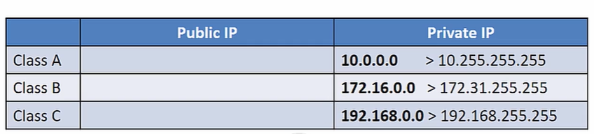
		<br>
		<em></em>
	</div>

Các dải địa chỉ cụ thể theo chuẩn **RFC 1918** (rất hay bị hỏi trong đề thi CCNA):
- **Địa chỉ Private (RFC 1918)** — không định tuyến được trên internet, chỉ dùng nội bộ, dùng chung cho nhiều tổ chức khác nhau mà không xung đột nhờ có NAT:
  - Lớp A: `10.0.0.0 – 10.255.255.255` (`10.0.0.0/8`)
  - Lớp B: `172.16.0.0 – 172.31.255.255` (`172.16.0.0/12`)
  - Lớp C: `192.168.0.0 – 192.168.255.255` (`192.168.0.0/16`)
- **Địa chỉ Public**: tất cả các dải còn lại (ngoài Private và các dải đặc biệt bên dưới), được IANA cấp phát duy nhất trên toàn cầu, định tuyến được trực tiếp trên internet
- **Các dải đặc biệt khác cần nhớ**:
  - `127.0.0.0/8`: dải **Loopback**, dùng để tự kiểm tra card mạng/hệ điều hành của chính thiết bị (thường dùng `127.0.0.1`)
  - `169.254.0.0/16`: dải **APIPA (Automatic Private IP Addressing)**, hệ điều hành tự gán khi thiết bị không xin được IP từ DHCP Server, cho biết dấu hiệu lỗi cấp phát DHCP
  - `0.0.0.0`: đại diện cho "toàn bộ địa chỉ chưa xác định", thường dùng trong default route
  - `255.255.255.255`: địa chỉ Broadcast giới hạn (Limited Broadcast) trong phạm vi 1 mạng cục bộ
## 4.2. IPv6
Kiến thức nền tảng về IPv6:
- Lý do ra đời IPv6: địa chỉ IPv4 (32 bit, ~4.29 tỷ địa chỉ) đã cạn kiệt, IPv6 dùng **128 bit** nhị phân nên số lượng địa chỉ gần như vô hạn (2^128 địa chỉ)
- Địa chỉ IPv6 được biểu diễn dưới dạng **8 nhóm số Hexa**, mỗi nhóm 16 bit, ngăn cách nhau bằng dấu `:`
	- VD: `2001:0DB8:0000:0000:0000:0000:1234:5678`
- Quy tắc rút gọn địa chỉ IPv6:
	- Có thể bỏ các số **0** đứng đầu mỗi nhóm: `0DB8` -> `DB8`
	- Nhiều nhóm số `0000` liên tiếp nhau có thể rút gọn thành `::` nhưng **chỉ được dùng 1 lần duy nhất** trong 1 địa chỉ để tránh nhập nhằng số lượng nhóm bị rút gọn
	- VD: `2001:0DB8:0000:0000:0000:0000:1234:5678` -> `2001:DB8::1234:5678`
### 4.2.1. Các loại địa chỉ IPv6
- **Unicast**: định danh cho 1 giao diện duy nhất, gửi từ 1 nguồn đến 1 đích
	- **Global Unicast Address (GUA)**: địa chỉ định tuyến được trên internet, tương đương địa chỉ Public của IPv4, thường bắt đầu bằng `2000::/3`
	- **Link-Local Address (LLA)**: chỉ có hiệu lực trong phạm vi 1 đoạn mạng (link) cục bộ, không định tuyến qua router, dải `FE80::/10`, tự động được gán trên mỗi cổng khi bật IPv6
	- **Unique Local Address (ULA)**: tương đương địa chỉ Private của IPv4, dùng nội bộ không định tuyến ra internet, dải `FC00::/7`
- **Multicast**: gửi cho 1 nhóm thiết bị, dải `FF00::/8`, thay thế hoàn toàn cho Broadcast (IPv6 không có khái niệm Broadcast)
- **Anycast**: 1 địa chỉ được gán cho nhiều thiết bị khác nhau, gói tin sẽ được gửi đến thiết bị **gần nhất** về mặt định tuyến
### 4.2.2. Cơ chế cấp phát địa chỉ IPv6
- **Static**: gán tay địa chỉ IPv6 cho từng thiết bị
- **Stateless Address Autoconfiguration (SLAAC)**: thiết bị tự sinh ra địa chỉ IPv6 của mình dựa vào thông tin prefix mà Router quảng bá qua bản tin `RA (Router Advertisement)` kết hợp với địa chỉ MAC (EUI-64)
- **DHCPv6**: tương tự như DHCP của IPv4, có thể cấp Stateful (đầy đủ thông tin) hoặc Stateless (chỉ cấp thêm DNS,... còn địa chỉ IP tự học qua SLAAC)
### 4.2.3. Cấu hình IPv6 cơ bản trên Router Cisco
```
ipv6 unicast-routing
int f0/0
	ipv6 address 2001:DB8::1/64
	ipv6 address FE80::1 link-local
	no shut
show ipv6 interface brief
show ipv6 route
```
# 5. Router
## 5.1. Cấu hình router Cisco
### 5.1.1. Các câu lệnh
- User EXEC Mode: `>` dùng lệnh `enable` để vào Privileged EXEC Mode
- Privileged EXEC Mode: `#` dùng lệnh `config t` để vào Global Config Mode
- Global Config Mode: `(config)#`
- Xem cấu hình đang chạy: `show run`
- Vào cấu hình cổng: `int f0/0`
  - Đặt địa chỉ IP: `ip add <ip> <subnet mask>` hoặc `ip add dhcp` để xin IP tự động
  - `no shut`: bật cổng lên
- Xem địa chỉ ip trên các cổng: `show ip int brief`
- Xem trạng thái chi tiết cổng: `show int f0/0`
- Chống trôi dòng lệnh: `logging synchronous`, giúp giữ đúng vị trí con trỏ dòng lệnh, không bị các dòng log/thông báo hệ thống chen ngang khi đang gõ lệnh
- Phân giải tên miền thành IP: `ip domain-lookup`
	- `ip host PCA 192.168.1.2`: gán tên gợi nhớ PCA cho địa chỉ IP 192.168.1.2
	- `ping PCA`: ping bằng tên gợi nhớ thay vì địa chỉ IP
- Lưu cấu hình: `wr` hoặc `copy run start`
- Xóa cấu hình và khởi động lại thiết bị với cấu hình trắng: `erase start` rồi `reload`
- Mã hóa password: `service password-encryption`
- Lưu cấu hình lên TFTP Server
	- `copy run tftp:`
	- `copy tftp: run`
- Lưu cấu hình lên FTP server
	- `ip ftp username anphuc`
	- `ip ftp password anphuc`
	- `copy run ftp:`
	- `copy ftp: run`
- Lưu hệ điều hành lên TFTP Server
	- `show flash:`
	- `copy flash: tftp:`
### 5.1.2. Thiết lập mật khẩu Console và mật khẩu Enable
- Mật khẩu Console:
    - Câu lệnh `line console 0` (0 là cổng console mặc định nếu router có 1 cổng)
    	- `password abc`
    	- `login`
- Mật khẩu Enable:
	- `enable password <mật khẩu>`
	- `enable password` lưu mật khẩu ở dạng không mã hóa mạnh (chỉ mã hóa yếu khi bật `service password-encryption`) nên trong thực tế **không nên dùng**. Nên thay thế bằng lệnh `enable secret <mật khẩu>` vì mật khẩu được băm (hash) bằng MD5 (hoặc SCRYPT ở IOS mới) ngay khi cấu hình, an toàn hơn nhiều. Lưu ý: nếu cấu hình đồng thời cả `enable password` và `enable secret` thì Cisco IOS luôn **ưu tiên dùng `enable secret`**.
- Tính năng tự đăng xuất Exec-Timeout: `exec-timeout 1 30 `(1 phút 30s)
# 6. Giao thức CDP (Cisco Discovery Protocol) - Phát hiện thiết bị láng giềng
- Xem các thiết bị láng giềng: `show cdp neighbors` 
	
	<div align="center">
		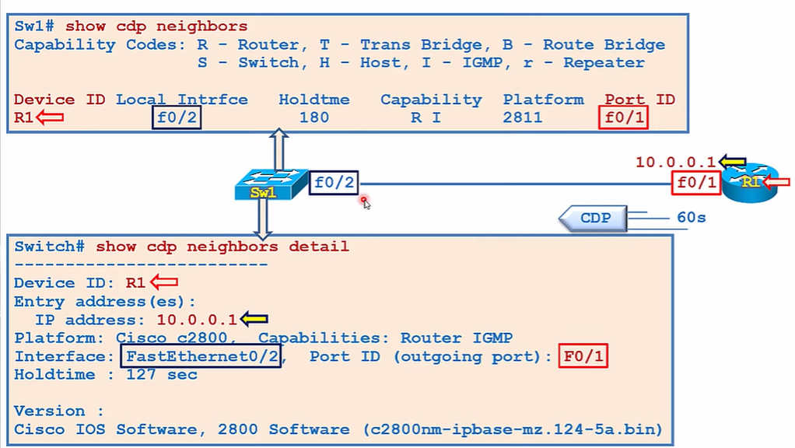
		<br>
		<em></em>
	</div>

- Phát hiện được là router hay firewall hay port nào kết nối 
- Biết được dòng sản phẩm
- `show cdp neighbors detail`
- CDP được kích hoạt mặc định trên các thiết bị Cisco và cứ định kỳ 60s 1 lần sẽ gửi bản tin CDP qua thiết bị gần đó, bản tin này chứa tất cả thông tin liên quan đến thiết bị gửi 
- Khi thiết bị nhận được bản tin CDP của bên láng giềng gửi cho nó thì nó lưu giữ thông tin trong vòng 180s
- Cơ chế là nó sẽ gửi Broadcast ra tất cả các thiết bị mỗi 60s 1 lần 
- Tắt CDP trên 1 cổng cụ thể: `no cdp enable`
- Tắt CDP trên toàn bộ thiết bị: `no cdp run`
- Giao thức tương tự là **LLDP (Link Layer Discovery Protocol)**, chuẩn mở nên hỗ trợ được trên nhiều hãng khác nhau chứ không riêng Cisco
	- `lldp run`: bật LLDP toàn thiết bị
	- `lldp enable`: bật LLDP trên từng cổng
	- `show lldp neighbors`: xem thiết bị láng giềng qua LLDP
# 7. Telnet
- Kỹ thuật kết nối từ xa cho thiết bị phục vụ cho việc cấu hình 
- Sử dụng `port 23`
## 7.1. Cấu hình 
- Bật telnet trên Cisco: 

	```
	line vty 0 4 (5 người được phép đồng thời telnet)
	password anphuc
	login
	```
- Kiểm tra người kết nối: `show users`
- Xóa phiên kết nối: `clear line ...`
- Thay đổi hoặc gỡ bỏ mật khẩu Telnet: `no password`
### 7.1.1. Cấu hình xác thực bằng Username và mật khẩu
	```
	username anphuc password anphuc123
	line vty 0 4 
		no password
		login local
	enable password anphuc
	```
	- Lưu ý: câu lệnh `enable password` chỉ có tác dụng nếu trước đó đã bật mật khẩu Enable (`enable password`/`enable secret`) trên thiết bị
### 7.1.2. Cấu hình telnet không cần mật khẩu
	```
	line vty 0 4 
		no login
	enable password anphuc
	```
- Cấp độ phân quyền của tài khoản: `privilege level 15`, mỗi tài khoản khi cấu hình có thể được gán 1 mức độ (level) giới hạn quyền truy cập khác nhau
### 7.1.3. Config lock
- Chỉ cho phép 1 người cấu hình thiết bị tại 1 thời điểm: `configuration mode exclusive auto`
- Xem log cấu hình: `do show configuration log`
### 7.1.4. Thay đổi port dịch vụ
- Sử dụng 1 port khác thay vì port 23, tạo access list cho phép truy cập vào port 3001 sau đó áp dụng access-list đó lên router và mở port 3001
	```
	access-list 101 permit tcp any any eq 3001
		- any đầu tiên là bất kỳ địa chỉ nào tới 
		- any thứ 2 là bất kỳ địa chỉ nào trên con router
	line vty 0 4
		rotary 1 (+3000 = 3001)
		access-class 101 in
		password ...
		login
	enable password ...
	```
- Cách xem được mật khẩu bằng Wireshark khi Telnet
	- Chọn đúng card mạng
	- Sau đó lọc các luồng `TELNET`
	- Chuột phải -> Follow -> TCP stream
- nếu truy cập bằng port 3001 
	- tcp.port==3001
## 7.2. Kỹ Thuật AAA hỗ trợ xác thực và phân quyền Telnet trên thiết bị
# 8. SSH (Secure Shell) - Cấu hình thiết bị từ xa
- Hỗ trợ dịch vụ mã hóa, mọi thông tin username, password và mọi câu lệnh thực thi cũng đều được mã hóa 
- Sử dụng port mặc định là `22`
	
	<div align="center">
		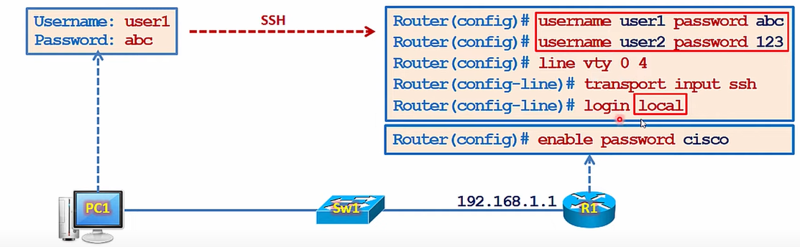
		<br>
		<em></em>
	</div>

	- `transport input ssh`: chỉ cho phép truy cập bằng SSH, nếu muốn cho phép cả 2 (SSH không được thì dùng Telnet) thì dùng `transport input all`
- Mọi thông tin về username, password trước khi được gửi tới router thì nó sẽ được mã hóa bằng 1 password hay còn gọi là key
- Key được thỏa thuận giữa 2 bên và key này được sử dụng để mã hóa dữ liệu
	- SSHv1: 3DES
	- SSHv2: AES
	- Được mã hóa thông qua mã hóa bất đối xứng SSH server đứng ra sinh ra 1 cặp `public key` và `private key`. Có ưu điểm là nếu dùng public key để mã hóa dữ liệu thì muốn giải mã được bắt buộc phải cần đến private key 
- Quá trình thỏa thuận giá trị password của mã hóa bất đối xứng (BĐX) diễn ra như sau:
	- R1 là SSH-server sẽ sinh ra cặp `public key và private key`
	- Public key thì sẽ **`công khai` cho client biết được** - PC1 phát sinh ra password này bằng `1 thuật toán ngẫu nhiên`
	- Tiến hành lấy `public key` kết hợp với `thuật toán mã hóa bất đối xứng RSA` để `mã hóa` password thành chuỗi bị mã hóa 
	- `Private key` kết hợp với `RSA` để `giải mã`
	- Và chỉ có Router sở hữu cái private key mới có thể giải mã được mã hóa này
	- tìm cách gửi bí mật cái mật khẩu này cho R1
	- Sử dụng mật mã này để mã hóa dữ liệu

> **📌 (Bổ sung làm rõ)**: Mô tả trên là cách diễn giải đơn giản hóa để dễ hình dung. Trong thực tế, SSH sử dụng thuật toán trao đổi khóa **Diffie-Hellman (DH)** để 2 bên cùng thống nhất ra 1 khóa phiên (session key) **đối xứng** dùng chung mà không cần truyền trực tiếp khóa đó qua mạng; cặp khóa bất đối xứng RSA của Server chủ yếu dùng để **xác thực danh tính Server** (tránh tấn công Man-in-the-Middle) trong bước bắt tay ban đầu, còn toàn bộ dữ liệu phiên làm việc sau đó được mã hóa bằng khóa đối xứng (AES) vì mã hóa đối xứng có tốc độ xử lý nhanh hơn nhiều so với mã hóa bất đối xứng.
## 8.1. Câu lệnh cấu hình
- Khai báo host name sau đó khai báo ip domain-name 
	```
	hostname DN
	ip domain-name anphuc.vn
		crypto key generate rsa (Khai báo rsa)
		768 (Khai báo chiều dài pulic key và private key)
	ip ssh version 2
	show ip ssh 
	show ssh
	```
- Giá trị `768` bit ở trên chỉ nên dùng để minh họa nhanh trong bài lab vì thiết bị cũ giới hạn tài nguyên. Trong thực tế triển khai, khóa RSA 768-bit được xem là **yếu, không đủ an toàn** và có nguy cơ bị bẻ khóa. Khuyến nghị hiện nay nên tạo khóa RSA tối thiểu **1024-bit**, và tốt nhất nên dùng **2048-bit** trở lên (`crypto key generate rsa modulus 2048`) để đảm bảo an toàn cho phiên SSH.
# 9. Định tuyến
## 9.1. Định tuyến tĩnh (Static Route)
- Đối với các dãy mạng khác nhau nhưng đều nằm cùng trên 1 con router thì không cần khai báo định tuyến tĩnh chỉ cần các thiết bị trong vùng mạng trỏ đúng tới cái default-gateway thì nó sẽ thông được với nhau 
- Kiểm tra định tuyến: `show ip route`
	
	<div align="center">
		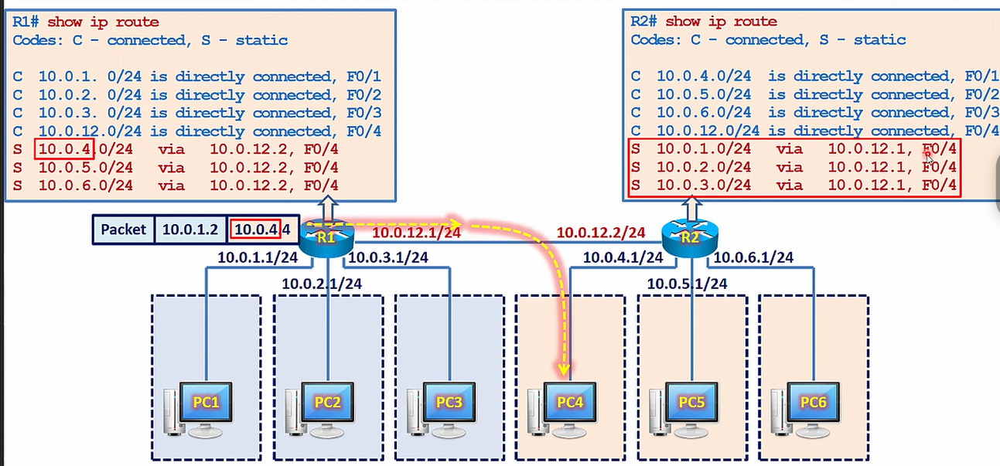
		<br>
		<em></em>
	</div>

- Nếu 2 router khác nhau thì các dãy mạng ở mỗi router không thể kết nối được với nhau bởi vì bảng định tuyến ở mỗi router đều không có đường đi đến lẫn nhau cho nên phải thêm đường đi cho chúng 
	- R1

		```
		ip route 10.0.4.0 255.255.255.0 10.0.12.2
		ip route 10.0.5.0 255.255.255.0 10.0.12.2
		ip route 10.0.6.0 255.255.255.0 10.0.12.2
		```
	- R2
		```
		ip route 10.0.1.0 255.255.255.0 10.0.12.1
		ip route 10.0.2.0 255.255.255.0 10.0.12.1
		ip route 10.0.3.0 255.255.255.0 10.0.12.1
		```
### 9.1.1. Cơ chế hoạt động của Static Route
- Đọc vào IP đích, kiểm tra bảng định tuyến sau đó chuyển tiếp dữ liệu ra đúng cổng tương ứng có trong bảng định tuyến
- Nếu IP đích không nằm trong bảng định tuyến thì Router sẽ tiến hành hủy gói tin (drop)
- Default route: Thông thường trên 1 Router muốn gửi dữ liệu ra ngoài internet thì bản thân con router này phải có 1 route đặc biệt là `default route` nó sẽ đại diện cho tất cả các route có thể có ở ngoài internet
	- `ip route 0.0.0.0 0.0.0.0 f0/0` (hạn chế sử dụng outbound interface để tránh làm giảm hiệu năng trong quá trình sử dụng)
	
	<div align="center">
		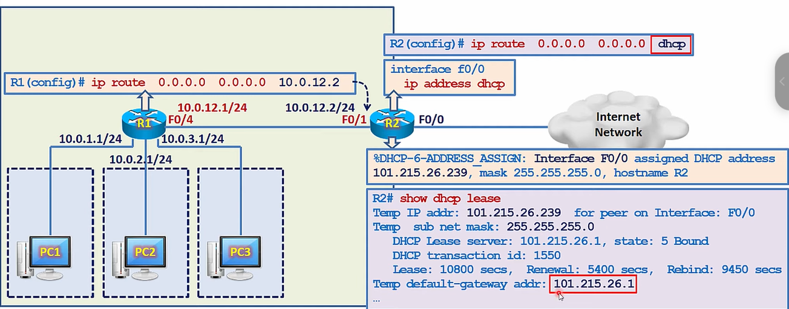
		<br>
		<em></em>
	</div>

- Và muốn dữ liệu mạng bên trong đi ra được internet thì ta cần NAT để có thể đi ra được internet
	
	<div align="center">
		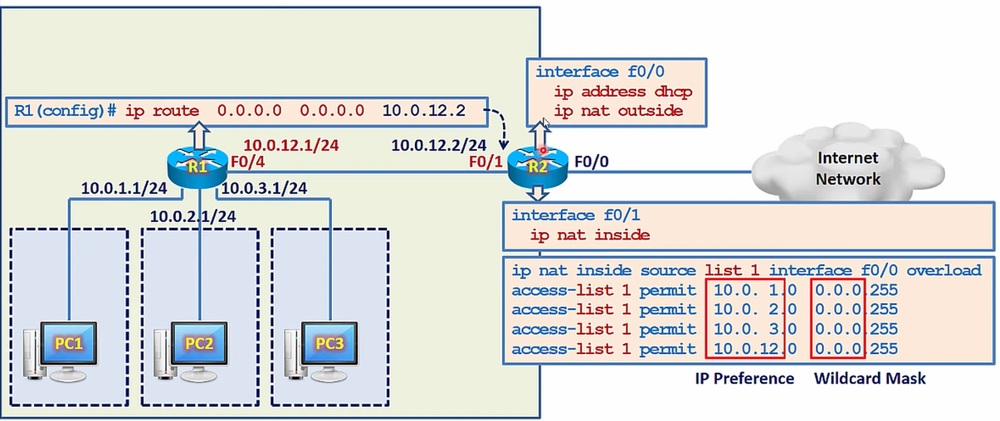
		<br>
		<em></em>
	</div>

### 9.1.2. Cơ chế Proxy ARP trong định tuyến
- Proxy ARP nếu không sử dụng cẩn thận thì nó sẽ làm giảm hiệu năng sử dụng mạng
- Nếu IP next-hop là 1 địa chỉ IP thì nó sẽ dễ dàng đi tới được đích hơn là để cổng 
- Ví dụ có 2 vùng mạng từ PCA sang PCB như ở hình:
	
	<div align="center">
		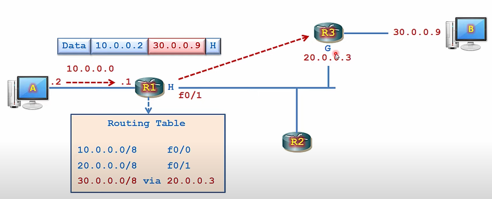
		<br>
		<em></em>
	</div>

	- Thì PC A sẽ soạn thảo bản tin `[data|10.0.0.2|30.0.0.9]` gồm IP nguồn và IP đích
	- Sau đó nó chuyển đến router, router sẽ đọc vào IP đích và tìm trong bảng định tuyến, phát hiện muốn đi đến lớp mạng `30.0.0.9` thì cần gửi bản tin qua IP next-hop `20.0.0.3`
	- Thường thì trước khi gửi bản tin qua phân đoạn mạng chính xác thì nó phải bổ sung thêm, MAC nguồn và MAC đích nữa 
	- Và lúc này MAC Nguồn là MAC của chính nó, MAC đích là MAC của next-hop `20.0.0.3` và để xác định được thì nó phải gửi ra 1 bản tin `ARP request` để hỏi thăm xem địa chỉ MAC tương ứng với next-hop đó là gì
	- Và khi R2 có địa chỉ `20.0.0.3` nhận được `ARP request` từ R1 gửi tới thì nó sẽ hồi đáp lại bằng `ARP reply` với `địa chỉ MAC` tương ứng của nó
	- Và lúc này R1 chỉ cần bổ sung thêm MAC đích vừa nhận được sau đó gửi dữ liệu đi, khi R3 nhận được thì nó sẽ xử lý bản tin của nó. Nó đọc vào IP đích và gửi ngược về lại đúng với địa chỉ IP đích cần gửi
	- Đứng tại R1 có thể kiểm tra được thông tin ARP do R3 hồi đáp trở về: `show arp`
- Tuy nhiên thay vì trỏ tới `IP next-hop` thì ta vẫn có thể chọn giải pháp `outbound interface`, tuy nhiên nó làm chậm hiệu năng của hệ thống và làm chậm quá trình định tuyến của hạ tầng mạng 
- Tiếp tục với trường hợp gửi dữ liệu trên, nhưng thay vì trỏ next-hop thì sẽ trỏ trực tiếp bằng cổng (outbound interface)
	- Dữ liệu đi đến R1 thì vẫn gắn MAC nguồn MAC đích, và gửi ARP request ra và R2 gửi ARP reply gửi về bởi vì R2 biết đường đi đến địa chỉ đích nên nó tuyên bố `30.0.0.9` tương ứng là địa chỉ MAC của chính nó, dù là địa chỉ này không phải là địa chỉ của R2 nhưng nó biết đường đi đến.
	- Là khi R1 nhận được ARP reply về thì nó lưu trữ về cache ARP, và quá trình gửi dữ liệu thành công
	- Tuy nhiên nếu IP đích là `30.0.0.8` thì nó lại gửi ARP request và R2 cũng tuyên bố tương tự là MAC của chính nó, tương tự với mọi địa chỉ khác trong cùng lớp mạng đó -> khiến bảng ARP table phình to ra rất nhiều, làm ảnh hưởng đến hiệu năng và khả năng định tuyến của Router này
### 9.1.3. Cấu hình cân bằng tải (Load Balancing)
- Tại router ta có 2 đường đi đến mạng đích thì lúc này ta có thể cấu hình 2 static route đến cùng mạng đích này 

	<div align="center">
		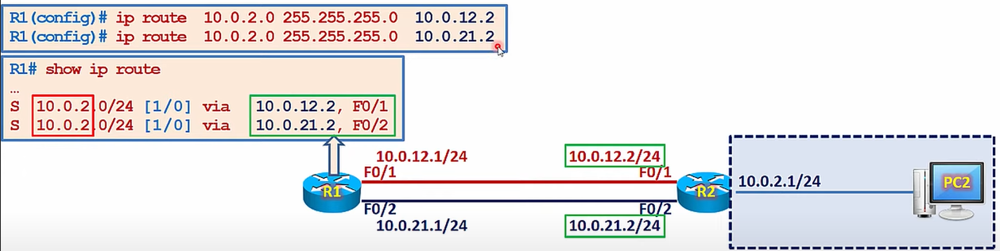
		<br>
		<em></em>
	</div>

- Lúc này thì dữ liệu sẽ được cân bằng tải theo cả 2 hướng là F0/1 và F0/2 với tỉ lệ 50% và khi một cổng bất kì gặp sự cố thì tất cả các lưu lượng sẽ đổ qua cổng còn lại đảm bảo không bị gián đoạn dữ liệu trên hệ thống.
	
	<div align="center">
		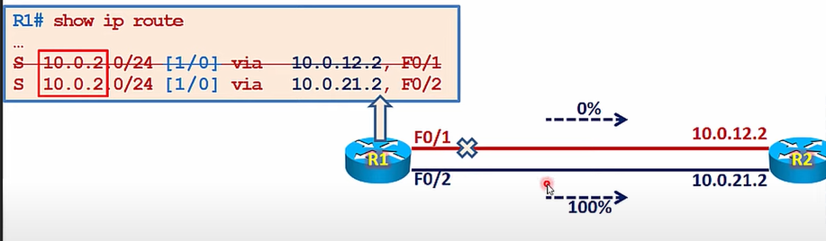
		<br>
		<em></em>
	</div>

#### 9.1.3.1. Định hướng lưu lượng bằng cách hiệu chỉnh tham số AD (Administrative Distance) của Static route
- Theo nguyên tắc là AD càng nhỏ thì đường đó càng tin cậy 
	
	<div align="center">
		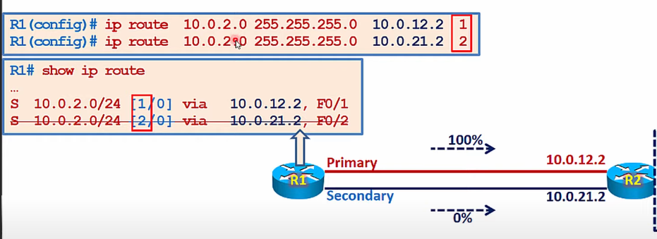
		<br>
		<em></em>
	</div>

		
	<div align="center">
		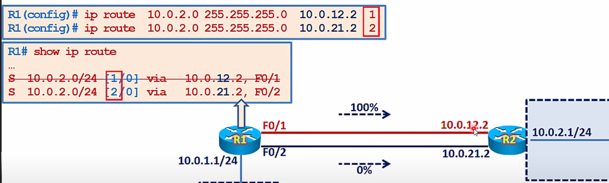
		<br>
		<em></em>
	</div>

		
	<div align="center">
		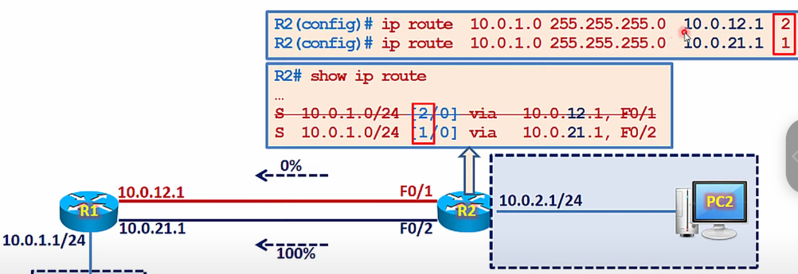
		<br>
		<em></em>
	</div>

- Đường LAN trên đi đường trên, LAN dưới đi đường dưới 
- Nếu muốn 2 đường bằng nhau thì chỉnh AD bằng nhau 
#### 9.1.3.2. Tối ưu định tuyến bằng kỹ thuật Summary (CIDR) (Classless Inter-Domain Routing)
- Nếu áp dụng kỹ thuật này thì việc định tuyến sẽ nhanh hơn
- Nếu ta muốn định tuyến cho 255 mạng thì phải cấu hình bằng tay rất lâu
	
	<div align="center">
		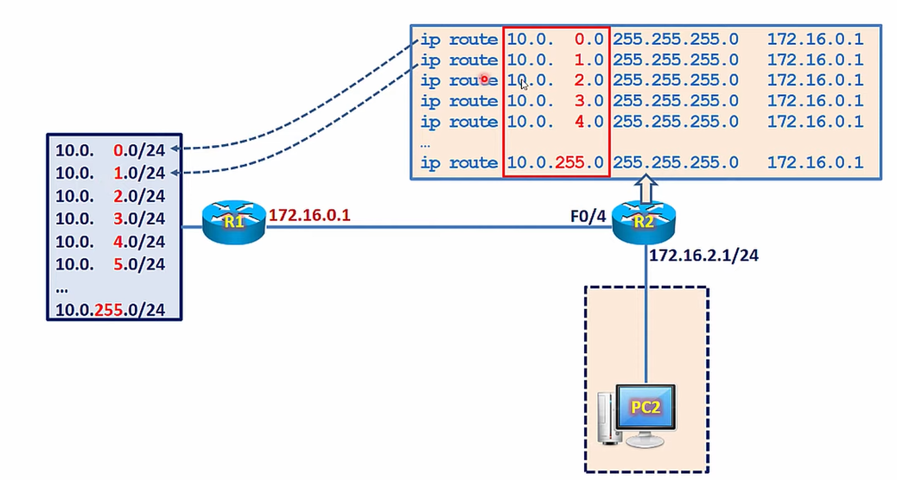
		<br>
		<em></em>
	</div>

- Nếu áp dụng kỹ thuật summary thì R 2 có thể gửi được dữ liệu đến tất cả mạng LAN 
	- `ip route 10.0.0.0 255.255.0.0 172.168.0.1`
	- Gom các bit giống nhau 
## 9.2. Định tuyến động (Dynamic Routing Protocol)
- Các loại giao thức định tuyến động thường thấy: BGP, RIP, OSPF, IS-IS
- Định tuyến phân loại thành 2 nhóm giao thức: `Interior Gateway` và `Exterior Gateway`
### 9.2.1. Interior Gateway (Định tuyến nội vùng)
- Được chia thành 2 nhóm giao thức:
#### 9.2.1.1. Distance Vector
- Giao thức phổ biến `RIP`
- Ưu điểm: `Không tiêu tốn nhiều tài nguyên xử lý của thiết bị` bởi vì thuật toán chọn đường đi của Distance Vector **tương đối đơn giản**
- Nhược điểm: Tiêu tốn quá nhiều thời gian để chọn được 1 đường đi hợp lý
##### 9.2.1.1.1. RIP (Routing Information Protocol)
- Câu lệnh kiểm tra bản rip: `show ip route rip`
- Khi từ 1 Router có nhiều đường đi tới mạng đích thì ta nên triển khai mô hình định tuyến động
	
	<div align="center">
		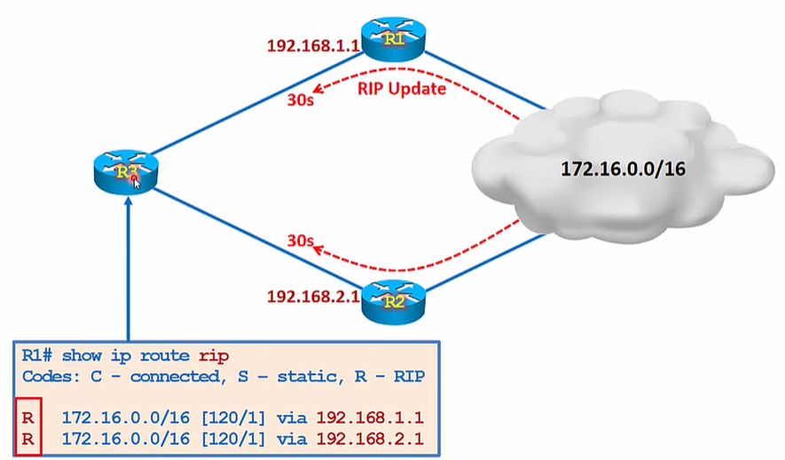
		<br>
		<em></em>
	</div>

- Và các Router đã bật RIP thì nó sẽ quảng bá cái mạng của mình cho các thiết bị lân cận mỗi 30s 1 lần 
- Và các Router nhận được thông tin quảng bá đến thì nó sẽ học được đường đi đến các mạng khác.
- Nếu phân đoạn mạng bất kỳ mà gặp sự cố thì Router sẽ thông báo cho các Router còn lại cái đường đó không còn truy cập được nữa và các router sẽ xóa cái đường đi đó trên bản định tuyến của mình
- Lựa chọn đường đi tối ưu dựa vào tham số AD (Administrative Distance)
	- Những Route học được từ giao thức RIP sẽ có AD là 120, còn nếu học được từ giao thức OSPF sẽ có AD là 110
	- AD càng thấp thì sẽ được ưu tiên, tin cậy
	- Route có ad thấp hơn sẽ được sử dụng trong suốt quá trình trao đổi dữ liệu
- *Metric: Đường nào có Metric thấp hơn thì đường đó sẽ tốt hơn
	
	<div align="center">
		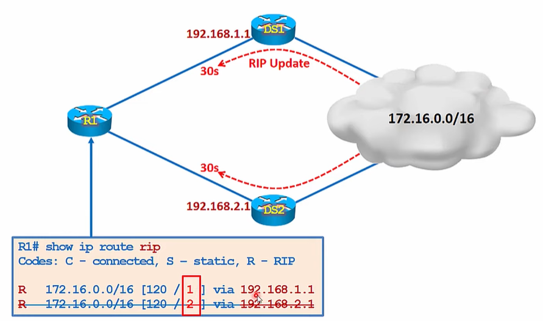
		<br>
		<em></em>
	</div>

	- Nếu đường có metric nhỏ hơn gặp sự cố thì cái đường có metric cao hơn sẽ xuất hiện trong bản định tuyến và đi theo đường này 
	- Cách tính metric: dựa vào hop count 
- Cơ chế hoạt động của RIP:
	- Sẽ quảng bá những thông tin mà nó biết cho R2 láng giềng cứ mỗi 30s 1 lần 
	- Và sau khi R2 láng giềng học được các mạng của R1 thì nó lại tiếp tục quảng bá cho R3 
	- Và khi R3 nhận được bản tin định tuyến từ R2 gửi qua thì nó cập nhật lại bảng định tuyến của nó
	
	<div align="center">
		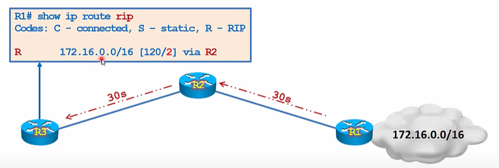
		<br>
		<em></em>
	</div>

	- Từ R3 ta thấy muốn đi qua mạng 172.16.0.0/16 thì phải đi qua 2 router R1 và R2 nên -> Hop Count = 2 
	- Nếu có 1 đường từ R1 -> R3 thì R3 sẽ học được đường đó và cập nhật lại bảng định tuyến với Hop Count = 1 và có 2 hướng đi đến mạng `172.16.0.0/26` thì nó quyết định đường tốt hơn và ẩn đường còn lại
	
	<div align="center">
		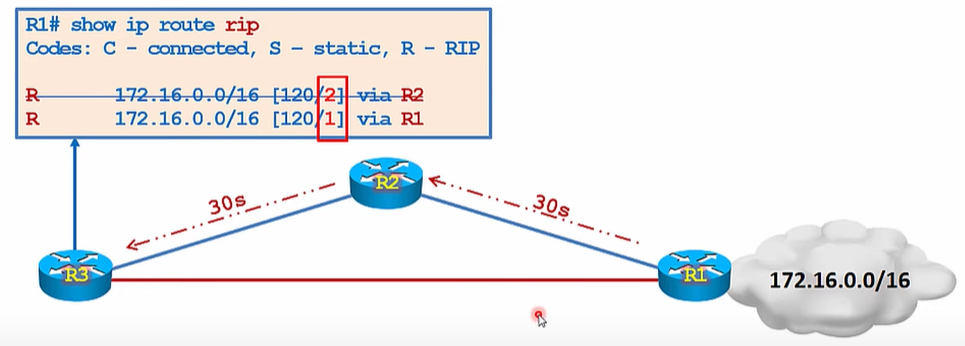
		<br>
		<em></em>
	</div>

	- Cách tính đường đi dựa vào Hop Count sẽ gây ra nhiều vấn đề: 
		- Chỉ quan tâm đường nào ngắn nhất nhưng tốc độ băng thông đường đó lại thấp hơn so với đường có Hop Count lớn hơn
	- Tóm tắt cơ chế hoạt động: cứ 30s 1 lần thì Router sẽ có những thông tin gì trong bảng định tuyến thì nó sẽ gửi hết qua cho thiết bị láng giềng với metric là 0 và router láng giềng sẽ kiểm tra những mạng mà router vừa gửi qua có trong bảng định tuyến của nó hay chưa nếu mà chưa có thì nó sẽ cập nhật vào bảng định tuyến và nó sẽ + metric thêm 1 và gửi ngược lại tất cả mạng mà nó biết qua router láng giềng lại. Và sau 1 khoảng thời gian nhất định thì các con router sẽ học được route của nhau
    - **Cơ chế chống loop Split Horizon**
    	- Nếu mạng ở router gặp sự cố và ngay lập tức nó sẽ xóa cái đường đi đến mạng đó, tuy nhiên router láng giềng vẫn còn cái thông tin đi đến mạng đó và nó bắt đầu quảng bá ngược lại cái đường đi cho route và nó sẽ học được và + metric thêm 1 đơn vị và nó có nguy cơ bị loop.
    	- **Vì bản thân con router đã quảng bá cái mạng đó và nó lại học ngược trở về cái mạng đó. Đó là nguyên nhân khiến nó bị loop**
    	- Để tránh loop xảy ra ta nên bật cơ chế chống loop: Nếu mà đứng tại R2 học được đường đi đến mạng `10.0.0.0/8` từ R1 và khi mà nó quảng bá ngược về mạng mà nó biết trong bảng định tuyến từ router láng giềng nó sẽ loại các mạng mà nó học được từ láng giềng này trước đó và R1 không học được đường đi tới và loop không còn xuất hiện nữa
    	
		<div align="center">
			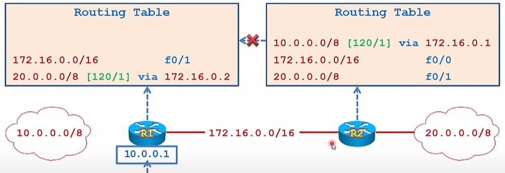
			<br>
			<em></em>
		</div>

    	- Cơ chế này tự động được bật khi cấu hình RIP
    	- Có thể tắt bằng cách vào cổng đó và `no ip split-horizon`
- Đối với giao thức RIP thì cái metric tối đa chỉ là 16 mà thôi 
	- Nếu đường có metric = 16 thì nó không bao giờ được sử dụng vì đường có nguy cơ bị loop 
- Các bộ Timer trong RIP
	- Để khảo sát độ hội tụ ta cần khảo sát 3 bộ Timer sau:
		- Update: 30s
		- Invalid: 180s 
		- Flush: 240s
	- Trường hợp đường đi đến mạng gặp sự cố và sau 30s vẫn không nhận được thông tin định tuyến thì nó vẫn duy trì cái đường đi đó trong vòng 180s nữa kể từ lúc nhận được thông tin định tuyến từ router láng giềng gửi qua
	- Sau khoảng 180s mà Router vẫn không nhận được thông tin định tuyến từ Router láng giềng thì nó sẽ tăng metric tối đa là 16 và tiếp tục quảng bá cái mạng này cho những con router khác biết ám chỉ mạng này đang gặp sự cố và nó sẽ duy trì trạng thái đó trong vòng 60s nữa và sau 240s thì chính thức xóa mạng đó khỏi thông tin định tuyến.
	
	<div align="center">
		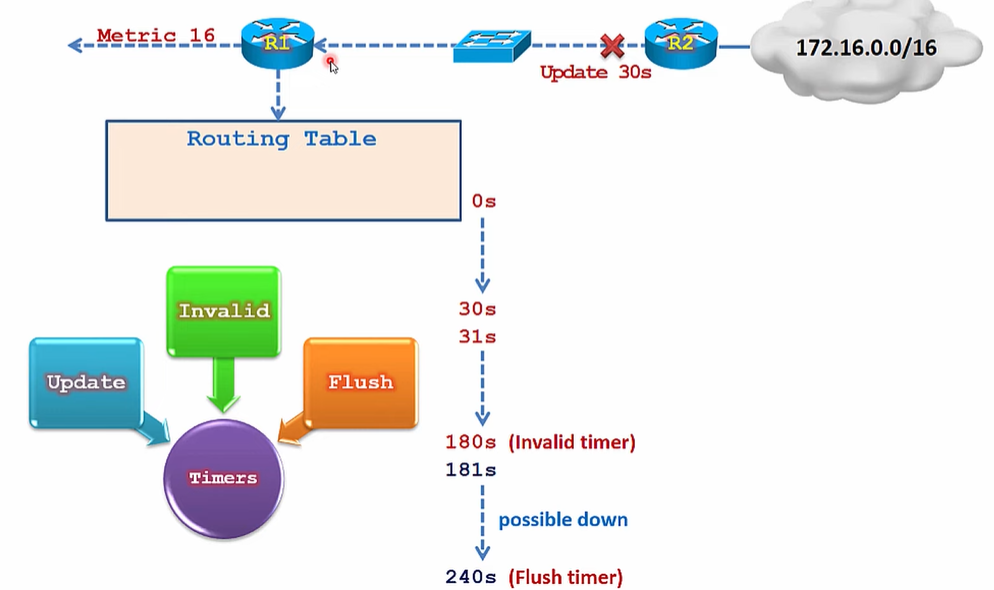
		<br>
		<em></em>
	</div>

- Bộ Timer kinh điển của RIP gồm **4 loại**, cụ thể:
	- **Update Timer (30s)**: định kỳ gửi toàn bộ bảng định tuyến cho router láng giềng
	- **Invalid Timer (180s)**: nếu quá 180s không nhận được cập nhật về 1 route thì route đó được đánh dấu là `possibly down` (không xóa ngay)
	- **Holddown Timer (180s)**: khi 1 route được đánh dấu `possibly down`, Router sẽ giữ nguyên route đó trong bảng định tuyến với trạng thái này trong 180s để chờ thông tin ổn định, đồng thời **không chấp nhận bất kỳ cập nhật nào có metric xấu hơn hoặc bằng** cho route này trong khoảng thời gian đó — đây là cơ chế quan trọng giúp chống loop tạm thời khi mạng có biến động
	- **Flush Timer (240s)**: sau 240s tính từ lúc route bắt đầu không ổn định mà vẫn không phục hồi thì route đó chính thức bị xóa khỏi bảng định tuyến
- RIPv1 và RIPv2
	- RIPv2 ra đời để khắc phục nhược điểm của RIPv1 
	- Những thiết bị chạy RIPv2 không có khả năng tương thích với RIPv1 và các con router sẽ không học được route của nhau 
	- Bởi vì ở RIPv1 sẽ quảng bá những mạng thông qua giao thức là `broadcast` còn RIPv2 sẽ quảng bá thông qua giao thức `multicast` `224.0.0.9`, chỉ có những con router nào đang chạy RIPv2 thì mới nhận được bản tin từ RIPv2 gửi tới
	- Và RIPv1 được xếp vào nhóm giao thức `classful` khi mà quảng bá định tuyến thì nó chỉ quảng bá `địa chỉ mạng` mà thôi còn RIPv2 được xếp vào nhóm giao thức `classless` tức là nó sẽ quảng bá `địa chỉ mạng và subnet mask`
		- Sự khác nhau chính là: nếu router đọc vào octet từ RIPv1 gửi tới thì nó sẽ tự quyết định lớp mạng A, B hay C, còn RIPv2 có kèm theo subnet mask nên sẽ biết chính xác prefix length cụ thể là bao nhiêu
	
	<div align="center">
		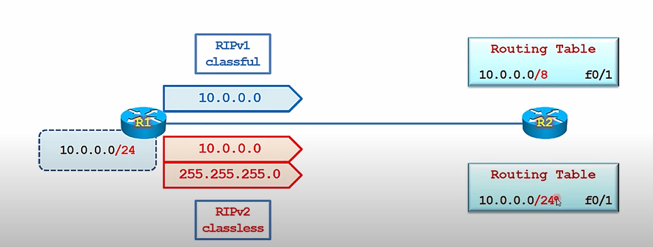
		<br>
		<em></em>
	</div>

### 9.2.2. Major Network
- Là 1 mạng lớn mà chưa bị chia nhỏ ra và lớp mạng và prefix length phải khớp với nhau thì được gọi là major network
  - VD: `10.0.0.0/8` -> Lớp A trùng với prefix length mặc định của nó -> Major network, `10.0.0.0/24` -> lớp A, được gọi là `subnet mạng con` của major network 10.0.0.0/8 
	
<div align="center">
  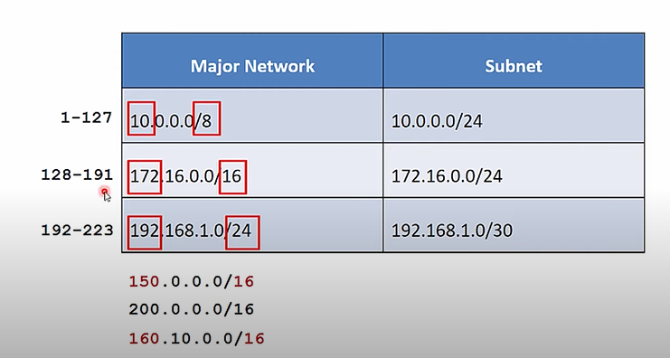
  <br>
  <em></em>
</div>

- Cấu hình RIP
	```
	router rip 
		version 2 
		network 192.168.1.0 
		network 172.16.0.0 
		no auto-summary (để học chính xác được 2 lớp mạng subnet)
	show ip route rip
	```
	
	<div align="center">
		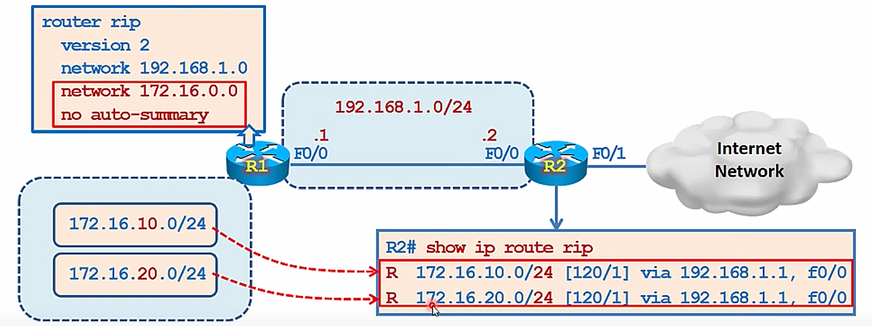
		<br>
		<em></em>
	</div>

	- Quảng bá default route: `default-information originate` trên con router biên kết nối trực tiếp với internet, sẽ quảng bá default route vào các thiết bị bên trong; nếu router biên bị mất kết nối với internet thì bảng định tuyến sẽ tự động xóa thông tin định tuyến này
- RIP vẫn là kiến thức nền tảng bắt buộc phải nắm cho kỳ thi CCNA (đại diện cho nhóm Distance Vector), nhưng trong triển khai hạ tầng mạng doanh nghiệp thực tế hiện nay **hầu như không còn ai sử dụng RIP** do hội tụ chậm, giới hạn 15 hop, chỉ dựa vào hop count nên không tối ưu. Thực tế các doanh nghiệp chủ yếu dùng **OSPF** (nội bộ, đa hãng), **EIGRP** (nội bộ, riêng hệ sinh thái Cisco) và **BGP** (giữa các nhà cung cấp dịch vụ/AS với nhau).
#### 9.2.2.1. Link-State 
- Giao thức phổ biến OSPF, EIGRP, IS-IS
- Ưu điểm: Nếu muốn hệ thống mạng tương thích nhanh với những thay đổi có khả năng xuất hiện trên hạ tầng mạng 
- Nhược điểm: Tiêu tốn nhiều tài nguyên xử lý của thiết bị như RAM và memory để lưu trữ cái tài nguyên database thông tin về cái đường đi có thể có để khi có bất kỳ hệ thống mạng gặp sự cố thì nó có đường khác thay thế, dự phòng 
##### 9.2.2.1.1. OSPF
- Giải pháp mã nguồn mở với cộng đồng lớn
- Sẽ quảng bá thông qua giao thức `Partial Update` 
	- `Partial Update`: Chỉ cần quảng bá những mạng mới nhất mà thôi chứ không cần quảng bá lại mạng trước đó đã gửi qua cho router láng giềng nữa 
- Khi 2 router thiết lập láng giềng với nhau thì nó sẽ quảng bá những thông tin cập nhật định tuyến của nó qua cho router láng giềng thông qua địa chỉ multicast đặc biệt là `224.0.0.5` dành riêng cho giao thức OSPF thì cái bảng topology chứa tất cả các đường đi có thể có và nó sẽ quảng bá hết cho router láng giềng và sau này nó cập những thông tin định tuyến mới này và không cần quan tâm đến những cái route mà trước đó nó đã học được
  - Quá trình trên đảm bảo các route trên router là hoàn toàn giống nhau nên đứng tại 1 con router bất kỳ thì ta có thể quan sát được bảng topology của toàn bộ hệ thống mạng trong cùng 1 vùng area 
  - Sử dụng giải thuật `Dijkstra algorithm` để tính toán trên bảng topology cái đường nào là tốt nhất sau đó đưa những đường này vào bảng định tuyến và router sẽ định tuyến gói tin dựa vào bảng `routing table`
	
	<div align="center">
		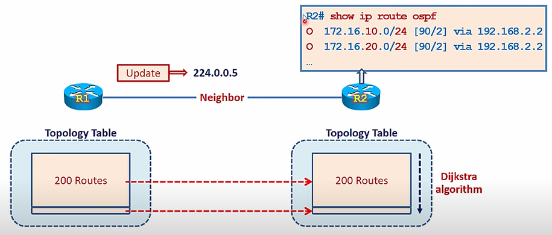
		<br>
		<em></em>
	</div>

- Cấu hình OSPF
	```
	router ospf 1 (số process định danh tiến trình mà ta đang triển khai, không cần giống nhau giữa các router và chỉ mang tính chất local)
		network 192.168.1.0 0.0.0.255 area 0 (xác định cổng nào sẽ tham gia vào việc định tuyến )
	```
	- area: là kỹ thuật giúp tối ưu hóa một hạ tầng mạng mà triển khai ospf giúp hiệu năng của thiết bị trở nên mượt mà hơn
	- ip tham chiếu và wildcard mask 
	- Định kỳ gửi bản tin `hello` 10s 1 lần tới địa chỉ multicast đặc biệt dành riêng cho ospf `224.0.0.5` giúp các router thiết lập mối quan hệ neighbor với nhau và thông qua bảng tin hello này giúp giám sát trạng thái của thiết bị mạng láng giềng
	- Dựa vào IP tham chiếu và wildcard mask bất kể cổng giao tiếp nào mà có 24 bit đầu tiên trùng với IP tham chiếu thì sẽ được tham gia vào định tuyến 
	- Có thể đặt cổng giao tiếp thành `network 192.168.1.1 0.0.0.0 area 0` để cho cổng đó tham gia vào định tuyến hoàn toàn được và nó sẽ quảng bá nguyên cái mạng 192.168.1.0/24
	- Vào để xác định chính xác 1 cổng có tham gia vào định tuyến thì ta vào cổng đó và thiết lập ospf lên

		```
		int e0/1
			ip ospf 1 area 0
		```
	
	<div align="center">
		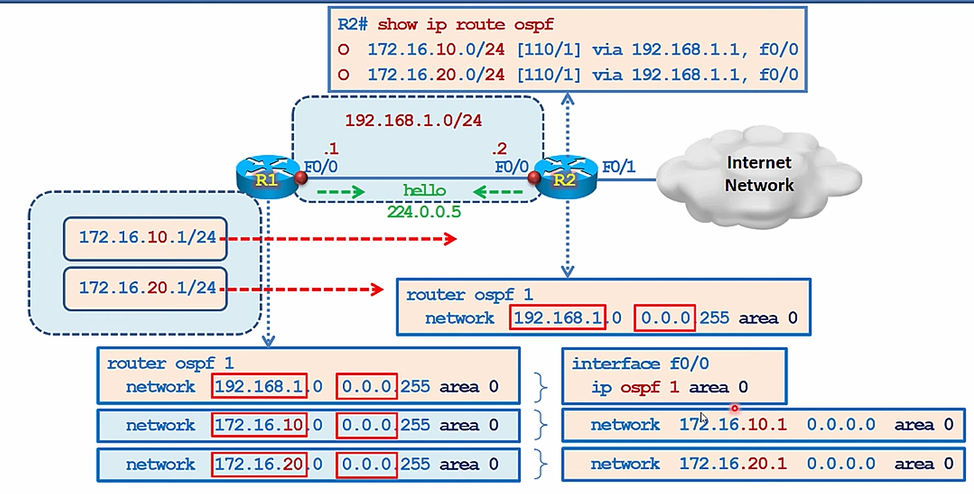
		<br>
		<em></em>
	</div>

	- Để tất cả các cổng trên router tham gia định tuyến thì: `network 0.0.0.0 255.255.255.255 area 0 `
	- Kiểm tra các cổng tham gia vào định tuyến: `show ip ospf int brief`
- Area:
	- Kỹ thuật chia area giúp bảng topology của 1 con router chạy OSPF trở nên nhỏ gọn hơn, giúp tối ưu chi phí thiết bị
	- Nếu hệ thống mạng quá lớn thì ta nên chia ra thành nhiều vùng area giúp giảm tải xử lý cho thiết bị
	- Nếu có 2 area, giả sử 1 route bất kỳ trong vùng area 1 gặp sự cố up, down liên tục thì lúc này nó sẽ lan truyền thông tin không ổn định này cho những con router thuộc area 1 mà thôi, và khi nhận được thông tin về sự bất ổn định thì nó sẽ chạy giải thuật `Dijkstra` hay `Shortest Path First (SPF)` để tính toán đường khác thay thế, và các con router ở vùng area 0 thì sẽ không bị ảnh hưởng bởi vùng area 1
	
	<div align="center">
		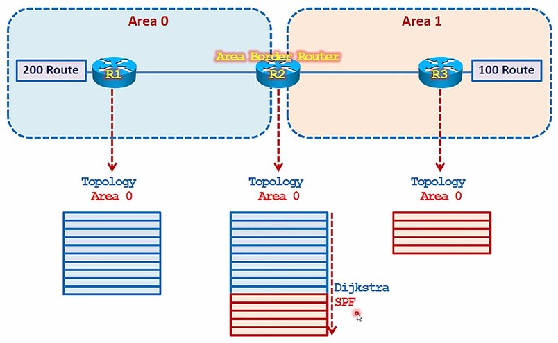
		<br>
		<em></em>
	</div>

- Default route:
	- Không nên triển khai định tuyến tĩnh trên cái môi trường có dự phòng bởi không có khả năng tương thích nhanh với hệ thống mạng.
		```
		ip route 0.0.0.0 0.0.0.0 f0/0
		router ospf 1
			default-information originate
		```
	- Nếu có 2 hướng đi ra internet thì nó tự động cân bằng tải 50 50 nếu 1 bên gặp sự cố và nó sẽ không quảng bá default route nữa và xóa đi, nếu khôi phục trở về thì tiếp tục quảng bá
	- Bảng tin hello 10s 1 lần và sau 4 lần 40s mà không nhận được quảng bá thì nó tự động xóa tất cả các route bị lỗi khỏi bảng định tuyến của nó
- Metric: 
	- Đường nào có metric thấp hơn thì sẽ tốt hơn
	- Cách tính metric:
		- Xác định cost của từng int đến mạng đích và cộng dồn chúng lại
		- Băng thông 
		- Cost = preference Bandwidth (Băng thông tham chiếu) /bandwidth = 10^8/bandwidth (bps)
		- Có thể hiệu chỉnh reference bandwidth:	
			```
			router ospf 1 
				auto-cost reference-bandwidth 100
			```
		- thiết lập cost trên 1 interface: `ip ospf cost 10`
		- `show ip ospf int f0/1`
		- Hiệu chỉnh metric = nhau để dữ liệu có thể đi qua 2 đường
- Hiệu chỉnh router-id
	- router-id là định danh của 1 con router khi tham gia vào định tuyến, không được trùng nhau, nếu trùng nhau thì 2 router đó sẽ không thể thiết lập quan hệ neighbor với nhau
	- Dùng để tránh loop trong suốt quá trình quảng bá thông tin các mạng, khi nó quảng bá mạng thì nó kèm theo router-id của chính nó để xác định rằng nó là chủ nhân của route đó, và nếu router đó nhận được quảng bá và nhận được router-id của chính nó thì nó sẽ không học vào bảng định tuyến của nó
	- Cấu hình router-id: `router-id 10.0.0.2` và khởi động lại tiến trình bằng lệnh `clear ip ospf process`
	- Nếu không cấu hình router-id thì nó sẽ ưu tiên lấy IP cao nhất trên cổng `loopback` làm `router-id`
- Hello Timer và Dead Timer
	- Các router thiết lập neighbor với nhau thông qua bản tin hello 10s 1 lần 
	```
	int e0/0
		ip ospf hello-interval 10
		ip ospf dead-interval 40
	```
	- Các giá trị này phải đồng nhất với nhau trên mỗi router cần định tuyến
- Điều kiện thiết lập neighbor
	- Phải thỏa mãn 5 yêu cầu dưới thì mới có thể thiết lập được neighbor với nhau
		- Area các cổng định tuyến phải giống nhau
		- Subnet & prefix-length
		- Hello & Dead Timer
		- Authentication khai báo mật mã phải giống nhau
		- MTU (Maximum Transmission Unit) trên các cổng phải giống nhau, dù môi trường truyền dẫn có khác nhau
	- Kiểm tra neighbor: `show ip ospf neighbor detail`
- Network Type (point-to-point vs Broadcast Multiaccess)
	- Point-to-point: Môi trường kết nối 2 con Router với nhau thông qua công nghệ `Leased Line`, cho phép kết nối 2 hệ thống mạng LAN cách xa nhau từ vài chục đến vài trăm cây số, thông qua môi trường truyền dẫn cáp quang hoặc cáp đồng tùy theo nhà cung cấp dịch vụ mà ta sử dụng
		- Các Router sẽ thiết lập mối quan hệ neighbor ngang hàng với nhau 
	
	<div align="center">
		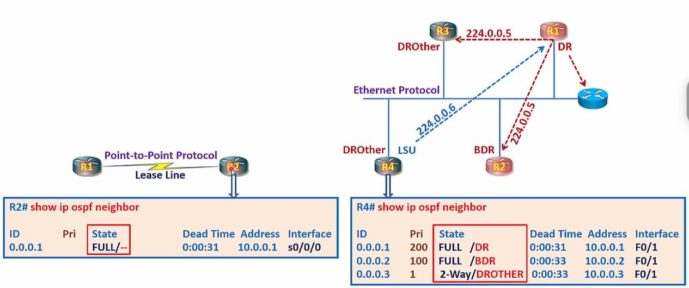
		<br>
		<em></em>
	</div>

	- Ethernet Protocol: từ 1 Router có thể kết nối đến 1 switch và từ 1 switch có thể được kết nối với nhiều các môi trường khác nữa gọi và mặc định network type là Broadcast Multiaccess
		- Cần phải trải qua quá trình bầu chọn DR, BDR và DROTHER, quá trình bầu chọn diễn ra trong 40s
			- `DR (Designated Router)`: đứng ra để phân phối quá trình trao đổi thông tin định tuyến giữa tất cả các con router mà tham gia vào cái môi trường Multiaccess này 
			- `BDR (Backup Designated Router)`: đóng vai trò là backup cho DR và tất cả các thiết bị còn lại đóng vai trò là `DROTHER` 
		- Khi thông thường khi các con router thành viên có thông tin định tuyến gì mới thì nó sẽ soạn 1 bảng tin `SLU (Link state Update)` và gửi về cho DR với Multicast đặc biệt là `224.0.0.6` và khi DR nhận được bảng tin đó thì nó sẽ gửi ra tất cả các Router thành viên còn lại. Nếu lắp đặt 1 Router mới thì DR đứng ra quảng bá tất cả các thông tin định tuyến trên hạ tầng mạng mới này
		
		<div align="center">
			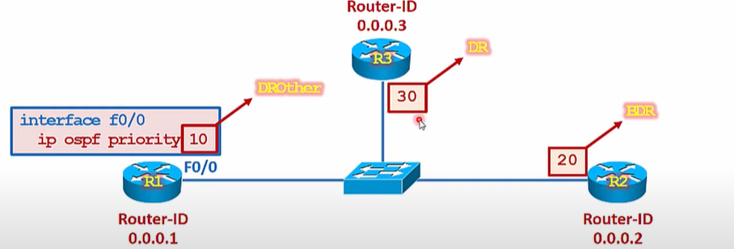
			<br>
			<em></em>
		</div>

		- Tiến trình bầu chọn DR, BDR dựa vào 2 tham số `priority` và `router-id`:
			- priority (chỉ số ưu tiên) thiết bị nào có chỉ số ưu tiên cao nhất thì thiết bị đó là DR và cao nhì là BDR còn lại là DROTHER
				```
				int f0/0
					ip ospf priority 10
				```
			- Nếu chỉ số ưu tiên đều bằng nhau thì nó sẽ dựa vào router-id để quyết định. Router-id lớn nhất là DR, nhì là BDR còn lại DROTHER 
			- Quá trình cũng tuân theo quy tắc `Non-Preempt`. Nếu thiết bị DR gặp sự cố thì ngay lập tức thiết bị đóng vai trò là BDR sẽ lên làm DR các router còn lại sẽ tranh chức BDR với nhau. Và nếu DR cũ đã khôi phục lại dù priority và router-id cao nhưng vẫn chỉ đóng vai trò là DROTHER mà thôi. Nên do vậy ta cần phải clear lại tiến trình ospf là sẽ hoạt động lại đúng như ban đầu: `clear ip ospf process`
			- Priority = 0 thì luôn đóng vai trò là DROTHER và không tham gia vào quá trình bầu chọn DR hoặc BDR. 
			- Lựa chọn thiết bị nào mạnh để đóng vai trò là DR hoặc BDR
			- Quá trình bầu chọn DR và BDR diễn ra trên từng phân đoạn mạng nếu không cần thiết và cấu hình chỉ có 2 thiết bị kết nối với nhau ta nên hiệu chỉnh network type thành `State Point_to_point`
				```
				int e0/0
					ip ospf network-type point-to-point
				```
			- FULL và 2-Way: đối với DR và BDR thì Router sẽ thiết lập đầy đủ với 2 thiết bị này gửi trực tiếp thông tin định tuyến, còn 2-Way thì không bao giờ trao đổi trực tiếp được mà phải qua trung gian
### 9.2.3. Exterior Gateway (Định tuyến ngoại vùng)
- Giao thức điển hình là BGP thường được các nhà mạng trên thế giới sử dụng 
- Được định tuyến dựa trên các AS với nhau 
- AS là Autonomous System: là tập hợp các router thuộc cùng 1 chính sách quản trị, cùng thuộc 1 tổ chức thì sẽ được gom vào 1 AS
	- VD: tất cả các con router của nhà mạng VNPT gom hết thành 1 AS và được định danh bằng số AS
- Và mỗi AS được định danh bằng 1 số AS, thông thường mỗi nhà cung cấp sẽ có 1 số AS và số AS này là duy nhất trên toàn thế giới
#### 9.2.3.1. BGP (Border Gateway Protocol)

<div align="center">
  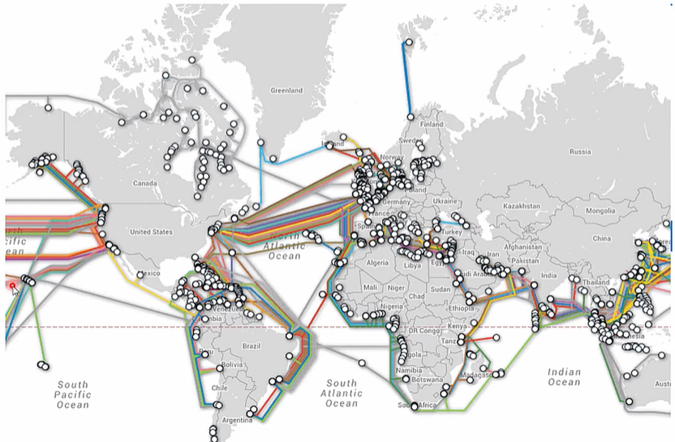
  <br>
  <em></em>
</div>

- Là giao thức định tuyến động mà hiện này hệ thống mạng internet toàn cầu đang sử dụng để định tuyến giữa các nhà cung cấp dịch vụ mạng
- Phải cấu hình `filter route` nếu không phải học hơn 700.000 routers từ môi trường internet chuyển tới, filter để chỉ học những cái mạng của nhà mạng mà thôi nhưng vẫn có thể đi được cái default routers trỏ tới con router của nhà mạng
- Cấu hình
	```
	router bgp 10 (as của mình)
		bgp router-id 9.0.0.1 (lấy ip cao nhất, ưu tiên loopback)
		neighbor 9.0.0.2 
		remote-as 20 (khai báo  ip của thiết bị láng giềng mà ta muốn thiết lập neighbor, as của láng giềng) 
	```
	- as: là tập hợp của tất cả các con router tham gia vào cùng 1 vùng định tuyến của 1 nhà cung cấp dịch vụ mạng nhất định
	- IANA: cơ quan quản lý địa chỉ mạng quốc tế, mỗi nhà cung cấp dịch vụ mạng sẽ được định danh duy nhất bằng 1 số ASN
	- Dãy AS Number (Public): dao động từ 1 - 64495
	- Private AS Number: 64512-65534
		
	<div align="center">
		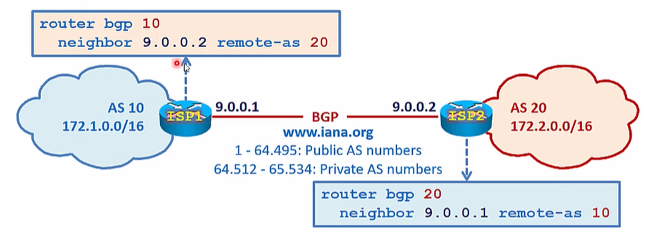
		<br>
		<em></em>
	</div>

	- Định kỳ gửi `hello` 60s 1 lần 
	- Kiểm tra bgp: `show ip bgp summary`
	
# 10. ICMP
Kiến thức nền tảng về ICMP:
## 10.1. Khái niệm ICMP (Internet Control Message Protocol)
- ICMP là giao thức thuộc lớp Network (L3), hoạt động cùng cấp với IP, dùng để `báo lỗi` và `chẩn đoán` tình trạng của quá trình truyền thông trên mạng chứ không dùng để truyền dữ liệu người dùng
- ICMP không có khái niệm port nguồn/đích như TCP/UDP vì nó không phải giao thức tầng Transport
## 10.2. Các bản tin ICMP phổ biến
- **Echo Request / Echo Reply**: dùng trong lệnh `ping` để kiểm tra khả năng kết nối đến 1 thiết bị đích, đo thời gian phản hồi (RTT)
- **Destination Unreachable**: báo cho máy gửi biết địa chỉ đích hoặc dịch vụ không thể truy cập được (host unreachable, network unreachable, port unreachable,...)
- **Time Exceeded**: gửi về khi giá trị `TTL (Time To Live)` trong IP header giảm về 0 trước khi tới được đích, được sử dụng trong lệnh `traceroute`/`tracert` để dò đường đi (mỗi hop TTL giảm 1 đơn vị)
- **Redirect**: Router thông báo cho PC biết có đường đi tốt hơn đến đích thông qua 1 gateway khác trong cùng mạng
## 10.3. Lệnh kiểm tra trên Cisco
- `ping <ip>`: kiểm tra kết nối tới thiết bị đích
- `traceroute <ip>`: liệt kê từng chặng (hop) router mà gói tin đi qua để đến được đích, hữu ích khi cần xác định vị trí xảy ra sự cố trên đường truyền
- `debug ip icmp`: theo dõi trực tiếp các bản tin ICMP đi qua thiết bị
# 11. VLAN (Virtual LAN) ảo hóa Switch
- Mỗi VLAN tương ứng như 1 switch vật lý, tất cả các phòng ban sẽ kết nối hết vào 1 vlan 
- Nếu trong 1 VLAN nhận được 1 bản tin `broadcast` thì tất cả các port thuộc cùng VLAN đó mới nhận được, nên mỗi VLAN là 1 `broadcast domain` riêng biệt
## 11.1. Cấu hình 

<div align="center">
  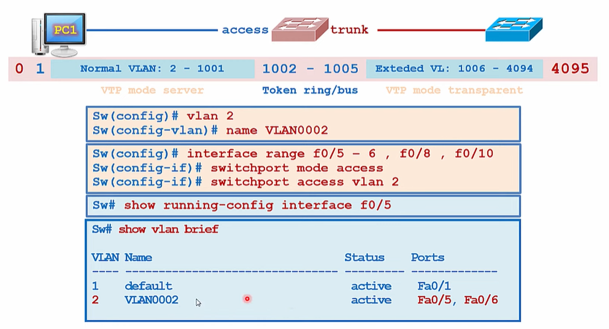
  <br>
  <em></em>
</div>

- Thực hiện

	```
	vlan 2
		name VLAN guest
	int f0/5
		switchport mode access
		switchport access vlan 2
	show vlan brief
	```
- Kết nối switch qua switch ta kết nối nó qua mode trunk 
## 11.2. Trunk 
- Kết nối giữa các switch gom tất cả các switch vật lý trở thành 1 switch vật lý 
- Nếu trên 2 switch vật lý cùng tạo VLAN 2 và kết nối trunk thì 2 PC trên mỗi vlan sẽ giao tiếp được với nhau
	
	<div align="center">
		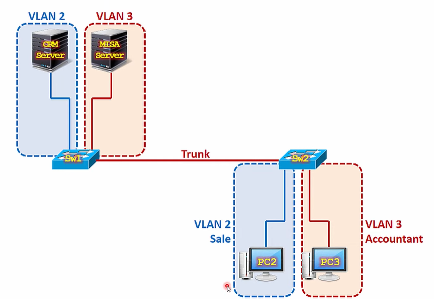
		<br>
		<em></em>
	</div>

- VLAN và Trunk có thể được phối hợp với nhau để phục vụ việc bảo mật và nếu muốn các VLAN có thể truy cập được với nhau thì ta cần phải có 1 con router hoặc switch layer 3
- Ở router mỗi cỗng sẽ ứng với gateway của VLAN và thuộc vlan đó nhằm mục đích định tuyến với các vlan khác và truy cập internet
- Giúp tiết kiệm port và số lượng kết nối nếu mode access thì cần phải có nhiều dây tương ứng còn trunk thì chỉ cần 2 port và 1 dây 
- Khi 1 PC ở VLAN 2 gửi dữ liệu tới PC ở VLAN 2 phía bên kia switch, đầu tiên switch phải `gắn nhãn` thông tin `VLAN` mà PC gửi thuộc về, phía bên nhận sẽ căn cứ vào nhãn VLAN đó để biết dữ liệu này thuộc VLAN nào
### 11.2.1. Cấu hình trunk 
- Trunk có 2 kiểu đóng gói 1 `dot1q` kiểu quốc tế, 2 `ISL` trunk độc quyền cisco

	```
	int f0/1
		sw trunk encapsulation dot1q
		sw mode trunk
		sw trunk native vlan 
	```
- `Native vlan`: Nếu sw nhận được dữ liệu từ VLAN mà VLAN này trùng với Native vlan thì nó không cần gán nhãn VLAN như thường lệ và cứ thế mà gửi sang switch đầu xa. Khi switch đầu xa nhận được mà không thấy bất kỳ nhãn nào thì nó mặc định là VLAN của Native vlan, với những VLAN không phải Native vlan thì nó vẫn phải gán nhãn như bình thường 
- Các giao thức CDP, STP, VTP, DTP thông thường được lan truyền qua Native Vlan
- Theo quy tắc mặc định, đường trunk cho phép tất cả VLAN đi qua, có thể cấu hình để điều chỉnh lại: `sw trunk allow vlan 1-2`, chỉ cho phép lưu lượng VLAN 1 và 2 đi qua trunk
- Hiệu chỉnh `Native vlan`: có thể sử dụng dot1q và hiệu chỉnh native vlan để cái port đó thuộc thành viên của native vlan
- Giao thức DTP tự động thiết lập trunk giữa các switch
	- Giao thức độc quyền Cisco và được bật tự động
	
<div align="center">
  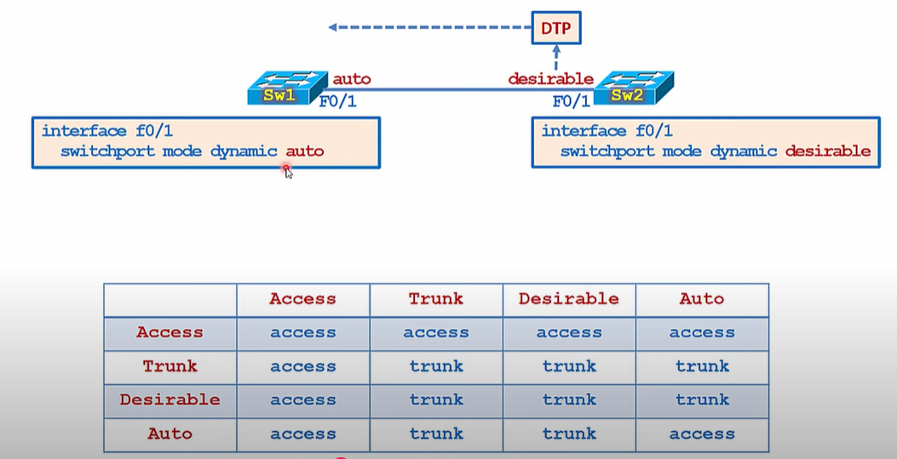
  <br>
  <em></em>
</div>

- Mặc định thì ở các thiết bị Cisco, trên các cổng thường cấu hình mặc định là `desirable` còn lại là `auto`
	- Định kỳ gửi DTP để thiết lập đường trunk và thiết bị nhận được sẽ hồi đáp về bảng tin DTP này và kết nối giữa 2 sw là trunk 
	- Tắt giao thức DTP: `switchport nonegotiate` 
- Giao thức VTP (VLAN Trunking Protocol) đồng bộ hóa thông tin VLAN giữa các switch
	- Đảm bảo database VLAN giữa các switch sẽ được đồng bộ với nhau để tránh lỗi
	- VTP domain: nhóm các switch cùng đồng bộ VLAN với nhau, cần phải tham gia vào cùng 1 VTP domain: `vtp domain AnPhuc` và hoạt động ở chế độ `server` hoặc `client` hoặc `transparent`
	
	<div align="center">
		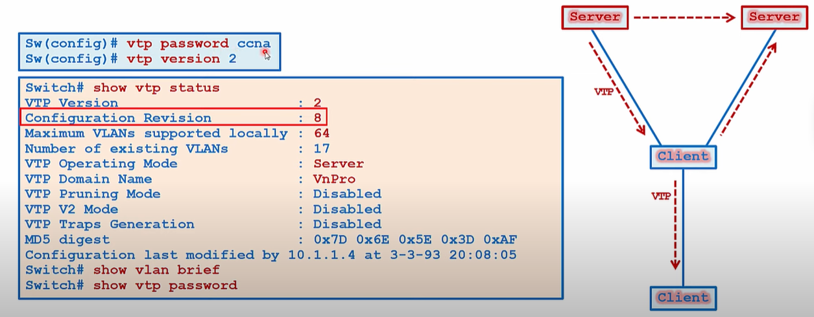
		<br>
		<em></em>
	</div>

- VTP (đặc biệt VTPv1/v2) tiềm ẩn rủi ro rất lớn trong triển khai thực tế: nếu gắn nhầm 1 switch mới (dù chưa cấu hình VLAN gì) vào hệ thống nhưng lại có **VTP revision number cao hơn** switch Server hiện tại, toàn bộ database VLAN của cả hệ thống có thể bị **ghi đè hoặc xóa sạch**, gây sập mạng diện rộng. Vì lý do này, nhiều tổ chức trong thực tế khuyến cáo: luôn để switch ở chế độ `vtp mode transparent` (không đồng bộ tự động) hoặc nếu bắt buộc dùng VTP thì nên dùng **VTPv3** (hỗ trợ đặt password xác thực domain + chỉ định rõ Primary Server) để tránh rủi ro nêu trên.
### 11.2.2. Định tuyến giữa các vlan 
- Các vlan khác nhau muốn đi qua được với nhau thì phải đi qua router
- Router on a Stick: chỉ cần 1 cổng vật lý duy nhất và tạo các cổng ảo (sub-interface) để trỏ đến từng VLAN
- Thiết lập trunk trên switch và router 
	- Trên switch thì trên cổng giao tiếp cấu hình trunk 
	- Trên router tiến hành tạo các sub interface và tiến hành đặt ip cho int này và sẽ là default gateway cho các vlan 
		```
		int f0/0.3
			encapsulation dot1q 3 (vlan 3)
			ip add 30.0.0.1 255.0.0.0
		```

## 11.3. Voice VLAN
Voice VLAN là kiến thức quan trọng trong CCNA, cụ thể:
- Là 1 VLAN riêng biệt dành cho lưu lượng thoại (điện thoại IP Phone), tách biệt với VLAN dữ liệu thông thường (Data VLAN) trên cùng 1 cổng switch
- Lý do cần tách riêng: lưu lượng thoại (voice) rất nhạy cảm với độ trễ (delay/jitter) nên cần được ưu tiên QoS riêng so với lưu lượng dữ liệu bình thường
- Mô hình triển khai: PC cắm vào cổng phía sau của IP Phone, còn IP Phone cắm vào switch; trên switch cùng 1 cổng vật lý sẽ gán 2 VLAN riêng: `Voice VLAN` cho điện thoại và `Access VLAN` cho PC
	```
	int f0/1
		switchport mode access
		switchport access vlan 10
		switchport voice vlan 20
	```
## 11.4. Tấn công VLAN Hopping
Kiến thức an toàn bảo mật liên quan VLAN, hay xuất hiện trong đề thi CCNA phần Security Fundamentals:
- Là kỹ thuật tấn công cho phép 1 thiết bị ở VLAN này có thể gửi được lưu lượng sang 1 VLAN khác mà đáng lẽ nó không được phép truy cập, gồm 2 dạng phổ biến:
	- **Switch Spoofing**: kẻ tấn công giả lập PC của mình thành switch để chủ động thương lượng trunk (thông qua DTP) với switch thật, sau khi trở thành trunk thì có thể truy cập được tất cả VLAN đi qua đường trunk đó
		- Cách phòng chống: tắt DTP trên các cổng access bằng `switchport nonegotiate`, cấu hình cứng `switchport mode access` thay vì để tự thương lượng
	- **Double Tagging**: kẻ tấn công gắn **2 lớp nhãn VLAN (2 lần dot1q tag)** lên frame gửi đi, lợi dụng cơ chế xử lý Native VLAN (switch bóc lớp nhãn ngoài cùng trùng Native VLAN rồi chuyển tiếp) khiến lớp nhãn còn lại (VLAN đích tấn công) bị lộ ra và được switch kế tiếp xử lý, giúp gói tin "nhảy" được sang VLAN khác dù ban đầu ở VLAN khác biệt
		- Cách phòng chống: không dùng VLAN 1 làm Native VLAN mặc định, đổi Native VLAN sang 1 VLAN không sử dụng cho mục đích khác (VD: VLAN 999 dùng riêng làm Native VLAN "rỗng")

# 12. Giao thức chống Loop STP
## 12.1. Mô hình thiết kế hạ tầng mạng 3 phân lớp
- Một hệ thống 3 phân lớp: core, distribution, Access
	
	<div align="center">
		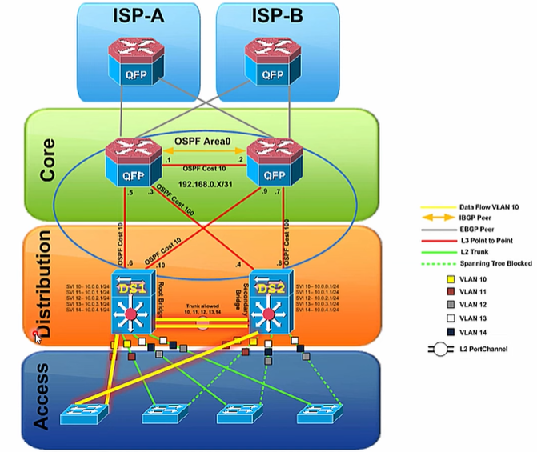
		<br>
		<em></em>
	</div>

	- Ở tầng access: có thể sử dụng những thiết bị cấp thấp hỗ trợ các port kết nối với các thiết bị đầu cuối, hỗ trợ cấp nguồn PoE và hỗ trợ bảo mật L2
	- Distribution: hỗ trợ những dòng SWL3 mạnh mẽ hơn, đảm bảo các cổng phù hợp để kết nối đến tầng core, hỗ trợ policy, giữa những sw với nhau thì nên để các cổng là 1Gi hoặc 10Gi
	- Core: trang bị cặp thiết bị mang tính chất dự phòng, nguồn, CPU và các cổng có tốc độ cao, hạn chế các policy ở tầng này
- Ở một số doanh nghiệp nhỏ thì chỉ cần sử dụng 2 phân lớp gom core và distribution mà thôi 
## 12.2. Nguyên nhân xảy ra loop 
- Thường bị khi kết nối ở dạng vòng `ring`
	
	<div align="center">
		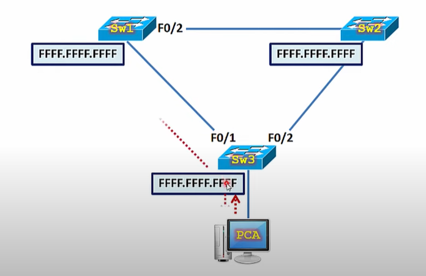
		<br>
		<em></em>
	</div>

	- Khi có 3 sw kết nối dạng vòng và gửi đi bảng tin `broadcast` thì nó sẽ lan truyền cho nhau và sw đều nhận được frame này và nó sẽ hình thành loop
- Khi 2 switch kết nối với nhau sử dụng 2 dây 2 sw sẽ liên tục gửi qua gửi lại
	
	<div align="center">
		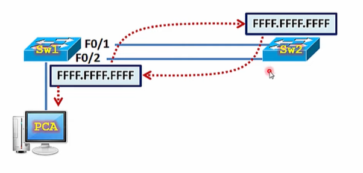
		<br>
		<em></em>
	</div>

## 12.3. Cơ chế chống Loop của STP
### 12.3.1. Block port (alternated Port)
- Sử dụng cơ chế block port để hạn chế loop trên hạ tầng mạng
- Khi STP được bật nó sẽ phối hợp với nhau và tính toán xem nên khóa cổng nào và từ đó tránh được nguy cơ bị loop trên hệ thống mạng, và không thể nhận được tin `broadcast hay bất kì bản tin nào` nên sẽ chống loop được.
## 12.4. Root Bridge và vai trò Port Role của các Port
- STP sẽ trải qua 4 giai đoạn để tính toán port nào là block port
### 12.4.1. Bầu chọn Root Bridge
- **📌 (Sửa lỗi)** Trong toàn bộ hệ thống mạng (1 VLAN), chỉ có **duy nhất 1 Switch** được bầu làm Root Bridge (RB) — bản gốc ghi nhầm là "Router", nhưng STP là giao thức chạy ở tầng 2 giữa các **Switch**, không phải Router
- Chỉ có RB mới được quyền chủ động gửi bản tin hello, các port còn lại chỉ chuyển tiếp lại
- Định kỳ gửi hello 2s 1 lần, các port còn lại chuyển tiếp qua designated port để đến được switch láng giềng
- Nguyên tắc bầu chọn:
	- Dựa vào tham số bridge-id (priority + MAC): sw nào có bridge-id nhỏ nhất thì đóng vai trò RB 
	- `Show spanning-tree` để kiểm tra 
	- Hiệu chỉnh giá trị priority: `spanning-tree vlan 1 priority 28672`
	- Nếu giá trị priority bằng nhau thì nó bầu chọn trên nguyên tắc chọn MAC nhỏ nhất thì đóng vai trò RB

	<div align="center">
		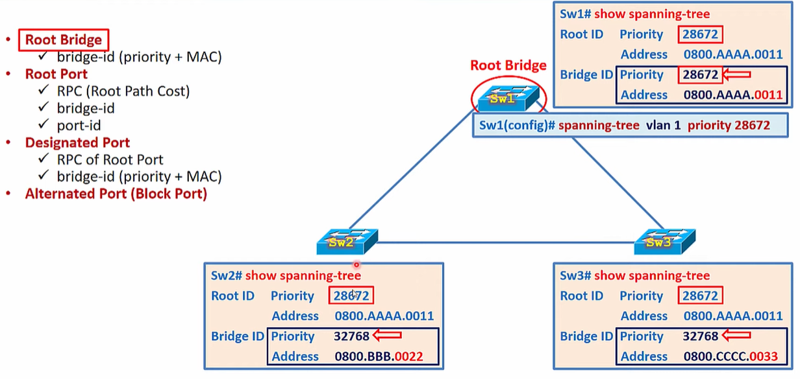
		<br>
		<em></em>
	</div>

### 12.4.2. Bầu chọn Root Port
- Không bao giờ xảy ra trên Root Bridge, và sẽ tiến hành trên các sw là non RB 
- Ở 1 sw nếu nối với 3 sw thì chỉ có 1 port đóng vai trò là root port 
- Root port là port gửi dữ liệu nhanh nhất đến RB từ đó có thể đi ra ngoài được internet
- Nguyên tắc bầu chọn:
	- Dựa trên tham số: RPC (Root Path Cost) nào có số thấp hơn thì đóng vai trò Root Port
	- Xác định Cost của từng port `show spanning-tree` do cisco quy ước mặc định đều bằng nhau
	- RPC sẽ được tính bằng cộng dồn các cost của các sw mà sẽ phải đi tới được RB
	- Tinh chỉnh cost: 
		```
		int f0/1
		spanning-tree vlan 1 cost 20
		```

### 12.4.3. Bầu chọn designated port
- STP có bao nhiêu phân đoạn mạng thì điều đó đồng nghĩa với việc có bấy nhiêu Designated Port 
- Có 3 phân đoạn mạng thì ít nhất có 3 Designated port
- Thường là các cổng trên RB
- Định kỳ gửi 1 bản tin hello, thông qua bản tin này STP cảm nhận có sự thay đổi của hạ tầng mạng đã xảy ra hay chưa, do đó nó quyết định có nên mở port đang bị block trở thành port bình thường và cho phép lưu lượng đi qua hay không 
- Có quyền gửi bản tin hello
- Port không nhận được bản tin hello sau 10 lần thì nó khẳng định đoạn mạng đó gặp sự cố và mở port block
### 12.4.4. Alternate Port (Block Port)
- Port dự phòng, cho phép dữ liệu đi qua 

Tiếp tục hoàn chỉnh chủ đề chống Loop STP với các nội dung bên dưới.
## 12.5. Các trạng thái cổng (Port State) của STP
- Khi 1 port bật lên thì STP (802.1D) không chuyển ngay sang trạng thái forward mà phải trải qua các trạng thái trung gian để tránh loop tạm thời:
	- **Blocking**: không gửi/nhận dữ liệu, chỉ lắng nghe bản tin BPDU (20s)
	- **Listening**: bắt đầu tham gia vào quá trình bầu chọn Root Bridge/Root Port/Designated Port nhưng chưa học địa chỉ MAC, chưa chuyển tiếp dữ liệu (15s)
	- **Learning**: bắt đầu học địa chỉ MAC vào bảng MAC Table nhưng vẫn chưa chuyển tiếp dữ liệu (15s)
	- **Forwarding**: chuyển tiếp dữ liệu bình thường và học địa chỉ MAC
	- **Disabled**: port bị tắt bằng tay (shutdown), không tham gia vào STP
- Tổng thời gian hội tụ mặc định của STP (802.1D) là khoảng **50s** (20s Blocking + 15s Listening + 15s Learning) nên STP truyền thống khá chậm khi có thay đổi hạ tầng mạng
## 12.6. BPDU (Bridge Protocol Data Unit)
- BPDU là bản tin dùng để trao đổi thông tin giữa các switch chạy STP nhằm phục vụ cho quá trình bầu chọn Root Bridge, Root Port, Designated Port
- 2 loại chính: `Configuration BPDU` (dùng trong bầu chọn, gửi định kỳ bởi Root Bridge) và `TCN BPDU - Topology Change Notification` (thông báo có sự thay đổi hạ tầng mạng)
## 12.7. RSTP (Rapid Spanning Tree Protocol - 802.1w)
- Là phiên bản cải tiến của STP truyền thống (802.1D), giúp rút ngắn thời gian hội tụ xuống chỉ còn vài giây thay vì 50s
- Gộp 2 trạng thái Listening và Learning của STP truyền thống lại, chỉ còn 3 trạng thái cổng: `Discarding`, `Learning`, `Forwarding`
- Định nghĩa thêm vai trò cổng mới:
	- **Alternate Port**: cổng dự phòng cho Root Port (tương đương Blocking Port của STP)
	- **Backup Port**: cổng dự phòng cho Designated Port trên cùng 1 phân đoạn mạng
- Cấu hình chuyển sang RSTP trên Cisco:
	```
	spanning-tree mode rapid-pvst
	```
## 12.8. Các tính năng bảo vệ STP thường dùng
### 12.8.1. PortFast
- Áp dụng cho các port kết nối trực tiếp đến thiết bị đầu cuối (PC, Server) không kết nối đến switch khác, giúp port chuyển thẳng sang trạng thái Forwarding ngay mà không cần trải qua Listening/Learning, giúp PC lấy IP từ DHCP nhanh hơn
	```
	int f0/1
		spanning-tree portfast
	```
### 12.8.2. BPDU Guard
- Bảo vệ các port đã bật PortFast, nếu port này nhận được bất kỳ bản tin BPDU nào (nghĩa là có switch khác gắn nhầm vào port đầu cuối) thì port sẽ tự động chuyển sang trạng thái `err-disable` để ngăn chặn nguy cơ loop
	```
	int f0/1
		spanning-tree bpduguard enable
	```
### 12.8.3. Root Guard
- Ngăn chặn 1 switch không mong muốn trở thành Root Bridge trên 1 port xác định, nếu port đó nhận được BPDU tốt hơn (có khả năng thành Root) thì port sẽ bị đưa vào trạng thái `root-inconsistent` (tương đương blocking) cho đến khi hết nhận được BPDU đó
	```
	int f0/1
		spanning-tree guard root
	```
### 12.8.4. Loop Guard
- Bảo vệ các port Root/Alternate không bị chuyển nhầm sang Forwarding khi không còn nhận được BPDU do lỗi 1 chiều (unidirectional link failure)
## 12.9. PVST+ và MST (Multiple Spanning Tree)
Kiến thức thực tế về việc chạy STP trên hệ thống có nhiều VLAN, thường được hỏi khi so sánh các biến thể STP.
- **PVST+ (Per-VLAN Spanning Tree Plus)**: là chế độ mặc định trên switch Cisco, chạy **1 instance STP độc lập cho mỗi VLAN**, giúp tối ưu đường đi riêng cho từng VLAN (VLAN khác nhau có thể có Root Bridge khác nhau để cân bằng tải) nhưng **tốn nhiều tài nguyên CPU** khi số lượng VLAN lớn (vì phải tính toán và gửi BPDU riêng cho từng VLAN)
- **MST (Multiple Spanning Tree - IEEE 802.1s)**: cho phép gom **nhiều VLAN vào chung 1 nhóm (instance)** và chỉ cần chạy 1 tiến trình STP cho cả nhóm đó thay vì chạy riêng cho từng VLAN, giúp giảm tải đáng kể cho CPU của switch. Đây là lựa chọn phổ biến trong các hệ thống mạng doanh nghiệp lớn có hàng trăm VLAN
	```
	spanning-tree mode mst
	spanning-tree mst configuration
		name REGION1
		revision 1
		instance 1 vlan 1-50
		instance 2 vlan 51-100
	```

# 13. EtherChannel (Port Aggregation - Gộp cổng)
EtherChannel là kiến thức quan trọng trong CCNA, cụ thể:
- Là kỹ thuật gộp nhiều cổng vật lý (thường 2-8 cổng) giữa 2 switch lại thành 1 cổng logic duy nhất nhằm:
	- Tăng băng thông giữa 2 thiết bị (băng thông được cộng dồn)
	- Cung cấp khả năng dự phòng: nếu 1 dây bị đứt thì lưu lượng tự động chuyển qua các dây còn lại mà không làm gián đoạn kết nối
	- STP sẽ nhìn EtherChannel như 1 cổng logic duy nhất nên không xảy ra tình trạng bị block port khi đấu nhiều dây song song giữa 2 switch
## 13.1. Các giao thức thương lượng EtherChannel
- **PAgP (Port Aggregation Protocol)**: giao thức độc quyền của Cisco, có 2 chế độ `desirable` (chủ động gửi yêu cầu) và `auto` (bị động chờ yêu cầu)
- **LACP (Link Aggregation Control Protocol)**: giao thức chuẩn mở IEEE 802.3ad, tương thích đa hãng, có 2 chế độ `active` (chủ động gửi yêu cầu) và `passive` (bị động chờ yêu cầu)
- Ngoài ra có thể cấu hình chế độ `on` để ép buộc tạo EtherChannel không cần thương lượng giao thức (2 đầu phải giống nhau)
## 13.2. Cấu hình EtherChannel (LACP)
```
int range f0/1-2
	channel-group 1 mode active
int port-channel 1
	switchport mode trunk
show etherchannel summary
```
- Lưu ý: các cổng thành viên tham gia EtherChannel phải có cấu hình đồng nhất (speed, duplex, VLAN, mode access/trunk,...) thì mới thương lượng thành công

# 14. FHRP (First Hop Redundancy Protocol) - Giao thức dự phòng Gateway
FHRP là kiến thức quan trọng trong CCNA, cụ thể:
- Vấn đề: nếu PC chỉ khai báo 1 default-gateway duy nhất, khi Router đóng vai trò gateway đó gặp sự cố thì toàn bộ PC trong VLAN sẽ mất kết nối ra ngoài
- Giải pháp: dùng nhiều Router cùng chia sẻ 1 địa chỉ IP ảo (Virtual IP) làm gateway chung, PC chỉ cần trỏ default-gateway đến địa chỉ ảo này
## 14.1. HSRP (Hot Standby Router Protocol)
- Giao thức độc quyền Cisco
- Trong 1 nhóm HSRP có 1 Router đóng vai trò `Active` (xử lý toàn bộ lưu lượng) và 1 hoặc nhiều Router đóng vai trò `Standby` (dự phòng, sẵn sàng thay thế khi Active gặp sự cố)
- Bầu chọn dựa trên tham số `priority` (mặc định 100), priority cao nhất sẽ làm Active, nếu bằng nhau thì IP vật lý cao nhất sẽ thắng
- Gửi bản tin hello định kỳ 3s 1 lần đến địa chỉ multicast `224.0.0.2`, nếu sau 10s không nhận được hello thì Standby sẽ chuyển lên làm Active
- Cấu hình cơ bản:
	```
	int f0/0
		ip address 10.0.0.2 255.255.255.0
		standby 1 ip 10.0.0.1
		standby 1 priority 110
		standby 1 preempt
	```
	- `standby 1 ip`: khai báo địa chỉ IP ảo dùng chung
	- `preempt`: cho phép Router có priority cao hơn giành lại vai trò Active khi nó phục hồi sau sự cố (mặc định HSRP không preempt)
Phân biệt HSRPv1 và HSRPv2:
- **HSRPv1**: chỉ hỗ trợ tối đa **255 group** trên 1 cổng, chỉ hỗ trợ IPv4, gửi hello đến địa chỉ multicast `224.0.0.2`
- **HSRPv2**: hỗ trợ tối đa **4096 group**, hỗ trợ cả IPv6, gửi hello đến địa chỉ multicast riêng `224.0.0.102`, đồng thời rút ngắn thời gian hội tụ hơn so với v1
- Cấu hình chọn version: `standby version 2`
## 14.2. VRRP (Virtual Router Redundancy Protocol)
- Giao thức chuẩn mở (IEEE), tương thích đa hãng, cơ chế hoạt động tương tự HSRP nhưng vai trò được gọi là `Master` và `Backup` thay vì Active/Standby
## 14.3. GLBP (Gateway Load Balancing Protocol)
- Giao thức độc quyền Cisco, khác biệt so với HSRP/VRRP ở chỗ **tất cả các Router trong nhóm đều được sử dụng đồng thời** (load balancing) thay vì chỉ có 1 Router Active xử lý lưu lượng, giúp tận dụng tối đa tài nguyên các Router dự phòng

# 15. DHCP (Dynamic Host Configuration Protocol)
DHCP là kiến thức quan trọng trong CCNA, cụ thể:
- Giao thức tự động cấp phát địa chỉ IP, subnet mask, default-gateway, DNS,... cho các thiết bị đầu cuối mà không cần cấu hình tay
## 15.1. Cơ chế hoạt động DORA
- Quá trình 4 bước giữa Client và DHCP Server:
	- **Discover**: Client gửi bản tin broadcast tìm kiếm DHCP Server trong mạng
	- **Offer**: DHCP Server phản hồi đề nghị cấp 1 địa chỉ IP còn trống
	- **Request**: Client gửi yêu cầu xác nhận muốn sử dụng địa chỉ IP được đề nghị (cũng gửi broadcast để các DHCP server khác biết địa chỉ đó đã được chọn)
	- **Acknowledge (ACK)**: DHCP Server xác nhận và chính thức cấp phát địa chỉ IP đó cho Client cùng các thông số đi kèm
- Địa chỉ IP được cấp có thời hạn sử dụng gọi là `lease time`, hết thời gian này Client phải gia hạn lại
## 15.2. Cấu hình DHCP Server trên Router Cisco
```
ip dhcp excluded-address 192.168.1.1 192.168.1.10
ip dhcp pool LAN1
	network 192.168.1.0 255.255.255.0
	default-router 192.168.1.1
	dns-server 8.8.8.8
	lease 7
show ip dhcp binding
```
## 15.3. DHCP Relay (IP Helper-Address)
- Vì bản tin DHCP Discover là broadcast nên mặc định không thể đi qua được Router để đến DHCP Server đặt ở vùng mạng khác
- Cấu hình `ip helper-address` trên cổng Router phía Client giúp chuyển đổi bản tin broadcast DHCP thành unicast rồi gửi thẳng đến DHCP Server ở xa
	```
	int f0/0
		ip helper-address 10.0.0.100
	```
## 15.4. DHCP Snooping
Kỹ thuật bảo mật đi kèm DHCP, hay được hỏi chung với Port Security:
- Là tính năng bảo mật trên switch giúp chống lại **Rogue DHCP Server** (kẻ tấn công tự dựng 1 DHCP Server giả trong mạng để cấp phát IP sai, chiếm quyền làm gateway/DNS giả nhằm nghe lén dữ liệu người dùng)
- Cơ chế: chia các port trên switch thành 2 loại
	- **Trusted port**: cổng được phép cho các bản tin phản hồi DHCP (Offer, ACK) đi qua, thường là cổng kết nối lên DHCP Server hợp lệ hoặc uplink lên switch khác
	- **Untrusted port**: cổng mặc định (thường là cổng kết nối tới PC người dùng), nếu switch phát hiện có bản tin phản hồi DHCP (Offer/ACK) xuất hiện từ 1 untrusted port thì sẽ **chặn ngay lập tức** vì đó là dấu hiệu của DHCP Server giả mạo
- Cấu hình cơ bản:
	```
	ip dhcp snooping
	ip dhcp snooping vlan 1
	int f0/1
		ip dhcp snooping trust
	```

# 16. NAT (Network Address Translation)
NAT là kiến thức quan trọng trong CCNA, chi tiết như sau:
- Kỹ thuật chuyển đổi địa chỉ IP Private thành địa chỉ IP Public (và ngược lại) để các thiết bị trong mạng nội bộ có thể truy cập được internet, đồng thời giúp tiết kiệm địa chỉ IPv4 Public
## 16.1. Static NAT
- Ánh xạ **cố định 1-1** giữa 1 địa chỉ IP Private và 1 địa chỉ IP Public, thường dùng cho Server cần truy cập từ internet vào
	```
	ip nat inside source static 192.168.1.10 203.0.113.10
	int f0/0
		ip nat inside
	int f0/1
		ip nat outside
	```
## 16.2. Dynamic NAT
- Ánh xạ động giữa 1 dải địa chỉ Private với 1 dải địa chỉ Public thông qua `access-list`, không cố định địa chỉ nào ánh xạ với địa chỉ nào
	```
	access-list 1 permit 192.168.1.0 0.0.0.255
	ip nat pool PUBLIC_POOL 203.0.113.1 203.0.113.10 netmask 255.255.255.0
	ip nat inside source list 1 pool PUBLIC_POOL
	```
## 16.3. PAT (Port Address Translation) - NAT Overload
- Cho phép **nhiều địa chỉ IP Private** cùng dùng chung **1 địa chỉ IP Public** duy nhất bằng cách phân biệt các phiên qua số port nguồn, đây là kiểu NAT phổ biến nhất được dùng trong thực tế (router gia đình, doanh nghiệp nhỏ)
	```
	access-list 1 permit 192.168.1.0 0.0.0.255
	ip nat inside source list 1 interface f0/1 overload
	```
- Lệnh kiểm tra: `show ip nat translations`, `show ip nat statistics`, `clear ip nat translation *`

# 17. ACL (Access Control List)
ACL là kiến thức quan trọng trong CCNA, chi tiết như sau:
- Là tập hợp các câu lệnh dùng để lọc lưu lượng đi qua Router/Switch dựa trên các tiêu chí như địa chỉ IP nguồn/đích, port, giao thức,... nhằm mục đích bảo mật hoặc điều hướng lưu lượng (ví dụ kết hợp với NAT, route-map)
- Router sẽ so khớp gói tin với ACL **theo thứ tự từ trên xuống dưới**, khi khớp dòng nào thì dừng lại và áp dụng hành động (permit/deny) của dòng đó, nếu không khớp dòng nào thì mặc định sẽ bị `deny` tất cả (implicit deny)
## 17.1. Wildcard Mask (tham số bắt buộc phải hiểu trước khi cấu hình ACL)
- Wildcard Mask có 32 bit giống Subnet Mask nhưng **ý nghĩa ngược lại**:
	- Bit `0`: bắt buộc phải **khớp chính xác** octet tương ứng của địa chỉ IP tham chiếu
	- Bit `1`: **bỏ qua**, không cần khớp octet tương ứng (chấp nhận bất kỳ giá trị nào)
- Cách tính nhanh: `Wildcard Mask = 255.255.255.255 - Subnet Mask`
	- VD: mạng `192.168.1.0/24` có Subnet Mask `255.255.255.255`, Wildcard tương ứng = `255.255.255.255 - 255.255.255.0 = 0.0.0.255`
	- VD: mạng `192.168.1.0/26` có Subnet Mask `255.255.255.192`, Wildcard tương ứng = `255.255.255.255 - 255.255.255.192 = 0.0.0.63`
- Các trường hợp đặc biệt hay gặp:
	- `host 192.168.1.5` tương đương `192.168.1.5 0.0.0.0` (chỉ khớp chính xác 1 địa chỉ IP duy nhất)
	- `any` tương đương `0.0.0.0 255.255.255.255` (khớp với mọi địa chỉ IP)
## 17.2. Standard ACL
- Chỉ lọc được dựa trên **địa chỉ IP nguồn**, dải số hiệu từ `1-99` và `1300-1999`
- Nên đặt ACL gần với **đích** cần bảo vệ vì nó lọc theo nguồn nên nếu đặt gần nguồn quá sẽ chặn nhầm các lưu lượng khác của nguồn đó
	```
	access-list 10 deny 192.168.1.0 0.0.0.255
	access-list 10 permit any
	int f0/0
		ip access-group 10 in
	```
## 17.3. Extended ACL
- Lọc được chi tiết hơn dựa trên: IP nguồn, IP đích, giao thức (tcp/udp/icmp), port nguồn, port đích, dải số hiệu từ `100-199` và `2000-2699`
- Nên đặt ACL gần với **nguồn** cần lọc để tiết kiệm tài nguyên xử lý trên toàn hệ thống mạng
	```
	access-list 101 deny tcp 192.168.1.0 0.0.0.255 any eq 80
	access-list 101 permit ip any any
	int f0/0
		ip access-group 101 in
	```
## 17.4. Named ACL
- Thay vì đặt số hiệu thì đặt tên gợi nhớ cho ACL, dễ quản lý và có thể chỉnh sửa/xóa từng dòng riêng lẻ mà không cần xóa toàn bộ ACL
	```
	ip access-list extended BLOCK_WEB
		deny tcp any any eq 80
		permit ip any any
	```
- Lệnh kiểm tra: `show access-lists`, `show ip interface` (để xem ACL nào đang áp trên cổng)

# 18. Port Security
Port Security là kiến thức quan trọng trong CCNA, cụ thể:
- Tính năng bảo mật trên switch giúp giới hạn và kiểm soát địa chỉ MAC nào được phép truy cập vào 1 port, tránh việc kẻ tấn công gắn thêm switch/thiết bị lạ vào hệ thống
## 18.1. Cấu hình cơ bản
```
int f0/1
	switchport mode access
	switchport port-security
	switchport port-security maximum 2
	switchport port-security mac-address sticky
	switchport port-security violation shutdown
```
- `maximum`: số lượng địa chỉ MAC tối đa được học trên port (mặc định là 1)
- `mac-address sticky`: tự động học địa chỉ MAC đầu tiên kết nối vào port và lưu vào running-config
- `violation`: hành động khi có vi phạm (MAC lạ kết nối vào hoặc vượt quá số lượng cho phép):
	- `shutdown` (mặc định): port bị đưa vào trạng thái `err-disable`, cần thao tác `shutdown` -> `no shutdown` để khôi phục
	- `restrict`: chặn lưu lượng vi phạm nhưng vẫn giữ port hoạt động, có ghi log
	- `protect`: chặn lưu lượng vi phạm, không ghi log
- Lệnh kiểm tra: `show port-security`, `show port-security address`

# 19. Wireless LAN (Mạng không dây)
Wireless LAN là kiến thức quan trọng trong CCNA, cụ thể:
## 19.1. Các thành phần cơ bản
- **AP (Access Point)**: thiết bị phát sóng wifi, cho phép các thiết bị không dây kết nối vào mạng LAN có dây
- **WLC (Wireless LAN Controller)**: thiết bị quản lý tập trung nhiều AP trong hệ thống mạng lớn (mô hình Lightweight AP)
- **SSID (Service Set Identifier)**: tên của mạng không dây hiển thị cho người dùng lựa chọn kết nối
### 19.1.1. Autonomous AP vs Lightweight AP
2 mô hình triển khai AP dưới đây là kiến thức nền tảng để hiểu vì sao cần WLC.
- **Autonomous AP**: mỗi AP hoạt động **độc lập**, tự chứa toàn bộ chức năng (quản lý, mã hóa, phát sóng), phải cấu hình tay riêng lẻ từng AP — chỉ phù hợp với mô hình nhỏ (vài AP), khó quản lý khi số lượng AP lớn
- **Lightweight AP (LAP)**: AP chỉ đảm nhiệm phần phát sóng (Data Plane), còn toàn bộ phần điều khiển, cấu hình tập trung (Control Plane) được đẩy về **WLC**, giúp quản lý hàng trăm - hàng nghìn AP tập trung tại 1 nơi, đây là mô hình phổ biến trong doanh nghiệp hiện nay
- **CAPWAP (Control And Provisioning of Wireless Access Points)**: là giao thức đường hầm (tunnel) dùng để trao đổi thông tin điều khiển và dữ liệu giữa Lightweight AP và WLC, chạy trên UDP port `5246` (control) và `5247` (data)
### 19.1.2. Roaming
- Là khả năng thiết bị đầu cuối (laptop, điện thoại) tự động chuyển vùng phủ sóng từ AP này sang AP khác mà **không bị gián đoạn kết nối** khi di chuyển trong cùng 1 hệ thống mạng WLAN, nhờ WLC đồng bộ thông tin phiên làm việc giữa các AP với nhau
## 19.2. Chuẩn IEEE 802.11
- Các chuẩn phổ biến: `802.11a/b/g/n/ac/ax`, mỗi chuẩn khác nhau về băng tần sử dụng (2.4GHz hoặc 5GHz) và tốc độ tối đa hỗ trợ
- Băng tần 2.4GHz: vùng phủ sóng rộng hơn nhưng dễ nhiễu, tốc độ thấp hơn 5GHz
- Băng tần 5GHz: tốc độ cao hơn nhưng vùng phủ sóng hẹp hơn
Về kênh (channel) phát sóng: băng tần 2.4GHz có tổng cộng 11-13 kênh (tùy khu vực) nhưng các kênh liền kề bị chồng lấn tần số gây nhiễu lẫn nhau, nên trong thực tế triển khai chỉ nên dùng **3 kênh không chồng lấn là 1, 6, 11** khi bố trí nhiều AP gần nhau để hạn chế nhiễu (interference). Băng tần 5GHz có nhiều kênh không chồng lấn hơn hẳn nên ít bị vấn đề này hơn.
## 19.3. Bảo mật Wireless
- **WEP**: chuẩn mã hóa cũ, đã lỗi thời và không còn an toàn
- **WPA/WPA2**: cải tiến bảo mật hơn WEP, WPA2 sử dụng thuật toán mã hóa AES
- **WPA3**: chuẩn bảo mật mới nhất hiện nay, khắc phục các lỗ hổng của WPA2
- **Chế độ xác thực**: `Personal (PSK - Pre-Shared Key)` dùng chung 1 mật khẩu cho tất cả người dùng, phù hợp hộ gia đình/quy mô nhỏ; `Enterprise (802.1X)` xác thực từng người dùng riêng biệt thông qua RADIUS Server, phù hợp doanh nghiệp

# 20. Network Automation & Programmability (Tự động hóa mạng)
Đây là phần kiến thức mới được đưa vào chương trình thi CCNA hiện tại.
## 20.1. Kiến trúc mạng truyền thống vs SDN
- Mạng truyền thống: mỗi thiết bị (router/switch) tự xử lý độc lập cả `Control Plane` (quyết định đường đi) và `Data Plane` (chuyển tiếp dữ liệu thực tế)
- **SDN (Software Defined Network)**: tách rời `Control Plane` ra khỏi thiết bị vật lý và tập trung về 1 bộ điều khiển (Controller) duy nhất, các thiết bị chỉ còn giữ lại `Data Plane` để chuyển tiếp dữ liệu theo chỉ định của Controller, giúp quản lý tập trung, dễ tự động hóa quy mô lớn
- Kiến trúc Cisco DNA Center là ví dụ điển hình cho việc quản lý tập trung hạ tầng mạng có dây và không dây
## 20.2. REST API
- Là phương thức phổ biến để các ứng dụng/Controller giao tiếp với thiết bị mạng, sử dụng các phương thức HTTP: `GET` (lấy dữ liệu), `POST` (tạo mới), `PUT`/`PATCH` (cập nhật), `DELETE` (xóa)
## 20.3. Định dạng dữ liệu JSON
- Định dạng dữ liệu phổ biến nhất khi trao đổi qua REST API, có cấu trúc dạng cặp `key: value`, dễ đọc và dễ được các ngôn ngữ lập trình xử lý
- VD: `{"hostname": "R1", "interface": "f0/0", "status": "up"}`
## 20.4. Công cụ tự động hóa cấu hình
- **Ansible, Puppet, Chef**: các công cụ tự động hóa cấu hình hàng loạt thiết bị mạng thay vì phải cấu hình tay từng thiết bị, giúp tiết kiệm thời gian và giảm sai sót do con người
## 20.5. NETCONF, RESTCONF và YANG
Bộ giao thức quản lý cấu hình chuẩn hóa dưới đây nằm cùng nhóm kiến thức Automation trong đề cương thi CCNA 200-301.
- **YANG (Yet Another Next Generation)**: là ngôn ngữ dùng để **mô hình hóa dữ liệu (data model)** cấu hình và trạng thái của thiết bị mạng theo 1 cấu trúc chuẩn hóa, đóng vai trò như "khuôn mẫu" mô tả thiết bị có những thông số gì, kiểu dữ liệu gì — bản thân YANG không phải là giao thức truyền tải mà chỉ là định dạng mô tả
- **NETCONF**: là giao thức quản lý cấu hình mạng chuẩn hóa (RFC 6241), truyền dữ liệu ở định dạng `XML`, chạy trên nền `SSH`, cho phép lấy (get) và chỉnh sửa (edit-config) cấu hình thiết bị theo mô hình dữ liệu YANG
- **RESTCONF**: tương tự NETCONF nhưng cung cấp giao diện kiểu **REST API** để thao tác với dữ liệu theo mô hình YANG, hỗ trợ định dạng `JSON` hoặc `XML`, sử dụng các phương thức HTTP quen thuộc (GET/POST/PUT/DELETE), dễ tích hợp với các ứng dụng automation hiện đại hơn so với NETCONF

# 21. Bảo mật hạ tầng mạng cơ bản (Security Fundamentals)
Kiến thức bảo mật tổng quan quan trọng trong CCNA, cụ thể:
## 21.1. Các mối đe dọa phổ biến
- **DoS/DDoS (Denial of Service)**: tấn công làm cạn kiệt tài nguyên khiến hệ thống/dịch vụ không thể phục vụ người dùng hợp lệ
- **Spoofing**: giả mạo địa chỉ IP hoặc MAC để đánh lừa hệ thống
- **Man-in-the-Middle**: kẻ tấn công chen vào giữa quá trình trao đổi dữ liệu của 2 bên để nghe lén hoặc chỉnh sửa dữ liệu
- **Social Engineering**: lợi dụng yếu tố con người (lừa đảo, giả mạo) để lấy được thông tin nhạy cảm thay vì tấn công trực tiếp vào hệ thống
## 21.2. Nguyên tắc AAA
- **Authentication**: xác thực danh tính người dùng (đúng username/password hay không)
- **Authorization**: phân quyền, xác định người dùng được phép làm gì sau khi đã xác thực thành công
- **Accounting**: ghi lại nhật ký (log) các hành động người dùng đã thực hiện để phục vụ kiểm tra, truy vết sau này
- Thường triển khai tập trung qua Server `RADIUS` hoặc `TACACS+` thay vì cấu hình local trên từng thiết bị
## 21.3. VPN (Virtual Private Network) cơ bản
- Tạo ra 1 đường truyền riêng ảo, được mã hóa, đi qua hạ tầng mạng công cộng (internet) giúp kết nối an toàn giữa 2 điểm ở xa nhau (site-to-site) hoặc từ 1 người dùng đến hệ thống mạng công ty (remote-access)
- Các giao thức phổ biến: `IPSec`, `SSL VPN`
## 21.4. Device Hardening (Gia cố bảo mật thiết bị)
- Đổi password mặc định, sử dụng mã hóa password (`service password-encryption`), giới hạn truy cập quản trị chỉ qua SSH thay vì Telnet
- Tắt các dịch vụ không cần thiết trên thiết bị để giảm bề mặt tấn công (attack surface)
- Áp dụng ACL để giới hạn địa chỉ IP được phép truy cập quản trị thiết bị

# 22. QoS (Quality of Service) cơ bản
QoS là 1 phần trong đề cương chính thức thi CCNA 200-301.
## 22.1. Lý do cần QoS
- Trên 1 đường truyền, băng thông là tài nguyên có giới hạn, khi nhiều loại lưu lượng (voice, video, dữ liệu thông thường, download file lớn) cùng đi qua 1 đường truyền thì cần có cơ chế **ưu tiên** loại lưu lượng nào quan trọng/nhạy cảm hơn (như thoại, video call) để tránh bị giật, trễ, mất gói
## 22.2. Các tham số ảnh hưởng chất lượng truyền
- **Bandwidth (Băng thông)**: tốc độ tối đa đường truyền có thể đáp ứng
- **Delay/Latency (Độ trễ)**: thời gian gói tin đi từ nguồn đến đích
- **Jitter**: độ trễ không đồng đều dao động giữa các gói tin liên tiếp, ảnh hưởng nghiêm trọng đến chất lượng thoại/video call
- **Packet Loss (Mất gói)**: tỷ lệ gói tin bị mất trong quá trình truyền
## 22.3. Các cơ chế QoS cơ bản
- **Classification & Marking (Phân loại & Đánh dấu)**: xác định loại lưu lượng nào (voice, video, data) và gắn nhãn ưu tiên vào gói tin (VD: trường `DSCP` trong IP header, hoặc `CoS` trong Ethernet header) để các thiết bị sau đó dựa vào nhãn này xử lý ưu tiên
- **Congestion Management (Quản lý hàng đợi)**: khi cổng bị nghẽn, dữ liệu được xếp vào các hàng đợi (queue) khác nhau theo mức ưu tiên, lưu lượng ưu tiên cao được xử lý và đẩy đi trước
- **Congestion Avoidance (Tránh nghẽn)**: chủ động loại bỏ bớt gói tin ưu tiên thấp trước khi hàng đợi bị đầy hoàn toàn (tránh tình trạng tràn hàng đợi làm rớt gói hàng loạt), kỹ thuật phổ biến là `WRED (Weighted Random Early Detection)`
- **Policing & Shaping (Giới hạn băng thông)**:
	- `Policing`: giám sát và drop (loại bỏ) ngay các gói tin vượt quá tốc độ cho phép
	- `Shaping`: giữ lại (buffer) các gói tin vượt quá tốc độ cho phép và gửi đi từ từ sau đó thay vì loại bỏ, giúp lưu lượng mượt hơn nhưng có thể gây trễ

# 23. Network Management (Quản lý & Giám sát mạng)
Nhóm chủ đề quản lý/giám sát mạng nằm trong đề cương chính thức thi CCNA 200-301.
## 23.1. NTP (Network Time Protocol)
- Giao thức đồng bộ thời gian giữa các thiết bị trong hệ thống mạng, đảm bảo tất cả thiết bị có cùng 1 mốc thời gian chính xác, rất quan trọng khi cần đối chiếu log giữa nhiều thiết bị lúc xảy ra sự cố
	```
	ntp server 10.0.0.1
	show ntp status
	```
## 23.2. Syslog
- Giao thức dùng để gửi các bản tin log (thông báo, cảnh báo, lỗi) từ thiết bị mạng về 1 Server tập trung (Syslog Server) để lưu trữ và theo dõi tập trung thay vì phải xem log riêng lẻ từng thiết bị
- Các mức độ (severity level) từ 0 (Emergency - nghiêm trọng nhất) đến 7 (Debugging - chi tiết nhất)
	```
	logging host 10.0.0.100
	logging trap informational
	```
## 23.3. SNMP (Simple Network Management Protocol)
- Giao thức giám sát tình trạng hoạt động của thiết bị mạng (CPU, RAM, trạng thái cổng,...) tập trung tại 1 Server quản lý (NMS - Network Management System)
- Cơ chế hoạt động dựa trên 2 chiều:
	- `Polling`: NMS chủ động định kỳ hỏi thăm (GET) thông tin từ thiết bị
	- `Trap`: thiết bị chủ động gửi cảnh báo ngay lập tức về NMS khi có sự kiện bất thường xảy ra, không cần đợi NMS hỏi
- Các phiên bản: SNMPv1/v2c (xác thực bằng community string dạng chuỗi rõ, kém an toàn), SNMPv3 (bổ sung xác thực và mã hóa, an toàn hơn)
## 23.4. NetFlow
- Công nghệ giám sát và thống kê lưu lượng đi qua thiết bị theo từng luồng (flow), giúp biết được ai đang dùng bao nhiêu băng thông, đi đến đâu, dùng giao thức/ứng dụng gì, hữu ích cho việc phân tích lưu lượng và phát hiện bất thường trên hệ thống mạng

# 24. Ảo hóa và Kiến trúc mạng hiện đại (Virtualization & Modern Network Architecture)
Nhóm chủ đề nền tảng về ảo hóa và kiến trúc mạng hiện đại nằm trong đề cương chính thức thi CCNA 200-301 (mục Network Fundamentals).
## 24.1. Ảo hóa (Virtualization) cơ bản
- **Máy ảo (Virtual Machine - VM)**: là 1 hệ điều hành được giả lập chạy trên nền tảng phần cứng vật lý dùng chung, giúp nhiều hệ điều hành khác nhau có thể chạy đồng thời trên cùng 1 máy chủ vật lý
- **Hypervisor**: phần mềm quản lý và phân bổ tài nguyên phần cứng (CPU, RAM, ổ đĩa) cho các máy ảo, gồm 2 loại:
	- `Type 1 (Bare-metal)`: cài trực tiếp lên phần cứng server, không cần hệ điều hành nền bên dưới (VD: VMware ESXi, Microsoft Hyper-V) — hiệu năng cao, thường dùng trong datacenter
	- `Type 2 (Hosted)`: cài đặt như 1 phần mềm ứng dụng chạy trên 1 hệ điều hành có sẵn (VD: VMware Workstation, VirtualBox) — dùng phổ biến cho máy cá nhân, lab học tập
- **Container**: là công nghệ ảo hóa ở mức nhẹ hơn VM, không đóng gói nguyên cả hệ điều hành mà chỉ đóng gói ứng dụng cùng các thư viện cần thiết, dùng chung nhân (kernel) hệ điều hành của máy chủ, giúp khởi động nhanh hơn và tốn ít tài nguyên hơn VM (công nghệ phổ biến: Docker)
- **VRF (Virtual Routing and Forwarding)**: kỹ thuật ảo hóa bảng định tuyến trên 1 Router vật lý, cho phép tồn tại nhiều bảng định tuyến độc lập trên cùng 1 thiết bị, tương tự như VLAN nhưng ở tầng Layer 3
## 24.2. Kiến trúc mạng Datacenter: Spine-Leaf
- Là mô hình thiết kế hạ tầng mạng phổ biến trong các Datacenter hiện đại, thay thế cho mô hình 3 lớp (Core-Distribution-Access) truyền thống
- Gồm 2 lớp thiết bị:
	- **Spine**: lớp lõi trung tâm, không kết nối trực tiếp xuống thiết bị đầu cuối mà chỉ kết nối với các switch Leaf
	- **Leaf**: lớp kết nối trực tiếp đến máy chủ (server) và các thiết bị đầu cuối, mỗi Leaf switch đều kết nối đến **tất cả** các Spine switch
- Ưu điểm: mọi Leaf đều cách nhau đúng 2 hop (Leaf - Spine - Leaf) nên độ trễ luôn cố định và dự đoán được, dễ dàng mở rộng quy mô bằng cách thêm Spine hoặc Leaf mà không ảnh hưởng đến toàn bộ hệ thống
## 24.3. Điện toán đám mây (Cloud Computing) cơ bản
- **On-premise**: hạ tầng (server, thiết bị mạng) được đặt và quản lý vật lý ngay tại tổ chức/doanh nghiệp
- **Cloud**: hạ tầng được thuê và vận hành từ nhà cung cấp dịch vụ đám mây (AWS, Azure, Google Cloud,...), truy cập và sử dụng qua internet
- Các mô hình dịch vụ Cloud phổ biến:
	- **IaaS (Infrastructure as a Service)**: nhà cung cấp cho thuê hạ tầng (máy chủ ảo, lưu trữ, mạng), người dùng tự cài đặt và quản lý hệ điều hành/ứng dụng bên trên (VD: AWS EC2)
	- **PaaS (Platform as a Service)**: nhà cung cấp quản lý luôn cả hệ điều hành và nền tảng chạy ứng dụng, người dùng chỉ cần tập trung phát triển và triển khai ứng dụng của mình
	- **SaaS (Software as a Service)**: nhà cung cấp cung cấp sẵn phần mềm hoàn chỉnh qua internet, người dùng chỉ việc sử dụng mà không cần quan tâm đến hạ tầng bên dưới (VD: Gmail, Microsoft 365)